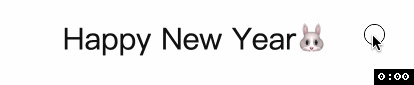

## 使用 transform-origin 实现的 hover 动效

先来看效果吧


首先就是思考蓝色线是如何出来的? 通过 `CSS` 属性 `transform` 的一个属性值 `scaleX(0)` 使其消失, 通过 `scaleX(1)` 使其出现.

然后思考如果让其从左边出现, 右边消失? 通过 `CSS` 属性 `transform-origin` 来改变变换 `transition` 的原点. `transform-origin` 的默认值是	`50% 50% 0`, 如果仅看 `X` 轴方向的变换就是 `center`, 也就是从中间出现然后向两边扩散, 如下图. 



### HTML
```html
<a href="">
  <span class="text">Happy New Year🐰</span>
</a>
```
### CSS
首先重置 `a` 的样式
```css
a {
  text-decoration: none;
  color: #111;
  font-size: 30px;
  line-height: 1.7;
}
```
然后, 蓝色线其实是 `absolute` 定位的 `before` 伪元素, 我们希望没有 `hover` 时蓝色线条消失并从左向右消失, 所以变换的原点就是元素的 `right`(`100% `宽度的地方)
```css
.text {
  position: relative;
}
.text::before {
  content: '';
  position: absolute;
  left: 0;
  right: 0;
  bottom: -4px;
  height: 4px;
  background-color: skyblue;
  transform: scaleX(0);
  transform-origin: right;
  transition: transform ease .3s;
}
```
添加 `hover` 效果, 也就是 `a hover` 时, 我们希望蓝色线条出现并且从左侧出现, 也就是 `left`(元素宽度为 `0` 的地方)
```css
a:hover .text::before {
  transform: scaleX(1);
  transform-origin: left;
}
```
谢谢你看到这里😊
