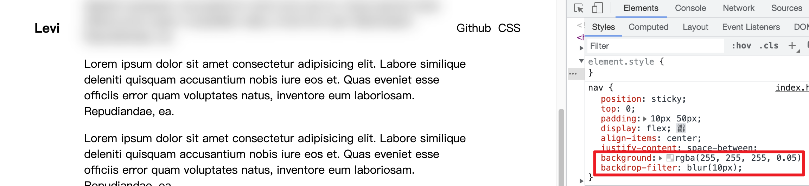
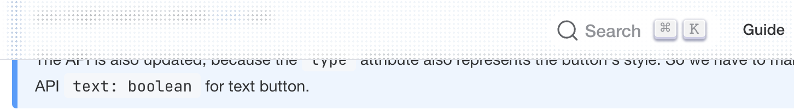
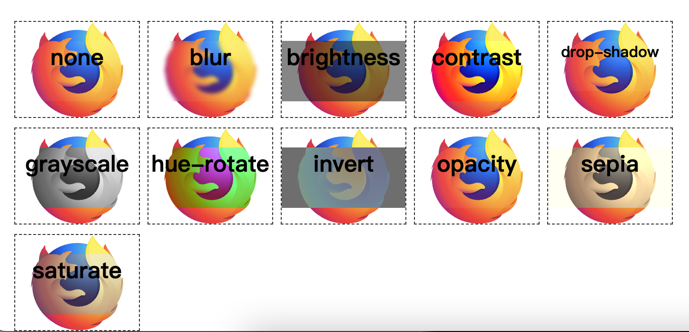
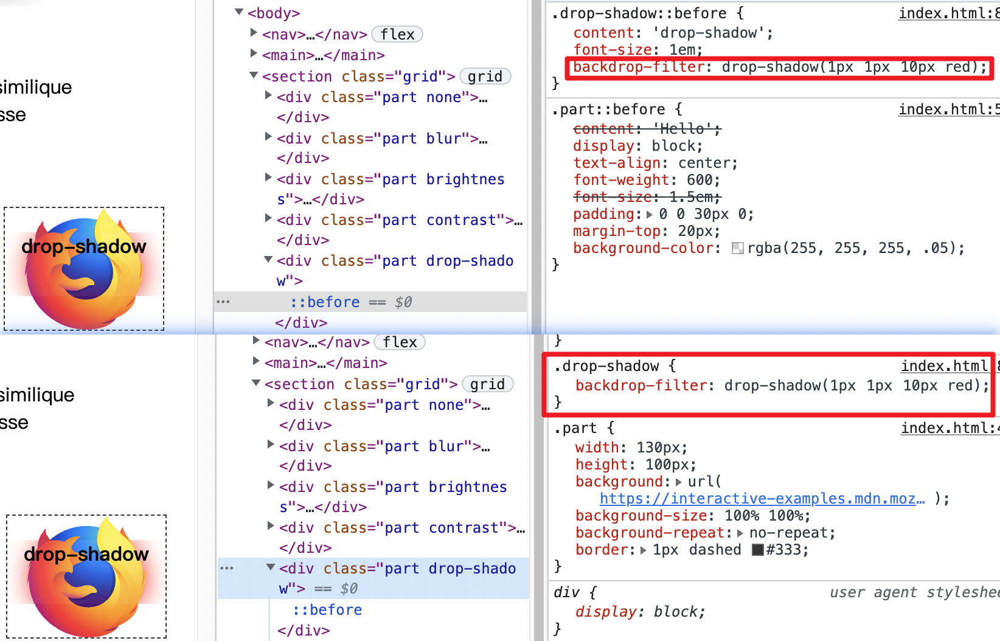
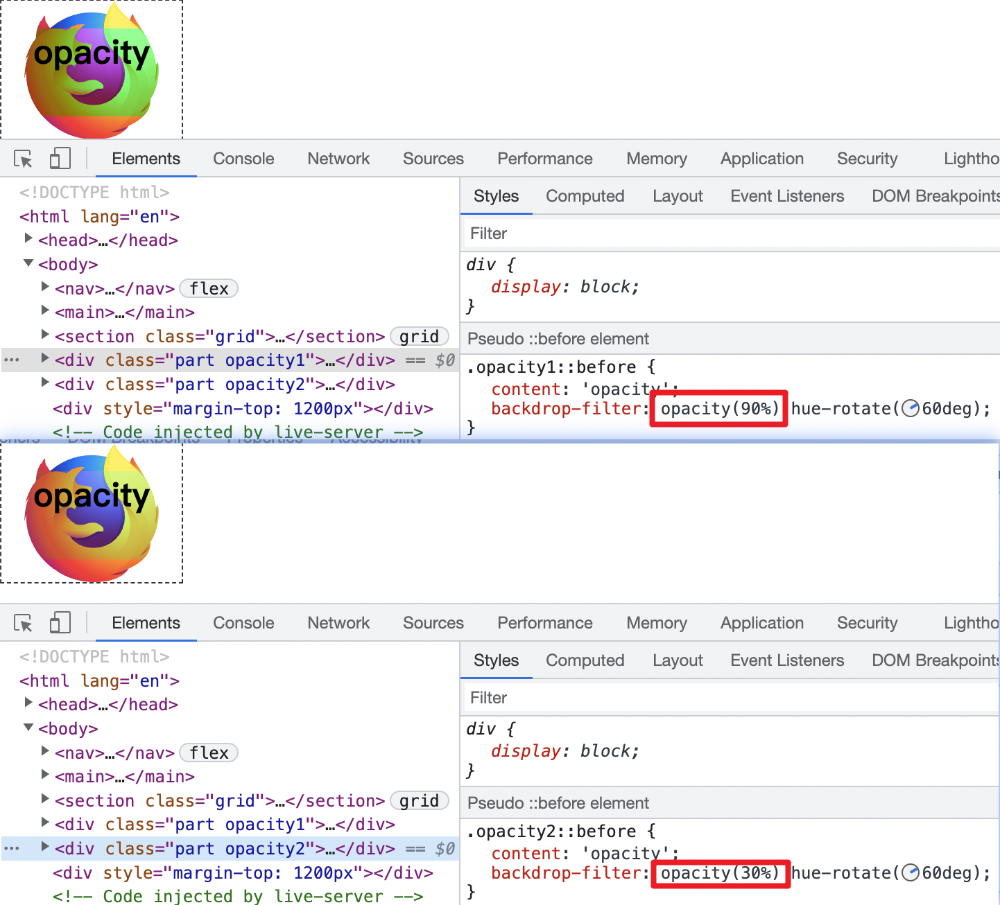
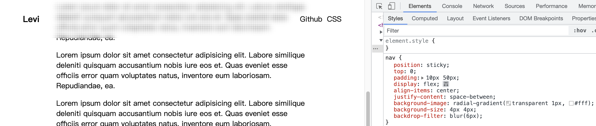
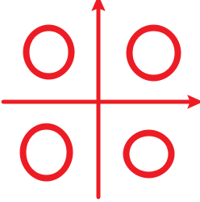

# 导航栏模糊背景 out 了? 来看看这种模糊是否合你胃口? 并且学习 `backdrop-filter`

传统情况模糊导航栏效果 🆚 一种比较新的模糊导航栏效果(比如 [Element-Plus](https://element-plus.gitee.io/en-US/) 官网的导航栏效果, 有些类似密集点阵式)





导航栏要实现这个效果必须设置背景为有透明的颜色并且通过 `backdrop-filter` 使用 `filter`. 看来我们必不可绕过 `backdrop-filter`
## [backdrop-filter](https://developer.mozilla.org/en-US/docs/Web/CSS/backdrop-filter)
> `backdrop-filter` 允许开发者将模糊或色彩偏离等图形效果应用到元素背后的区域. 因为它应用于元素背后所有内容, 因此如果你想要看到效果必须将元素的背景设置部分透明.

`backdrop-filter` 只有一个关键词属性值, `none` 表示不应用任何滤镜.



```html
<section class="grid">
  <div class="part none"></div>
  <div class="part blur"></div>
  <div class="part brightness"></div>
  <div class="part contrast"></div>
  <div class="part drop-shadow"></div>
  <div class="part grayscale"></div>
  <div class="part hue-rotate"></div>
  <div class="part invert"></div>
  <div class="part opacity"></div>
  <div class="part sepia"></div>
  <div class="part saturate"></div>
</section>
```
```css
.part {
  background: url('https://interactive-examples.mdn.mozilla.net/media/examples/firefox-logo.svg');
  background-size: 100% 100%;
  background-repeat: no-repeat;
}
.part::before {
  background-color: rgba(255, 255, 255, .05);
}
.blur::before {
  backdrop-filter: blur(2px); /** 其他类似 */
}
```
看完上面代码, 会让人有一点疑惑, 好像很多滤镜都生效了, 但是有两个就是没有生效, 分别是 `drop-shadow` 和 `opacity`. 为此, 我进行了调研...🤔

虽然 `backdrop-filter` 是添加到前面的元素的 `CSS` 规则中却应用在后面的元素, 但是对于 `drop-shadow` 特殊一点, 必须前后元素同时应用才可以看到效果. 很有意思的是, `tailwindcss` 中没有这个滤镜👀

```css
.drop-shadow::before {
  backdrop-filter: drop-shadow(1px 1px 10px red);
}
.drop-shadow {
  backdrop-filter: drop-shadow(1px 1px 10px red);
}
```


接下来说到为什么 `opacity` 没有效果, 不, 它有效果, 只是单单只用这一个滤镜 `opacity` 看不出来效果. 如下图, 应用了更大值 `opacity` 之后还是能看到 `hue-rotate` 的变化被减弱了.



## 新的模糊导航栏效果
聪明的小伙伴可能已经想象到如何实现这个效果了, 那就是调整 background-size 大小实现平铺. 另外一点就是不能使用 background-color 而要用 background-image. 先看效果

```css
nav {
  position: sticky;
  top: 0;
  padding: 10px 50px;
  display: flex;
  align-items: center;
  justify-content: space-between;
  background-image: radial-gradient(transparent 1px, #fff);
  background-size: 4px 4px;
  backdrop-filter: blur(6px);
}
```


我们来说下为什么不能使用 `background-color`, 因为要实现点阵式效果, 就要保证每个的 `4px` 宽高的背景「有一定距离」. 实际上这些每个小背景之间是互相紧密排列的没法强行增加间隔. 所以我们使用径向渐变, 从透明色渐变为白色, 这样不同背景都是以白色互相连接而透明部分互相隔离, 看起来就是点阵式了. 下图是灵魂画手的简笔画说明😅


谢谢你看到这里😊
