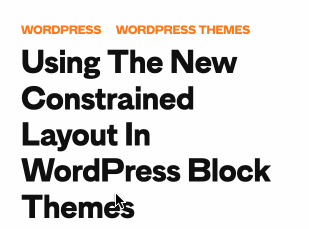
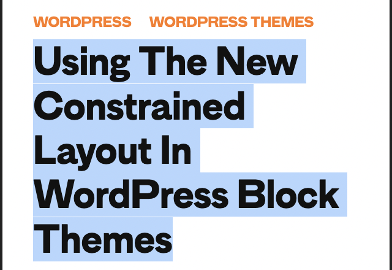
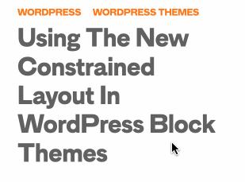

## `CSS-TRICKS` 中标题 `hover` 看到的问题的注意

在看 `CSS-Tricks` 瞎看的时候, 鼠标无意中划过文章的标题, 看到了一个现象, 也不能说严重, 但是个人感觉没有的话体验会更好. (我是菜鸟🐦



问题就是当鼠标移动在标题移动, 标题的颜色在不停地变化. 我们看一下模拟的文档结构就知道怎么回事了
```html
<h2>
  <a href="#">
    Using The New Constrained Layout In WordPress Block Themes
  </a>
</h2>
```
```css
h2 { color: #111; font-size: 32px; line-height: 1.1; }
h2 a { color: inherit; text-decoration: none; }
h2:hover { opacity: .6; }
```
问题就出现在 `line-height` 的值稍稍有点大, 如果我们鼠标🖱️选中标题的文字, 就能看到行与行之间是有很窄的上级节点的白色背景. 所以如果给 `<a>` 设置 `hover` 就有可能出现这个问题.



那你会说, 不给 `<a>` 而给 `<h2>` 设置不就好了? 没错可以给 `<h2>` 设置, 但是这样出现了另一个效果, 即便鼠标 `hover` 在了 `<h2>` 的空白区域而不是 `<a>` 上, `<a>` 的透明度也会改变, 就像下图. 这可能也不是开发者想要的效果



其实我们可以 `line-height` 设置为 `1`, 即减小行高就可以了, 但是文件行与行之间的间距就会变小. 目前我还找出更好的方法, 只能暂时做些取舍了.

谢谢你看到这里😊


