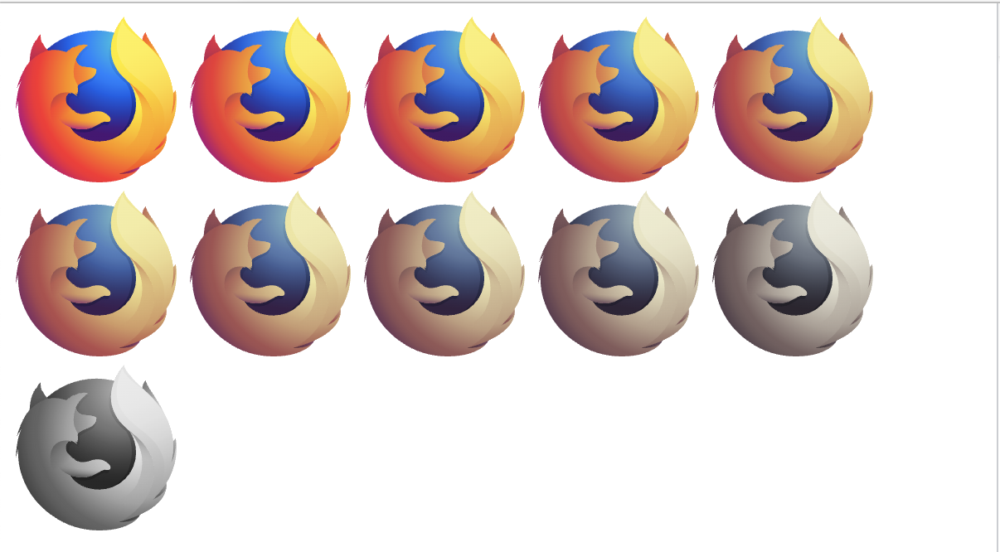
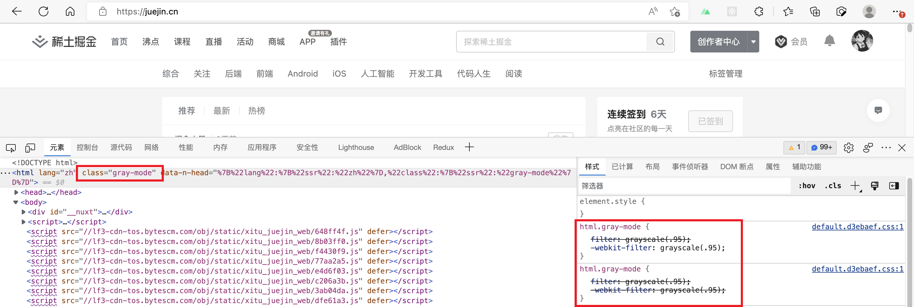
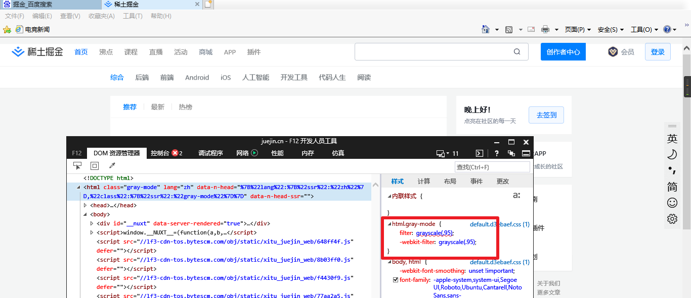
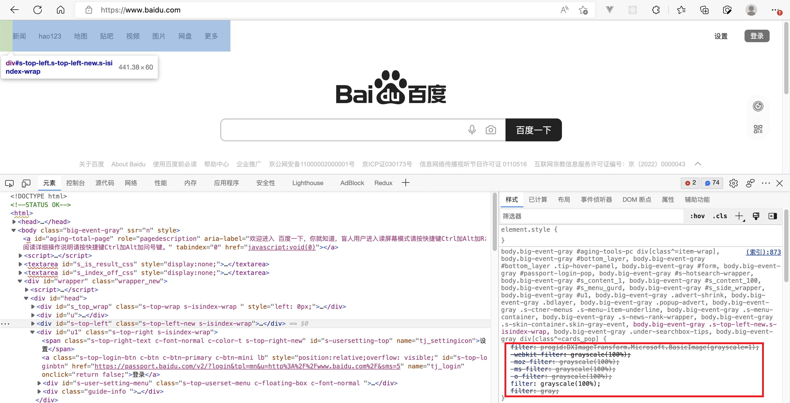
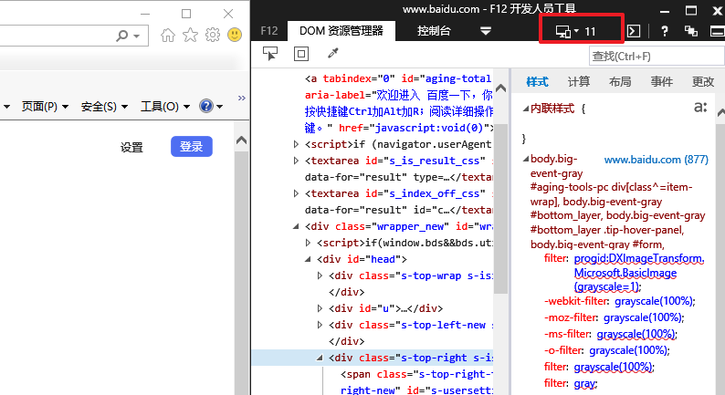
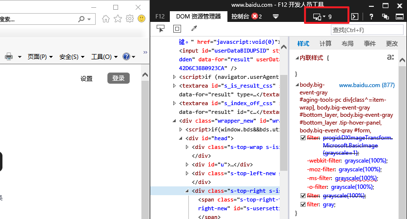
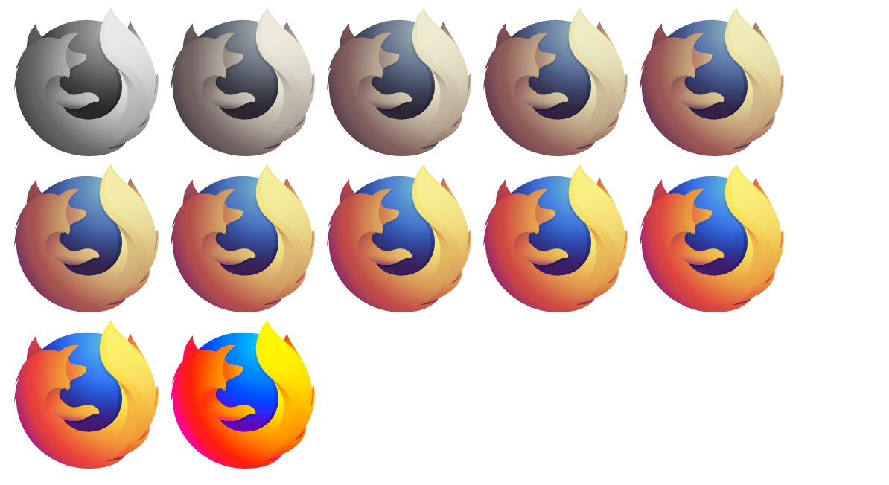

## `filter: grayscale()` 让你的页面变灰

出于一些原因我们可能让网站变灰, 我看了一下最近不同网站实现的效果, 果然大家都是用了 `filter` 这个属性, 但是各个网站的实现又有亿点点差距😅

很遗憾的是, 必须先说这个属性的不支持 `IE` 浏览器而且这个属性非继承, 所以如果打算打算兼容 `IE` 浏览器可能要看到最后😎

`filter` 对指定的元素应用图形效果(比如模糊或者色彩移动). 该属性通常用于调整图像、背景和边框. 

`grayscale()` 将输入的图像进行灰度转换, 它是 `filter` 的一个合法属性值. `grayscale()` 一个 `number` 类型或百分比类型的参数, 参数表示灰度转换的程度. `100%` 表示完全灰度, `0%` 表示无任何灰度转换. `0%` 和 `100%` 之间的值是对灰度效果的线性增加. 如果没有参数默认为 `1`, 插值的初始值为 `0`, 也就是从 `0` 开始灰度转换的意思.

下面通过对同一幅图从小到大应用 `filter: grayscale()` 看看效果
```css
.grayscale-1 { filter: grayscale(.1); }
.grayscale-2 { filter: grayscale(.2); }
.grayscale-3 { filter: grayscale(.3); }
.grayscale-4 { filter: grayscale(.4); }
.grayscale-5 { filter: grayscale(.5); }
.grayscale-6 { filter: grayscale(.6); }
.grayscale-7 { filter: grayscale(.7); }
.grayscale-8 { filter: grayscale(.8); }
.grayscale-9 { filter: grayscale(.9); }
.grayscale-10 { filter: grayscale(); }
```

从上图可以看到, 如果想要真的实现灰白效果, `filter: grayscale(1)` 或者 `filter: grayscale(100%)` 或者 `filter: grayscale()` 是必不可少了. 下面看看不同的网站实现变灰的细节吧~

### 掘金

掘金简单的在 `html` 元素上加上 `class="gray-mode"`, 使用的属性呢还是 `filter: grayscale(.95)`

这样说来, 掘金就是放弃了对 `IE` 浏览器的兼容, 我打开了自己的尘封已久的 `ThinkPad` 之后发现果然是这样——页面没有变灰


### 百度
百度并没有简单地只在 `html` 上加上 `filter` 效果, 而是针对特定的元素应用了灰度效果.


首先我们看到了一个在 `MDN` 上查不到的用法 `filter: gray;` 和微软的私有属性值 `filter: progid:DXImageTransform.Microsoft.BasicImage(grayscale=1)`. 根据 [stack overflow](https://stackoverflow.com/questions/609273/convert-an-image-to-grayscale-in-html-css/8612047#8612047) 上的介绍, `filter: gray;` 是为了支持 `IE 6-9`. 那 `IE 10-11` 怎么办呢? 😬不好意思, 根据 [stack overflow](https://stackoverflow.com/questions/14813142/internet-explorer-10-how-to-apply-grayscale-filter/14818991#14818991) `IE 10-11` 并不像 `IE 9` 和更早的 `IE` 版本支持 `DX filters` 了. 所以在 `IE 11` 上百度首页右上角的登录按钮仍然是蓝色, 但是如果换成 `IE 9`, 登录按钮就变灰了.




### `saturate()`
其实嘞, 使用另一个 `filter` 的属性 `saturate(0)` 也可以实现灰度效果. 但是我也不知道为啥没有人用, 当然还可以看到最后一张图是 `200%` 的饱和度, 颜色更加鲜艳了.
```css
.saturate-0 { filter: saturate(0); }
.saturate-1 { filter: saturate(.1); }
.saturate-2 { filter: saturate(.2); }
.saturate-3 { filter: saturate(.3); }
.saturate-4 { filter: saturate(.4); }
.saturate-5 { filter: saturate(.5); }
.saturate-6 { filter: saturate(.6); }
.saturate-7 { filter: saturate(.7); }
.saturate-8 { filter: saturate(.8); }
.saturate-9 { filter: saturate(.9); }
.saturate-10 { filter: saturate(1); }
.saturate-20 { filter: saturate(2); }
```


谢谢你看到这里😊
