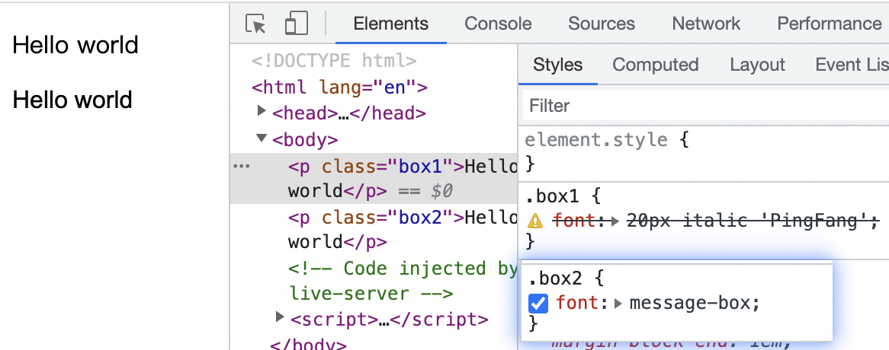

## CSS font 规则
`CSS` 中的 `font` 属性是一个简写属性, 可以设置字体的所有属性. 和所有简写属性一样, 如果某个对应的属性没有值, 那就会使用初始值. 可能会覆盖之前不是使用简写属性的值. 比如我们在使用 `font` 之前单独设置了 `font-weight` 为 `bolder`, 但是之后没有在 `font` 忘写了字重对应的值, 那么 `font-weight` 最终值就是 `normal`(初始值).

尽管 `font-size-adjust` 和 `font-kerning` 两个属性不是 `font` 可以简写的属性, 它们仍然会被置为初始值. 所以如果要避免误伤, 就要先写 `font` 再写 `font-size-adjust` 和 `font-kerning`.

`font` 是下面所有 `CSS` 属性的简写
- `font-family`
- `font-size`
- `font-stretch`
- `font-style`
- `font-variant`
- `font-weight`
- `line-height`

### 语法
`font` 属性要么是一个关键词, 要么是各种字体属性值组成的简写.

如果是关键词, 将会选择一种系统字体. 关键词可以是下面的值.
- `caption`: 用于按钮、下拉列表等系统字体
- `icon`: 用于 `icon` 的系统字体
- `menu`: 用于菜单的系统字体
- `message-box`: 用于对话框的系统字体
- `small-caption`: 用于小型控件的系统字体
- `status-bar`: 用于 `windows` 状态栏的系统字体 

除此之外, 浏览器还会实现一个更多的、带有私有前缀的关键词. 比如 `Gecko` 内核的浏览器支持 `-moz-info`, `-moz-desktop` 等.

如果不使用关键词而使用简写属性的话, 必须包括 `font-size` 和 `font-family`. 剩下的五个属性可选. 另外需要注意的是📖
- `font-style`, `font-variant`, `font-weight` 必须在 `font-size` 之前.
- `font-variant` 只包含定义在 `CSS 2.1` 中的属性值, 也就是 `normal` 和 `small-caps`
- `font-stretch` 只能使用单个关键词的值
- `line-height` 必须立刻跟在 `font-size` 之后并用 `/` 分割, 比如 `16px/1.5` 表示 `font-size` 是 `16px`, `line-height` 是 `1.5`
- `font-family` 必须是所有属性值的最后一个.

从上图看到, 违反了第一条规则整个 `CSS` 规则不生效. 另外使用了 `message-box` 这个关键字可以看到字体更粗.

谢谢你看到这里😊
