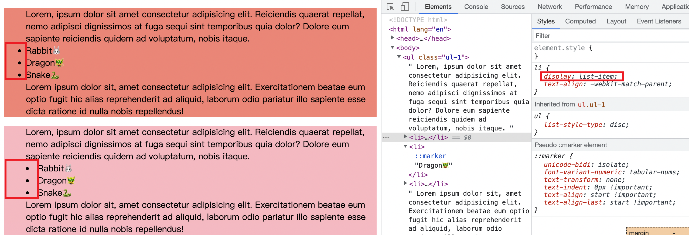
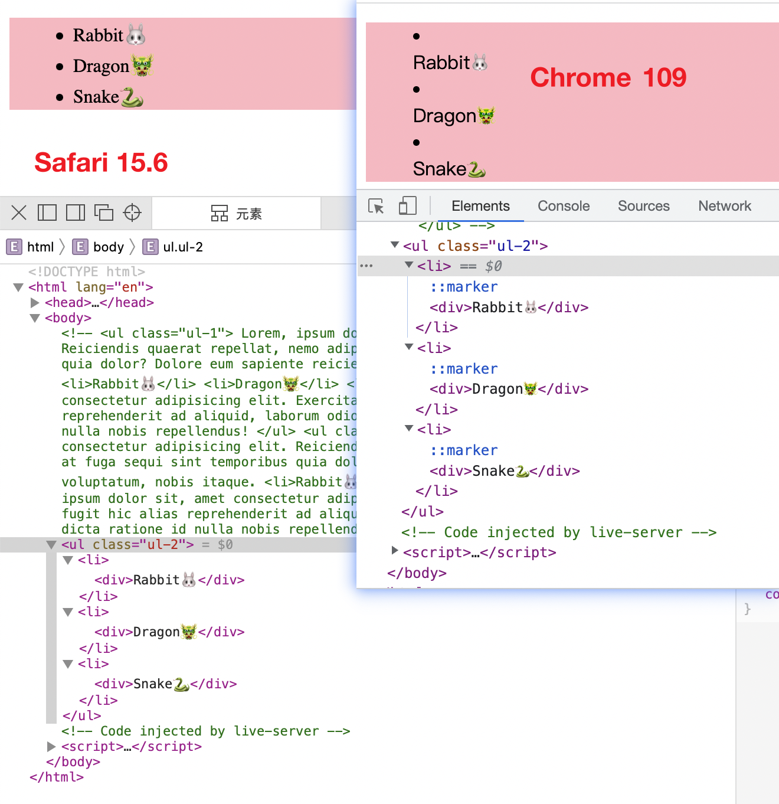
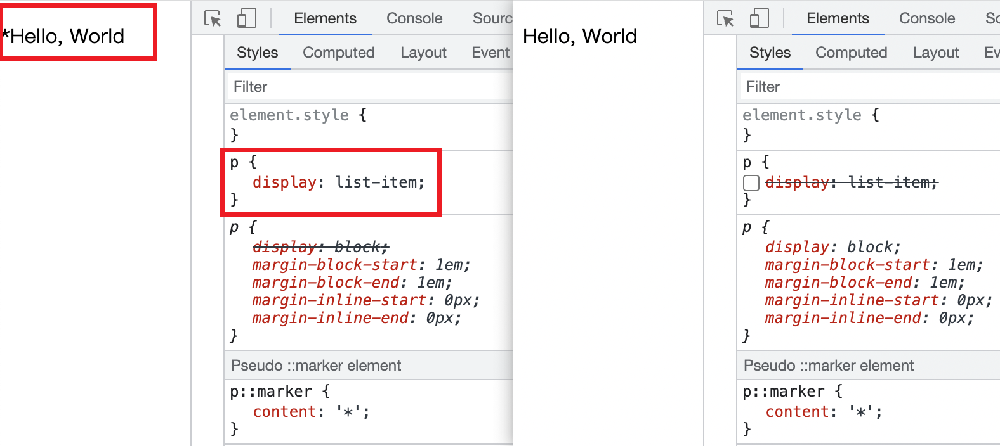

## list-style-position
> 指定 `display` 属性为 `list-item` 的元素的 `::marker` 伪元素的位置.

我们最常见的 `display` 为 `list-item` 的就是 `<li>` 元素了. 来看代码
```html
<ul class="ul-1">
  Lorem, ipsum...
  <li>Rabbit🐰</li>
  <li>Dragon🐲</li>
  <li>Snake🐍</li>
  Lorem ipsum...
</ul>
<ul class="ul-2">
  Lorem, ipsum...
  <li>Rabbit🐰</li>
  <li>Dragon🐲</li>
  <li>Snake🐍</li>
  Lorem ipsum...
</ul>
```
```css
.ul-1 {
  background-color: salmon;
}
.ul-2 {
  background-color: lightpink;
  list-style-position: inside;
}
```


`list-style-position` 可以取值如下, 效果如上图
- `outside`
- `inside`

这个属性是可以继承的, 所以上面的代码中将其应用到 `list-item` 的父元素上, 从而使得所有 `<li>` 元素都生效.

另外, 在 `list-style-position: inside` 情况下, 如果 `list-item` 元素的第一个子元素是块元素, 那么不同的浏览器会有不同的渲染结果. `MDN` 上介绍 `Chrome` 和 `Safari` 会将块元素和 `::marker` 元素渲染在同一行, 但是我实测不是这样, 如下图, 在 `Chrome` `arm64` `109` 版本下, 块元素渲染在 `::marker` 的下一行, 但是在 `Safari` `15.6` 版本下块元素与 `::marker` 渲染在同一行.



除此之外, 给任意元素添加 `::marker` 伪元素不见得都有效, 除非该元素的 `display` 属性为 `list-item`


谢谢你看到这里😊
