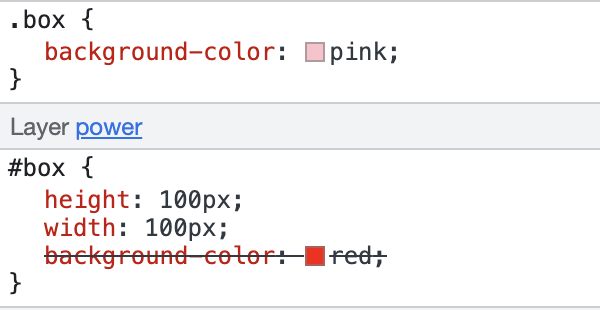

# @layer
> `@layer` CSS 规则用来声明一个级联层(cascade layer), 并且在多个级联层的情况下定义优先级.

级联层到底有什么用呢? 我们知道不同来源的 CSS 规则有着不同的优先级, 比如 web 开发者编写的 CSS 样式表(author stylesheets) 比浏览器默认的样式(user-agent stylesheets) 的优先级更高. 可以将不同优先级的规则理解为级联规则.

使用级联层, 开发者可以更灵活地控制级联规则. 写在级联层 A 中的 CSS 规则与写在级联层 B 中的 CSS 规则完全没有关系, 究竟哪个规则生效? `只与`级联层有关系. 因此, 当我们想要引入第三方样式文件又不想让第三方某些优先级过高的 CSS 规则覆盖原本的重名的规则, 就可以在级联层中引入.

## 功能
任何没有在级联层中声明的 CSS 规则都会被聚集在一起并被放入一个`匿名的级联层中`, 这个匿名的级联层会在所有手动声明的(declared)、有名字的(named)和匿名的级联层之后. 这意味着任何没有声明在级联层中的 CSS 规则都将`覆盖`声明在级联层中的 CSS 规则, 并且与 CSS 规则的权重无关.

看个例子
```html
<div class="box" id="box"></div>
```
```css
.box {
  background-color: pink;
}
@layer power {
  #box {
    height: 100px;
    width: 100px;
    background-color: red;
  }
}
```
从下图就能看出, 即便级联层中的 CSS 规则权重更高, 但是生效的是在级联层外面定义的 CSS 规则. 因此在开发中可以把基础样式写在级联层中, 个性化定制的样式不写在级联层中, 这样就可以覆盖基础样式也不会被权重或 CSS 规则的书写顺序困扰.


## 语法
```css
@layer name { rules }
@layer name;
@layer name1, name2, name3;
@layer { rules }
```
其中, name 是每一个级联层的名字. rules 是定义在级联层中的 CSS 规则.

## 创建级联层的三种方式
1️⃣ 第一种, 创建一个具名的级联层, 并且级联层中有 CSS 规则.
```css
@layer basement {
  .pt-5 {
    padding-top: 5px;
  }
}
```
2️⃣ 第二种, 创建一个具名的级联层, 但是没有任何 CSS 规则. 这种方式创建一个级联层或同时创建多个级联层.
```css
@layer colors;
@layer colors, layout;
```

```css
```


`@layer`


谢谢你看到这里😊
