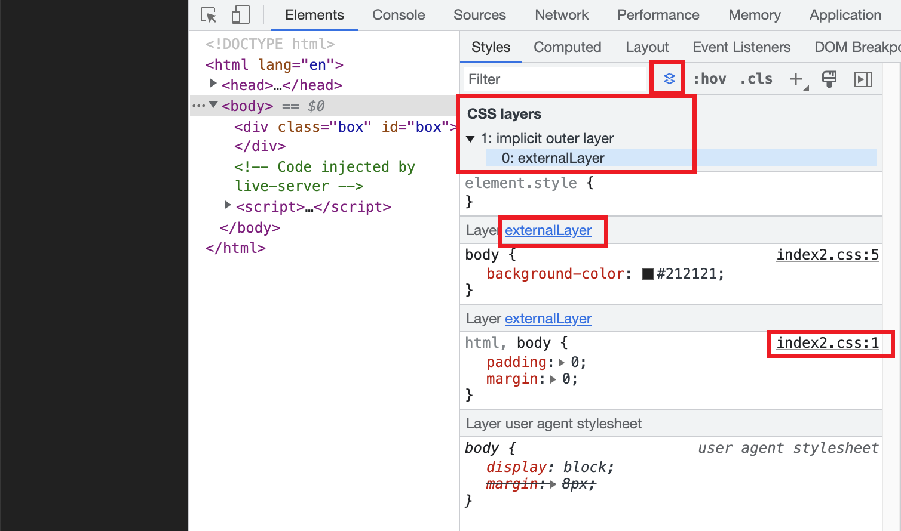
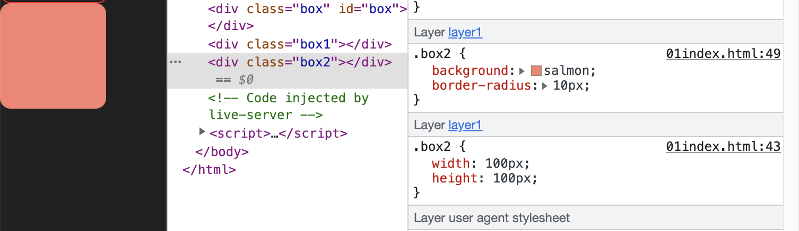
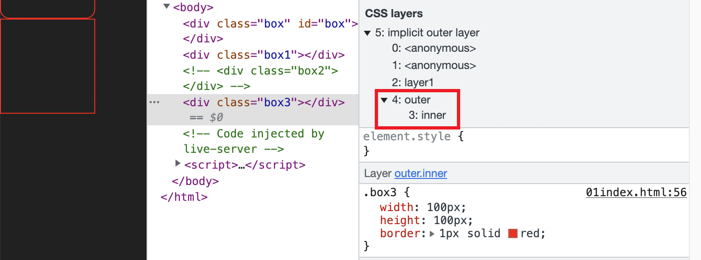
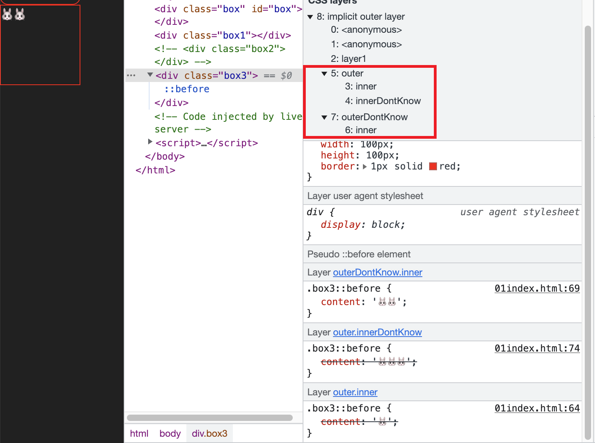
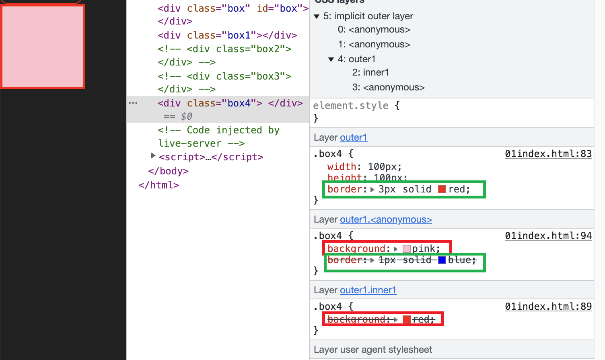

<!-- TOC -->

- [@layer](#layer)
  - [功能与优先级](#%E5%8A%9F%E8%83%BD%E4%B8%8E%E4%BC%98%E5%85%88%E7%BA%A7)
  - [语法](#%E8%AF%AD%E6%B3%95)
  - [创建级联层的三种方式](#%E5%88%9B%E5%BB%BA%E7%BA%A7%E8%81%94%E5%B1%82%E7%9A%84%E4%B8%89%E7%A7%8D%E6%96%B9%E5%BC%8F)
  - [嵌套的 @layer](#%E5%B5%8C%E5%A5%97%E7%9A%84-layer)
    - [内层的优先级.](#%E5%86%85%E5%B1%82%E7%9A%84%E4%BC%98%E5%85%88%E7%BA%A7)
  - [@layer 与 !important](#layer-%E4%B8%8E-important)
  - [浏览器兼容性](#%E6%B5%8F%E8%A7%88%E5%99%A8%E5%85%BC%E5%AE%B9%E6%80%A7)

<!-- /TOC -->

# @layer
> `@layer` CSS 规则用来声明一个级联层(cascade layer), 并且在多个级联层的情况下定义优先级.
## 功能与优先级
级联层到底有什么用呢? 我们知道不同来源的 CSS 规则有着不同的优先级, 比如 web 开发者编写的 CSS 样式表(author stylesheets) 比浏览器默认的样式(user-agent stylesheets) 的优先级更高. 可以将不同优先级的规则理解为级联规则.

使用级联层, 开发者可以更灵活地控制级联规则. 写在级联层 A 中的 CSS 规则与写在级联层 B 中的 CSS 规则完全没有关系, 究竟哪个规则生效? `只与`级联层有关系. 因此, 当我们想要引入第三方样式文件又不想让第三方某些优先级过高的 CSS 规则覆盖原本的重名的规则, 就可以在级联层中引入.


任何没有在级联层中声明的 CSS 规则都会被聚集在一起并被放入一个`匿名的级联层中`, 这个匿名的级联层会在所有手动声明的(declared)、有名字的(named)和匿名的级联层之后. 这意味着任何没有声明在级联层中的 CSS 规则都将`覆盖`声明在级联层中的 CSS 规则, 并且与 CSS 规则的权重无关.

看个例子
```html
<div class="box" id="box"></div>
```
```css
.box {
  background-color: pink;
}
@layer power {
  #box {
    height: 100px;
    width: 100px;
    background-color: red;
  }
}
```
从下图就能看出, 即便级联层中的 CSS 规则权重更高, 但是生效的是在级联层外面定义的 CSS 规则. 因此在开发中可以把基础样式写在级联层中, 个性化定制的样式不写在级联层中, 这样就可以覆盖基础样式也不会被权重或 CSS 规则的书写顺序困扰.


## 语法
```css
@layer name { rules }
@layer name;
@layer name1, name2, name3;
@layer { rules }
```
其中, name 是每一个级联层的名字. rules 是定义在级联层中的 CSS 规则.

## 创建级联层的三种方式
1️⃣ 第一种, 创建一个具名的级联层, 并且级联层中有 CSS 规则.
```css
@layer basement {
  .pt-5 {
    padding-top: 5px;
  }
}
```
2️⃣ 第二种, 创建一个具名的级联层, 但是没有任何 CSS 规则. 这种方式创建一个级联层或同时创建多个级联层. 同时创建多个级联层的同时, 他们的优先级顺序也确定了, 即 layout 的优先级比 colors 更高.
```css
@layer colors;
@layer colors, layout;
```
但是如果这写成这样也很奇怪, 因为没有具体的 CSS 规则, 因此在声明之后可以重复再声明一次并添加 CSS 规则, 并且级联层的优先级不会发生变化
```css
@layer basement, utilities;
  @layer utilities {
    .pt-5 {
      padding-top: 5px;
    }
  }
  @layer basement {
    html, body {
      padding: 0;
      margin: 0;
    }
  }
```

3️⃣ 第三种, 创建匿名的级联层. 如果没有名字就无法在后续追加 CSS 规则, 其优先级与具名的级联层计算规则一样.
```css
@layer {
  .box1 {
    width: 100px;
    height: 100px;
    border: 1px solid red;
    border-radius: 10px;
  }
}
```

4️⃣ 另外呢, 如果想要使用 @import 引入一个外部的样式表, 使用 `@import url(...) layer(layerName)`.

来看操作. 首先在 html 页面中通过 link 标签引入 index1.css
```css
<link rel="stylesheet" href="index1.css">
```
接着在 index1.css 中引入 index2.css. 这样就会直接创建一个名为 externalLayer 的级联层.
```css
@import url(index2.css) layer(externalLayer);
```
在 index2.css 中创建一些样式
```css
html, body {
  padding: 0;
  margin: 0;
}
body {
  background-color: #212121;
}
```
来看结果. 在 Chrome 109 开发者工具中, 已经可以看到对 @layer 规则的支持.



当然 `@import url(...) layer(layerName)` 也可以省略 layerName, 这样就会创建一个匿名的级联层.
```css
@import url(index2.css) layer;
```

📖 这种方法要注意 @import 规则必须出现在其他所有规则之前, 除了 @charset 和 @layer 规则.


如果想要在已经声明的级联层中追加样式, 写法与声明时一样, 但不是覆盖而是追加.
```css
@layer layer1 {
  .box2 {
    width: 100px;
    height: 100px;
  }
}
@layer layer1 {
  .box2 {
    background: salmon;
    border-radius: 10px;
  }
}
```


## 嵌套的 @layer
@layer 规则是可以嵌套的.
```css
@layer outer {
  @layer inner {
    .box3 {
      width: 100px;
      height: 100px;
      border: 1px solid red;
    }
  }
}
```


如果想要向内层的 @layer 添加新的样式, 可以把内外层的名字使用 `.` 连接
```css
@layer outer.inner {
  .box3::before {
    content: '🐰'
  }
}
```

如果我们直接追加没有声明过的的级联层呢? 比如下面代码中, 增加了一个不存在的外层 outerDontKnow 和不存在的 内层 inner; 还在存在的外层中增加了不存在的内层 innerDontKnow, 所以最后有几个兔子呢?
```css
@layer outer.inner {
  .box3::before {
    content: '🐰'
  }
}
@layer outerDontKnow.inner {
  .box3::before {
    content: '🐰🐰'
  }
}
@layer outer.innerDontKnow {
  .box3::before {
    content: '🐰🐰🐰'
  }
}
```
答案是🐰🐰, 因为 @layer outerDontKnow.inner 就是声明了新的级联层, 其优先级比已经存在的 outer 更高.



级联层内部的优先级规则与最外层的级联层优先级规则相同, 
```css
@layer outer1 {
  .box4 {
    width: 100px;
    height: 100px;
    border: 3px solid red;
  }
  @layer inner1 {
    .box4 {
      background: red;
    }
  }
  @layer {
    .box4 {
      background: pink;
      border: 1px solid blue;
    }
  }
}
```
内部匿名级联层的优先级高于 inner1, 而没有声明在级联层中优先级又高于内部匿名级联层的优先级


### 内层的优先级.

## @layer 与 !important

## 浏览器兼容性

`@layer`


谢谢你看到这里😊
