<!-- TOC -->

- [重新认识 !important](#%E9%87%8D%E6%96%B0%E8%AE%A4%E8%AF%86-important)
  - [影响级联规则](#%E5%BD%B1%E5%93%8D%E7%BA%A7%E8%81%94%E8%A7%84%E5%88%99)
    - [与 animation 和 transition 的关系](#%E4%B8%8E-animation-%E5%92%8C-transition-%E7%9A%84%E5%85%B3%E7%B3%BB)
    - [级联层cascade layer](#%E7%BA%A7%E8%81%94%E5%B1%82cascade-layer)
    - [内联样式](#%E5%86%85%E8%81%94%E6%A0%B7%E5%BC%8F)
    - [!important 与权重](#important-%E4%B8%8E%E6%9D%83%E9%87%8D)
  - [!important 与简写属性](#important-%E4%B8%8E%E7%AE%80%E5%86%99%E5%B1%9E%E6%80%A7)
  - [!important 与自定义变量](#important-%E4%B8%8E%E8%87%AA%E5%AE%9A%E4%B9%89%E5%8F%98%E9%87%8F)
  - [!important 最佳实践](#important-%E6%9C%80%E4%BD%B3%E5%AE%9E%E8%B7%B5)

<!-- /TOC -->
在开始之前, 先来规范一下文中的用于, 首先看 [W3C](https://www.w3schools.com/css/css_syntax.ASP) 中关于 `CSS` 的一些术语定义吧. 下图来自 W3C


我们将一个完整的 `color: blue;` 称为一个声明(`declaration`), 其中 `color` 称为属性(`property`), `blue` 称为值(`value`)

# 重新认识 !important
`!important` 表示 `CSS` 声明是「重要」的. `!important` 改变了 `CSS` 级联中究竟使用哪个 `CSS` 声明的规则. 如果一个 `CSS` 声明不是重要(important)的, 那么就称其为一般(normal)声明.

我们只需要将 `!important` 加在一个 `CSS` 声明的值的后面, 要加上至少一个空格, `!` 和 `important` 之间可以有空格, 但是通常没有空格
```css
.box {
  border-radius: 10px; /* normal declaration */
  font-size: 18px ! important; /* 可以, 但不推荐 */
  background-color: red !important; /* 可以, 推荐 */
}
```

## 影响级联规则
在级联规则中, 有三种常见的样式表, 他们的优先级依次 **`降低`**
- `author stylesheets`: 最常见的样式表, 由 `web` 开发人员编写
- `user stylesheets`: 大多数浏览器中, 网站的用户可以使用自定义的 `user` 样式表覆盖网站的样式. 根据浏览器的不同, `user` 样式表可以直接配置或者`通过浏览器扩展添加`.
- `user-agent stylesheets`: 浏览器默认样式表.

一旦应用了 `!important`, 优先级就完全反过来. `user-agent` 所有 `!important` 样式表优先级大过 `user` 所有 `!important` 样式表优先级; 而 `user` 所有 `!important` 样式表优先级又大过 `author` 所有 `!important` 样式表优先级.

举个例子, 我们可以使用广告拦截器插件拦截页面某个元素. 本来 `author` 样式表的优先级高于 `user` 样式表, 但是因为 `user` 样式表中的 `CSS` 声明使用了 `!important`, 所以它的优先级就反过来高过 `author` 样式表中 `!important` 的 `CSS` 声明. 

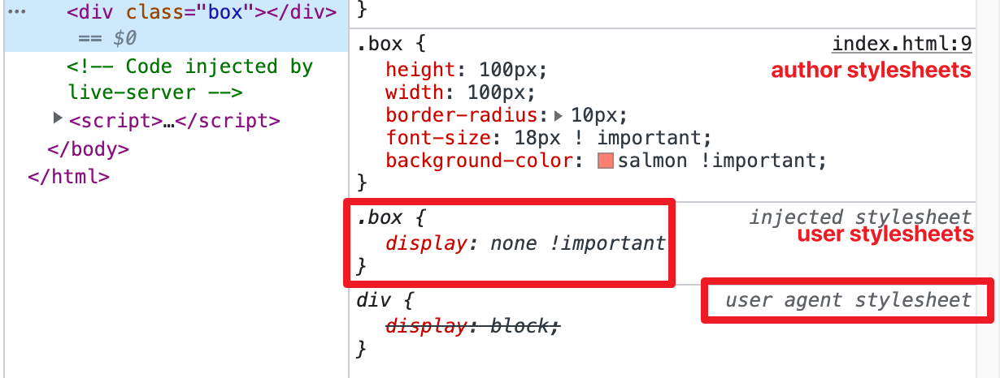

因此即便我们在 `author` 样式表中多加 `display: block !important;` 仍然无济于事, 元素 `display` 的计算属性还是 `none`. 这也就是使用广告拦截器插件拦截页面元素时, 网站开发者是没有能力覆盖插件的 `user stylesheets` 的原因.

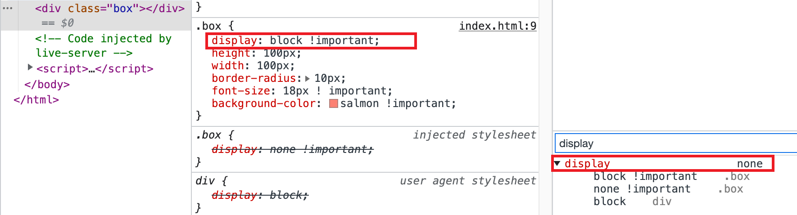

反转 `important` 样式表优先级满足了用户的某些特殊要求, 比如要改变浏览器字体大小, 从而覆盖网页开发者编写的样式表. 同样的, `user-agent` 样式表中 `important` 声明的优先级更高也会阻止某些恶意插件破环页面功能等.

### 与 `animation` 和 `transition` 的关系
首先要注意的是, 在 `@keyframes` 中的声明不能使用 `!important`

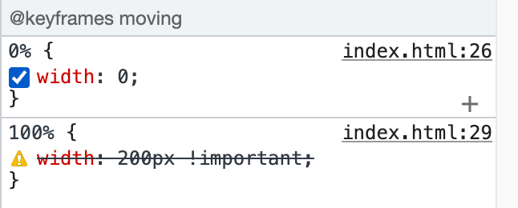

所有 `important` 声明都比 `animation` 中声明的优先级高. 下面的例子中对 `width` 设置了 `!important`, 但是在动画中呢, 需要 `width` 从 `0` 到 `100px` 变化
```css
.box2 {
  width: 100px !important;
  height: 100px;
  background-color: salmon;
  animation: moving linear 2s infinite;
}
@keyframes moving {
  from {
    width: 0;
    height: 0;
  }
  to {
    width: 200px;
    height: 100px;
  }
}
```
这条规则在 `Chrome 109` 版本和 `Firefox` 上的表现符合预期, 即元素的宽度始终为 `100px` 而不会动态变化, 但是在 `Safari 15.6` 上就不是啦. 至于为什么 `Safari` 浏览器表现不同于其他浏览器, 俺也不知道🤷‍♀️, 在开发时需要注意避免.

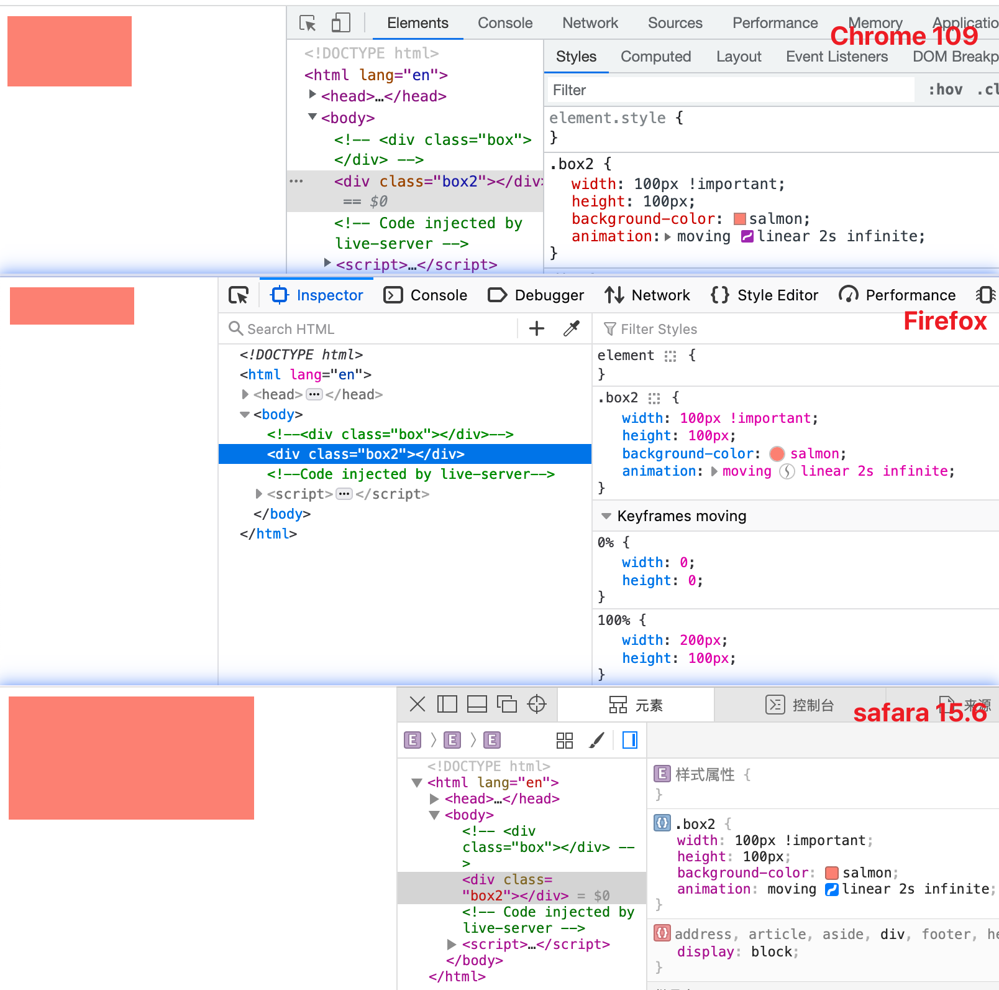

`transition` 优先级高于 `important` 声明. 当 `CSS` 属性从一个值变向另一个值时, 这个属性将不会匹配特定的 `important` 声明.

```css
/* 第一种 */
.box3 {
  background-color: lightblue;
  transition: background-color 1s linear;
}
.box3:hover {
  background-color: red !important;
}

/* 第二种 */
.box3 {
  background-color: lightblue !important;
  transition: background-color 1s linear;
}
.box3:hover {
  background-color: red;
}
```
从下图中可以看到, 如果 `important` 添加在在过渡后的声明, 那么过渡正常; 反之添加在过渡前的声明, 则没有过渡.

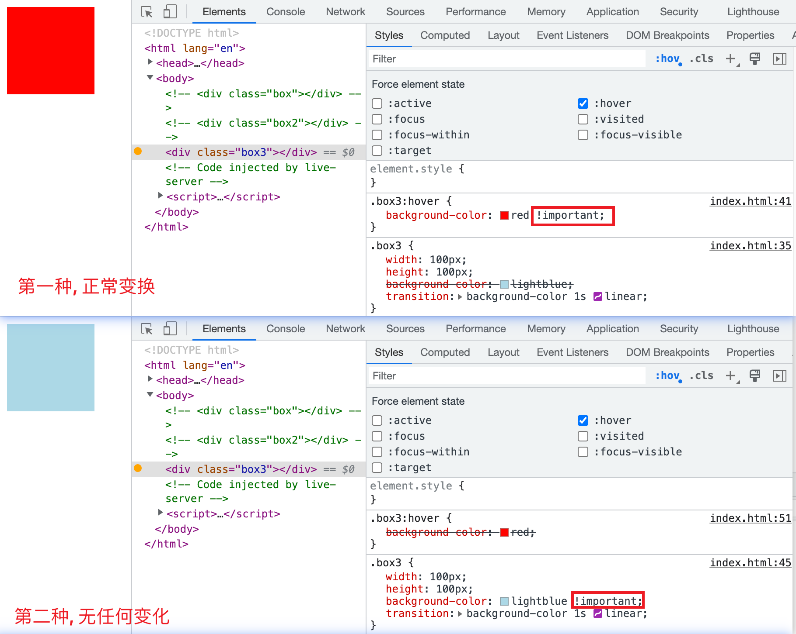

如果过渡前后都有 `important` 呢? 答案是过渡正常发生.
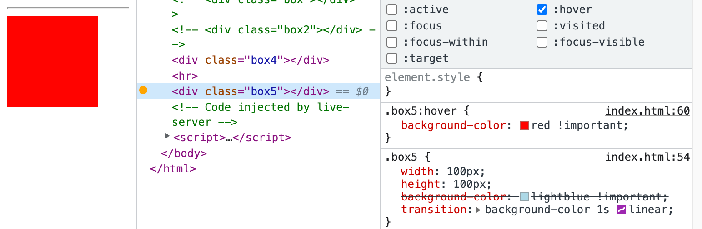

上述三种情况在 `Chrome`, `Firefox` 和 `Safari` 表现相同.

### 级联层(cascade layer)
样式表有三种来源(不止三种, 这里只讨论三种), 即 `user-agent stylesheets` 浏览器默认样式, `user stylesheets` 通过浏览器配置或浏览器插件添加和 `author stylesheets` 网页开发人员编写.

对于在级联层外的一般(normal)声明优先级高于在级联层内的一般声明; 如果一般声明在不同级联层中, 那么在最后声明的级联层中的一般声明的优先级最高. 具体规则需要查看 [@layer](https://developer.mozilla.org/en-US/docs/Web/CSS/@layer).

看个简单的例子
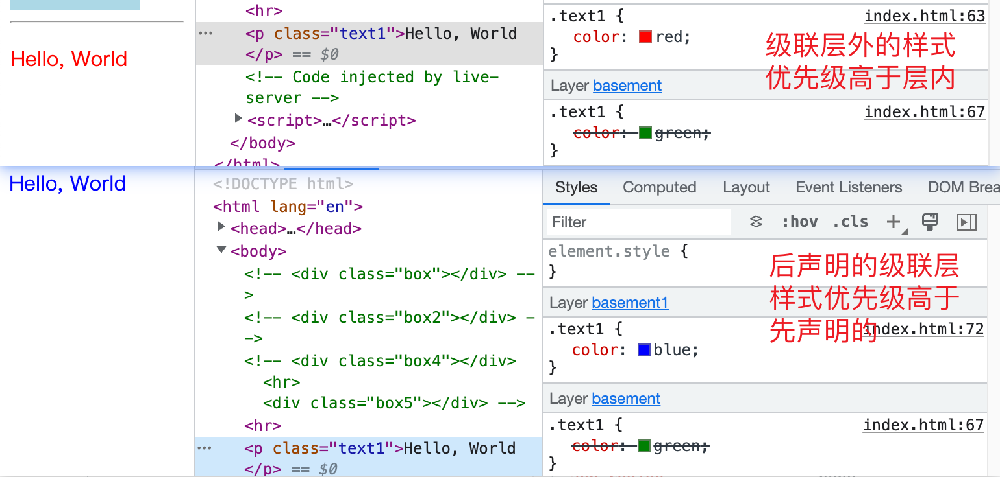


如果使用了 `!important`, 那么优先级就反转了. 先声明的级联层中的 `important` 声明优先级高于后声明的级联层中的 `important` 声明, 同时, 所有级联层中的 `important` 声明优先级高于级联层外的 `important` 优先级

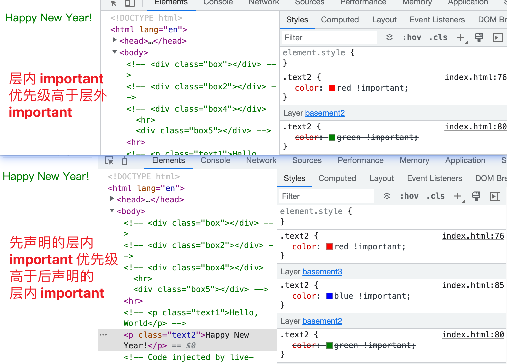

### 内联样式
内联样式就是使用 `style attribute` 的声明. 内联样式也可以是一般(normal)声明或 `important` 声明. 内联一般声明的优先级高于所有其他一般声明, 不论其来源. 而内联 `important` 声明的优先级高于其他所有 `important` 声明, 不论级联层, 但是 `user-agent` 样式表的 `important` 声明, `user` 样式表的 `important` 声明和 `transitions` 高过内联 `important` 声明.

这里只关注内联 `important` 声明, 首先第一条, 内联 `important` 声明的优先级高于其他所有 `important` 声明, 即便 `important` 声明在级联层中, 可对照上部分.

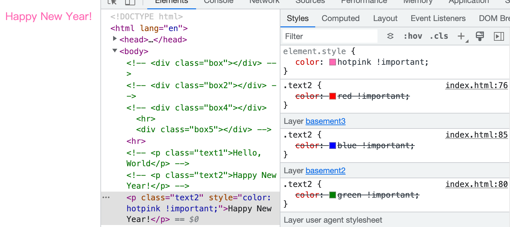

验证第二部分, 内联 `important` 声明优先级低于 `user-agent` 样式表的 `important` 声明
声明和 `user` 样式表的 `important` 声明声明. 首先创建一个 `button` 元素, 然后用浏览器插件屏蔽它, 再增加内联 `important` 声明
声明, 发现元素仍然被屏蔽.


第三部分, 就是 `transitions` 的优先级更高我看浏览器的实际表现与规范中所写不同, 俺也不知道为啥...

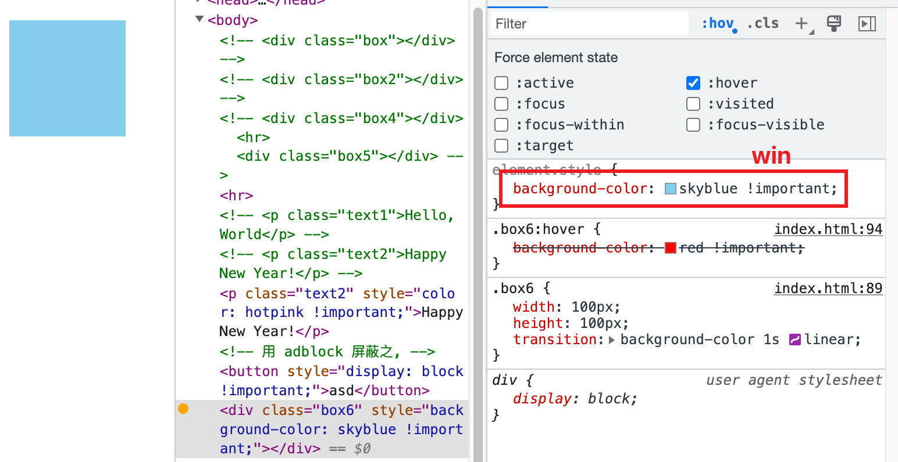

### !important 与权重
关于优先级与权重的说法, 我个人认为是不同来源的 `CSS` 样式表是「优先级」,同一来源的 `CSS` 规则之间是「权重」.

`!important` 并不影响 `CSS` 规则的权重, 但是却有关系. 如果两条 `CSS` 规则的权重不同, 那么使用 `!important` 的样式胜出, 与权重无关
```html
<div class="box7" id="box7">Where are you from?</div>
```
```css
#box7.box7 {
  color: red;      
}
.box7 {
  color: green !important;
}
```


如果两个 `CSS` 规则都是 `important` 规则, 那么权重高的胜出.

## !important 与简写属性
在简写属性中使用 `!important` 会使简写属性包括的所有属性都变成 `!important`. 
```css
p.smile {
  border-top: 1px solid black;
}
.smile {
  border: 5px solid red !important;
}
```
虽然 `.smile` 的权重低于 `p.smile`, 但是 `border` 中的 `!important` 使得 `border-top-width` 也变成了 `important`, 所以胜出.

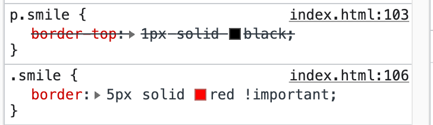

## !important 与自定义变量
```css
:root {
  --custom-bg-color: pink !important;
  --custom-bg-color: skyblue;
}
```
如果将 `!important` 添加到 `CSS` 变量声明中, 只有赋值时 `!important` 才起作用. 也就是将 `pink` 复制给变量 `--custom-bg-color` 时起了作用, 因为如果没有 `!important`, `--custom-bg-color` 的值应该是 `skyblue`.

赋值之后 `!important` 就从自定义属性上「脱落」了, 使用 `var()` 函数时并不会传递 `!important`.
```css
.box8 {
  background-color: var(--custom-bg-color);
  background-color: red;
}
```
从下图就可以看出, `.box8` 的背景色是 `red`, 因为关于背景色的两条 `CSS` 声明都是一般声明.

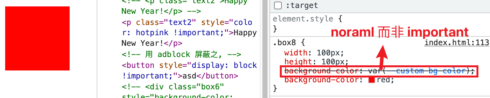

## !important 最佳实践
避免使用 !important 覆盖权重. 如果就是想创建 `important` 声明, 应该在代码中增加注释来解释这样做的原因并且告诉其他开发者不要覆盖 `important`.

即便要覆盖不在你控制下的高权重的样式, 比如使用 `id` 选择器的第三方库的样式, 你也不需要使用 `!important`. 可以考虑在第一个级联层中引入第三方样式文件. 只要第三方样式中不包含 `!important`, 你自己的样式就会覆盖第三方的样式.

如果真的需要覆盖外部样式表中的 `important` 样式, 仍然考虑创建一个级联层并在级联层中包含用来覆盖的 `CSS` 规则, 并将该级联层声明为第一个级联层. 我们来解释一下这个应该怎么做

首先在 `index.html` 中创建 `.box9` 元素, 并通过 `link` 标签引入 `index1.css`.
```html
<link rel="stylesheet" href="index1.css">
<div class="box9"></div>
```
在 `index1.css` 中编写 `.box9` 的样式, 并引入 `index2.css` 作为模拟的外部样式
```css
@layer basement;
@import "./index2.css" layer(basement);

.box9 {
  width: 100px;
  height: 100px;
  background-color: green;
}
```
下面是 `index2.css` 的代码
```css
.box9 {
  background-color: blueviolet !important;
}
```
可以看到此时页面中 `.box9` 的背景色是紫色, 这是因为如果级联层中的 `CSS` 声明有 `!important` 标志, 那么其优先级就会高过外部没有在级联层中的 `CSS` 声明.
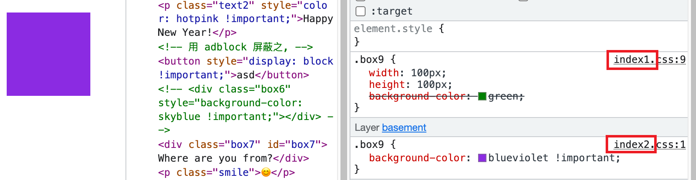

为了覆盖外部的 `important`, 我们也必须列用下面的特性: 即先声明的级联层中的 `important` 优先级高过后声明的级联层中的 `important`. 于是修改 `index1.css`. 
```css
@layer haha, basement;
@import url(index2.css) layer(basement);

@layer haha {
  .box9 {
    background-color: green !important;
  }
}

.box9 {
  width: 100px;
  height: 100px;
  background-color: green;
}
```

📖我们先创建了两个没有任何规则的级联层, 然后分别引入外部样式资源, 并在 `haha` 这个级联层中追加用来覆盖的 `CSS`. 这里有一个点值得注意 `@layer haha, basement;` 中 `haha` 是首先声明的, `basement` 是其次声明的.
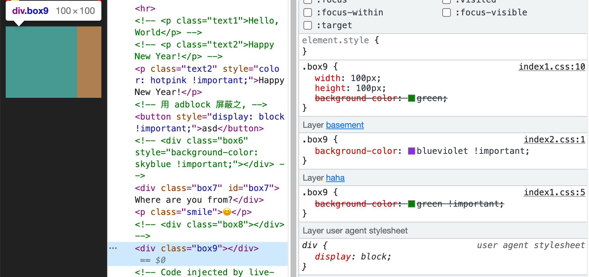
📖不该加分号的地方不要乱加, 别问我怎么知道的.

谢谢你看到这里😊
