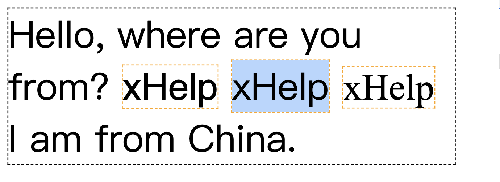

# vertical-align
> `vertical-align` 设置 `display` 值为 `inline`, `inline-block` 和 `table-cell` 的元素竖直对齐方式.

## 从 `line-height: normal` 究竟是多高说起
我们先来看一段代码, 分析一下为什么第二行的行高, 也就是 `line-height` 比第一行和第三行还要高?

```html
<p class="border-dash-black max-w-12em text-40">
  Hello, where are you from?
  <span class="border-dash-orange Helvetica">xHelp</span>
  <span class="border-dash-orange">xHelp</span>
  <span class="border-dash-orange Times-New-Roman">xHelp</span>
  I am from China.
</p>
```


要知道 line-height 就一定要先了解行盒子(line box), 因为 line-height 的定义就是行盒子的高度.

以上面的 `<p>` 标签为例, 在英文从左到右的书写顺序下, 每一个内联标签和不在内联标签中的文字都是从左到右排列的. 由于宽度限制, 一行不能容下更多文字的情况下就会另起一行排列. 上图中一共有 3 行, 每一行其实就是一个看不见行盒子. 行盒子就是要容下这一行中所有的元素.

我们知道, line-height 这个属性的值默认是 normal, 也就是说 `<p>` 的 line-height 值为 normal, 按理说每个行盒子的高度应该是一样的才对, 但是为什么第二行的行盒子就是比第一行和第三行的高呢? 原因出在 normal 这个值究竟是多少?

实际上, CSS 规范中并没有指定 normal 的值究竟是多少, 实际上不同的字体在设计时的 normal 值差别很大. 有人做过统计, Google Fonts 上 1000+ 的字体的 line-height 的 normal 计算值从 0.9+ 到 3.3+

### 很多专业术语
在深挖 normal 之前, 我们需要认识一些在字体设计领域的专业术语, 实际上其中大部分我们在 CSS 的世界中也常常听到.


- `baseline`: 小写字母 x 的下边界
- `x-height`: 小写字母 x 的高度, CSS 中有一个专门表示这个高度的单位 [ex](https://developer.mozilla.org/en-US/docs/Web/CSS/font-size#ex)
- `cap height`: 大写字母的高度. cap 是 Capital 的前三个字母, Capital 本身就有大写字母的意思
- `ascender`: 一些字母从 baseline 到高过 x-height 并且通常高过 cap height 的部分, 比如小写字母 b 的竖直笔画
- `descender`: 在 baseline 下面的部分, 比如 g 或者 p 的下半部分.
- `UPM(Unit Per Em)`: 首先 em 是 CSS 中表示一个字体大小的长度单位. UPM 的意思是在一个 em 的长度内逻辑单元的个数. 为什么是逻辑单元呢?
    - 在活字印刷技术当中, 传统的字体是刻在一个一个的方块上, 这个方块的高度是统一的, 通常与大写字母 M 的宽度相同. 这样做是为了让这个字母的比例是正方形的（因此命名为 em square）
    - 在字体设计领域, 不同类型的字体文件对 UPM 的定义也不相同. 比如 OpenType 字体的 UPM 通常为 1000. 而 TrueType 字体的 UPM 通常为 2 的整数次幂, 比如 1024 或 2048.
    - 所以如果 H 字母在 OpenType 字体设计时如果高度为 700, 那么 H 在以 10
    px 的 font-size 展示到浏览器页面时, 其高度就是 7px.
- `ascend`: baseline 到 ascender 的高度
- `ascend`: baseline 到 descender 的高度

### 实践出真知
有了上面的基础知识后, 我们就可以动手亲自看看 normal 的值究竟是多少了. 首先下载 [fontforge](https://fontforge.org/en-US/) 这款开源的字体设计软件, 然后下载 JetBrainsMono-Bold.ttf 这款开源字体文件.


可以看到 UPM 是 1000. 并且 Ascend 和 Descend 分别是 1020 和 -300. 当然截图中有两个上高和下深, 但使用的是 macOS, 所以选择了 HHead 上高和 HHead 下深.

如果我们在 CSS 中使用这款字体, 看看其高度是多少?


好奇 21.5 的高度是怎么计算的吗? 其实有了上面数据, 我们就可以计算在 font-size 默认 16px 大小的前提下, 字体的高度了, 公式很简单. 最后值为 21.12


最后算出来的高度就是 21.5. 在我几周前构思这篇文章的时候计算值还是 21. 有可能是因为我更新了浏览器, 也有可能是浏览器在渲染字体的时计算方式远比我这里列出的公式复杂.


不论什么原因, 我们都知道了字体的 line-height 的 normal 值是怎么大概计算出来的了.
## 参考
1. [https://iamvdo.me/en/blog/css-font-metrics-line-height-and-vertical-align](https://iamvdo.me/en/blog/css-font-metrics-line-height-and-vertical-align)
2. [https://christopheraue.net/design/vertical-align#centering-an-icon](https://christopheraue.net/design/vertical-align#centering-an-icon)
2. [https://developer.mozilla.org/en-US/docs/Web/CSS/vertical-align](https://developer.mozilla.org/en-US/docs/Web/CSS/vertical-align)


谢谢你看到这里😊