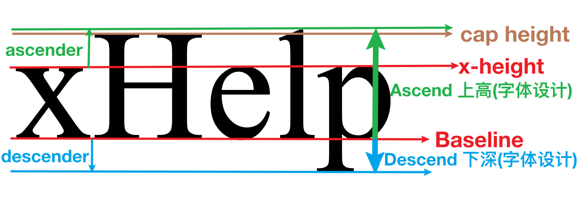

# 与其焦虑被 AI 取代或猜测前端是否已死, 不如看看 vertical-align 扎实你的基础!!!
> `vertical-align` 设置 `display` 值为 `inline`, `inline-block` 和 `table-cell` 的元素竖直对齐方式.

## 从 `line-height: normal` 究竟是多高说起
我们先来看一段代码, 分析一下为什么第二行的行高, 也就是 `line-height` 比第一行和第三行还要高?

```html
<p class="border-dash-black max-w-12em text-40 Helvetica">
  Hello, where are you from?
  <span class="border-dash-orange Helvetica">xHelp</span>
  <span class="border-dash-orange PingFang">xHelp</span>
  <span class="border-dash-orange Times-New-Roman">xHelp</span>
  I am from China.
</p>
```


要知道 `line-height` 就一定要先了解行盒子(`line box`), 因为 `line-height` 的定义就是行盒子的高度.

以上面的 `<p>` 标签为例, 在英文从左到右的书写顺序下, 每一个内联标签和不在内联标签中的文字都是从左到右排列的. 由于宽度限制, 一行不能容下更多文字的情况下就会另起一行排列. 上图中一共有 `3` 行, 每一行其实就是一个看不见行盒子. 行盒子就是要容下这一行中所有的元素.

我们知道, `line-height` 这个属性的值默认是 `normal`, 也就是说 `<p>` 的 `line-height` 值为 `normal`, 按理说每个行盒子的高度应该是一样的才对, 但是为什么第二行的行盒子就是比第一行和第三行的高呢? 原因出在 `normal` 这个值究竟是多少?

实际上, `CSS` 规范中并没有指定 `normal` 的值究竟是多少, 不同的字体在设计时的 `normal` 值差别很大. 有人做过统计, `Google Fonts` 上 `1000+` 的字体的 `line-height` 的 `normal` 计算值从 `0.9+` 到 `3.3+`

### 很多专业术语
在深挖 `normal` 之前, 我们需要认识一些在字体设计领域的专业术语, 实际上其中大部分我们在 `CSS` 的世界中也常常听到.


- `baseline`: 小写字母 `x` 的下边界
- `x-height`: 小写字母 `x` 的高度, `CSS` 中有一个专门表示这个高度的单位 [ex](https://developer.mozilla.org/en-US/docs/Web/CSS/font-size#ex)
- `cap height`: 大写字母的高度. `cap` 是 `Capital` 的前三个字母, `Capital` 本身就有大写字母的意思
- `ascender`: 一些字母从 `baseline` 到高过 `x-height` 并且通常高过 `cap height` 的部分, 比如小写字母 `b` 的竖直笔画
- `descender`: 在 `baseline` 下面的部分, 比如 `g` 或者 `p` 的下半部分.
    - 
- `UPM(Unit Per Em)`: 首先 `em` 是 `CSS` 中表示一个字体大小的长度单位. `UPM` 的意思是在一个 `em` 的长度内逻辑单元的个数. 为什么是逻辑单元呢?
    - 在活字印刷技术当中, 传统的字体是刻在一个一个的方块上, 这个方块的高度是统一的, 通常与大写字母 `M` 的`宽度`相同. 这样做是为了让这个字母的比例是正方形的（因此命名为 `em square`）
    - 在字体设计领域, 不同类型的字体文件对 `UPM` 的定义也不相同. 比如 `OpenType` 字体的 `UPM` 通常为 `1000`. 而 `TrueType` 字体的 `UPM` 通常为 `2` 的整数次幂, 比如 `1024` 或 `2048`.
    - 所以如果 `H` 字母在 `OpenType` 字体设计时如果高度为 `700`, 那么 `H` 在以 `10px` 的 `font-size` 展示到浏览器页面时, 其高度就是 `7px`.
- `ascend`: `baseline` 到 `ascender` 的高度
- `descend`: `baseline` 到 `descender` 的高度

### 实践出真知
有了上面的基础知识后, 我们就可以动手亲自看看 `normal` 的值究竟是多少了. 首先下载 [fontforge](https://fontforge.org/en-US/) 这款开源的字体设计软件, 然后下载 `JetBrainsMono-Bold.ttf` 这款开源字体文件.


可以看到 `UPM` 是 `1000`. 并且 `Ascend` 和 `Descend` 分别是 `1020` 和 `-300`. 当然截图中有两个上高和下深, 但我使用的是 `macOS`, 所以选择了 `HHead` 上高和 `HHead` 下深.

如果我们在 `CSS` 中使用这款字体, 看看其高度是多少?


好奇 `21.5` 的高度是怎么计算的吗? 其实有了上面数据, 我们就可以计算在 `font-size` 默认 `16px` 大小的前提下, 字体的高度了, 公式很简单. 最后值为 `21.12`


最后算出来的高度就是 `21.5`. 在我几周前构思这篇文章的时候计算值还是 `21`. 有可能是因为我更新了浏览器, 也有可能是浏览器在渲染字体的计算方式远比我这里列出的公式复杂.


不论什么原因, 我们都知道了字体的 `line-height` 的 `normal` 值是怎么大概计算出来的了. 我们也可以回答为什么第二行比第一行和第三行还要高了, 就是因为第二行中的 `PingFang` 字体在设计时的 `normal` 行高就比 `Helvetica` 的行高要高. 由于行盒子要容纳一行中所有元素, 所以相应的就变高了.

### 行距
下面就出现了新的问题, 既然第二行的行高最高并且是由 `PingFang` 字体撑起来, 那么其他字体呢? `Helvetica` 和 `Times New Roman` 如何处理高出来部分呢? 于是引入了`行距`的概念

如果我们用鼠标选中第二行出现蓝色背景, 你就会发现 `Helvetica` 和 `Times New Roman` 的橘色边框的区域处于蓝色背景垂直居中的位置. 达到这样效果就是把高出的部分一分为二, 上面放一份下面放一份. 这也就是行距.


行距翻译自英文 `leading`, 其中 `lead` 的意思是铅. 在印刷时为了增加两行文字之间的距离就会在行与行之间加上铅条. 但是注意区分行距是两行文字 `baseline` 之间的距离, 行高是文字高度加上行距.

## 进入正题
`vertical-align` 字如其名, 就是垂直方向的对齐. 但是这个属性只对 `display` 为 `inline`, `inline-block` 和 `table-cell` 的元素有效, 这里我们不讨论 `table-cell` 😅

`vertical-align` 的默认值就是 `baseline`, 也就是把子元素的 `baseline` 与父元素的 `baseline` 对齐. 我们先看一个面试题, 为什么图片的下面有一条空隙?

### 从一道面试题开始始
```html
<p class="border-dash-black">
  
</p>
```


要回答这个问题需要有两个知识点
1. `` 元素本身没有 ``baseline``, 又因为 `vertical-align` 的默认值是 `baseline`, 所以图片的下边缘刚好在父元素的 `baseline`.
2. `<p>` 元素中压根没有一个字, 如何确定其 `baseline` 呢? 非也非也, 有东西, 只是看不见.
    - [CSS 规范](https://www.w3.org/TR/CSS2/visudet.html#strut)中提到, 如果一个块元素由内联元素构成, 那么 `line-height` 指定了这个块元素的最低高度. 最低高度由两部分构成, `baseline` 上方的高度和 `baseline` 下方的高度. 好像每一个行盒子都以一个宽度为 `0` 的 `inline` 盒子开始, 这个 `inline` 盒子的 `font-size` 和 `line-height` 继承父元素, 规范中将这个宽度为 `0` 的 `inline` 盒子成为 `strut`, 其中文意思是支柱.
    - 有了 `strut` 即便块元素没有任何元素, 也可以确定块元素的 `baseline`.

有了上面两个概念, 解决这个问题就可以从两方面入手
1. 出现空隙的本质是因为 `line-height` 不是 `0`, 我们直接把 `line-height` 改成 `0` 或者把 `font-size` 改成 `0`. (修改 `font-size` 也有效可以理解是因为 `line-height` 是相对于 `font-size` 计算的)
2. 既然 `vertical-align` 的默认值是 `baseline`, 那有没有其他值, 使得图片下边缘刚好就在父元素的行盒子的下边缘呢?

你别说, 还真有, 就是 `bottom`.

### vertical 的关键字属性
1. 第一组: 与 `line box` 有关
    - `top`: 元素的 `上边界` 与 `line box` 的 `上边界` 对齐
    - `bottom`: 元素的 `下边界` 与 `line box` 的 `下边界` 对齐
2. 第二组: 与 `content area` 有关
    - `text-top`: 元素的 `上边界` 与 `content area` 的 `上边界` 对齐
    - `text-bottom`: 元素的 `下边界` 与 `content area` 的 `下边界` 对齐
    - `super`: 元素的 `baseline` 与 `content area` 的 `sup` 元素的 `baseline` 对齐
    - `sub`: 元素的 `baseline` 与 `content area` 的 `sub` 元素的 `baseline` 对齐
    - `middle`: 元素的高度中心在父元素的 `baseline` 加上 `x-height` 一半的地方

我知道你有点晕, 先别晕, 虽然 `<sup>` 和 `<sub>` 不常见, 但是在数学和化学中常常用到的标签.
```html
<p>
  <span>x<sup>2</sup>y</span>
  <span>H<sub>2</sub>O</span>
</p>
```


上面又出现了 `content area` 这个奇怪的新概念, 没关系, [CSS 2.1](https://www.w3.org/TR/CSS2/visudet.html#inline-non-replaced) 并没有定义 `inline` 元素的 `content area` 是什么, 在这里我们就简单理解成 `content-box`(📖注意下图中特别标注添加了 `padding` 的部分).


多一句, `vertical-align` 还支持数值类型和百分比类型的值, 其中百分比类型是相对于 `line-height` 计算的.

### 震惊! `baseline` 的移动
同样是 `inline-block`, 不同的内容竟然存在着 `baseline` 移动的情形, 希望平时没有注意的你这次一定要注意了.
```html
<p class="border-dash-black">
  x
  <span class="border-dash-orange inline-block p-10">xHelp</span>
  <span class="border-dash-orange inline-block p-10 w-40 overflow-hidden">xHelpxHelp</span>
  <span class="border-dash-orange inline-block p-10 w-5 h-5"></span>
</p>
```


同样都是 `display: inline-block` 的元素, 但是看起来 `baseline` 却大有不同
- `正常文字内容`: `baseline` 就是文字的 `baseline`
- `设置 overflow: hidden`: `baseline` 是元素的下边界
- `无内容`: `baseline` 是元素的下边界

所以在遇到不同类型的对齐需求时的一定要注意.

## 参考
1. [https://iamvdo.me/en/blog/css-font-metrics-line-height-and-vertical-align](https://iamvdo.me/en/blog/css-font-metrics-line-height-and-vertical-align)
2. [https://christopheraue.net/design/vertical-align#centering-an-icon](https://christopheraue.net/design/vertical-align#centering-an-icon)
3. [https://developer.mozilla.org/en-US/docs/Web/CSS/vertical-align](https://developer.mozilla.org/en-US/docs/Web/CSS/vertical-align)
4. [https://www.w3.org/TR/CSS2/visudet.html#strut](https://www.w3.org/TR/CSS2/visudet.html#strut)

谢谢你看到这里😊 还和我标题中说的一样, 我不知道未来是怎么样, 但我写这篇文章的时候焦虑有很多缓解, 因为我学到了很多知识, 最关键的是, 我行动了!!!