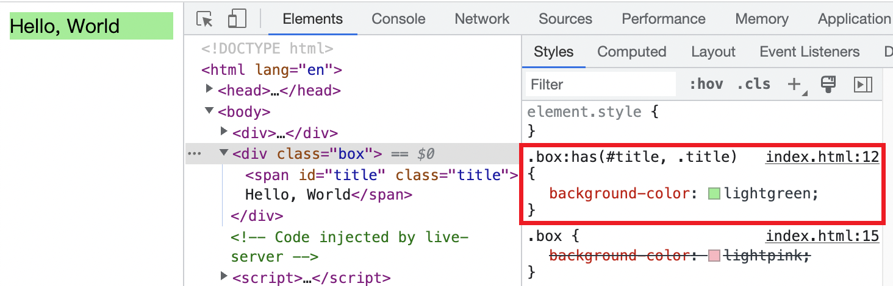
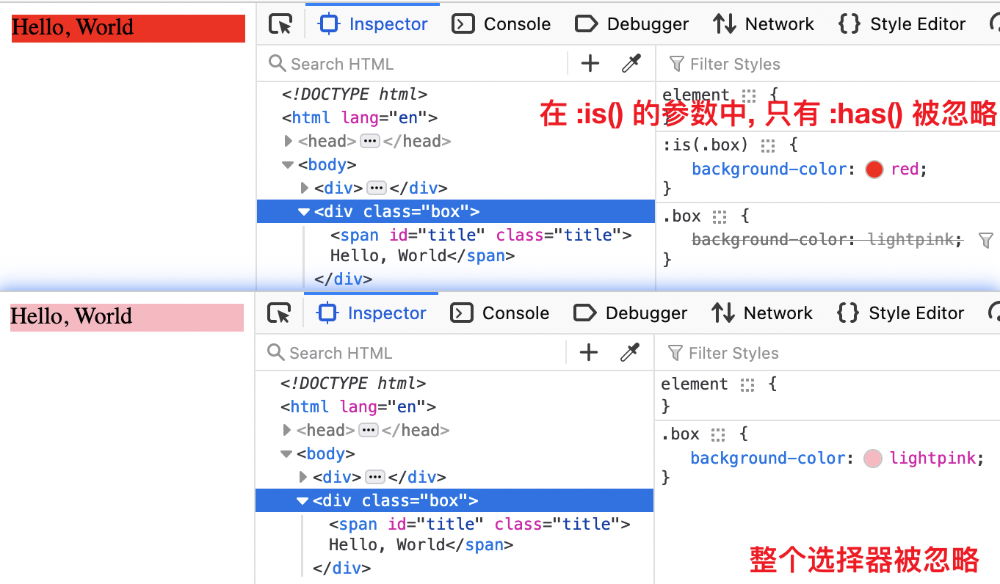
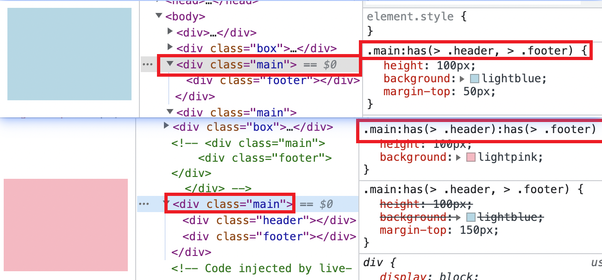
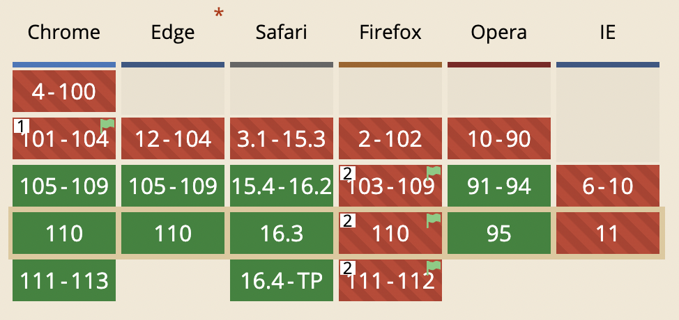

# :has() 父元素选择器来了?

我们先来看一个概念, `relative selector`. 

在 `CSS` 术语中, 我们通常所说的后代选择器、相邻兄弟选择器等是不准确的, 他们实际上被翻译作「组合器」(`combinator`). `relative selector` 选择器选中一个元素, 这个元素与一个或多个目标元素有关并且以一个组合器开头. 如果没有组合器, 那么默认就是后代选择器(一个空格 `' '`)

比如 [MDN](https://developer.mozilla.org/en-US/docs/Web/CSS/CSS_Selectors#relative_selector) 给出的例子 `dt:has(+ img)`. 其中 `relative selector` 就是 `+ img`, 整个选择器的意思就是`每个 dt, 并且该 dt 有 img 元素为其相邻兄弟`.

回到正题, `:has()` 表示一个元素 `A`, 这个伪元素选择器接收一个 `relative selector` 列表作为参数, 如果参数中任何一个 `relative selector` 在锚定 `A` 时至少匹配一个元素. 

这句话比较绕, 我们以 `dt:has(+ img)` 为例子解释, 即 `+ img` 在以所有 `dt` 为锚点锚定时, 匹配到了至少一个 `dt` 的相邻兄弟 `img`. 所以 `:has()` 的全名是**关系**伪类元素选择器, 突出关系的意思就是 `:has()` 和其参数是有关系的.

`:has()` 的出现让很多人高呼 CSS 终于支持父元素选择器了, 是的, `:has()` 代表了一种表示父元素或者相邻前一个元素的方式.
## 权重
`:has()` 的权重规则与 `:is()` 和 `:not()` 一样, 即参数中权重最大的选择器的权重.
```html
<div class="box">
  <span id="title" class="title">Hello, World</span>
</div>
```
```css
.box:has(#title, .title) {
  background-color: lightgreen;
}
.box {
  background-color: lightpink;
}
```
`.box:has(#title, .title)` 最终的权重与其参数列表中的 `#title` 和 `.title` 权重中最大的 `ID` 选择器的权重一样.

## 语法
如果浏览器不支持 `:has()`, 那么`整个选择器`都将被忽略. 除非 `:has()` 出现在 `:is()` 或 `:where()` 这种参数是宽容选择器列表中. 即不支持的选择器会被忽略, 不影响其他选择器

比如目前 `Firefox` 在未设置 `layout.css.has-selector.enabled` 为 `true` 的情况下, 是不支持 `:has()` 的
```css
.box:has(#title, .title) {
  background-color: lightgreen;
}
.box {
  background-color: lightpink;
}
:is(.box, :has(span)) {
  background-color: red;
}
```


`:has()` 不能嵌套在另一个 `:has()` 中.

`:has()` 的参数中不能使用伪元素选择器, `:has()` 的锚点元素 `A` 也不能是伪元素.

### 表示「或」和「与」
如果 `:has()` 的参数是用逗号分隔, 比如 `A:has(a, b)`, 表示「或」的条件, 即 `A` 的后代中有 `a` 或者 `b` 时 `A` 就会被选中.

如果多个 `:has()` 链式调用, 比如 `A:has(a):has(b)`, 表示「与」的条件, 即 `A` 的后代中有 `a` 和 `b` 时 `A` 才会被选中.

```html
<div class="main">
  <div class="footer"></div>
</div>
<div class="main">
  <div class="header"></div>
  <div class="footer"></div>
</div>
```
```css
.main:has(> .header):has(> .footer) {
  height: 100px;
  background: lightpink;
}
.main:has(> .header, > .footer) {
  height: 100px;
  background: lightblue;
}
```


## 浏览器兼容性
从 [caniuse](https://caniuse.com/?search=%3Ahas) 来看, 这个属性将来会大放异彩



谢谢你看到这里😊