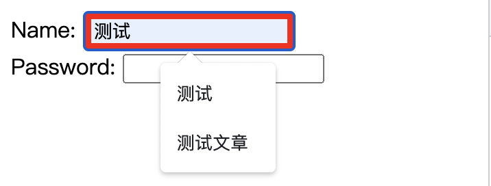
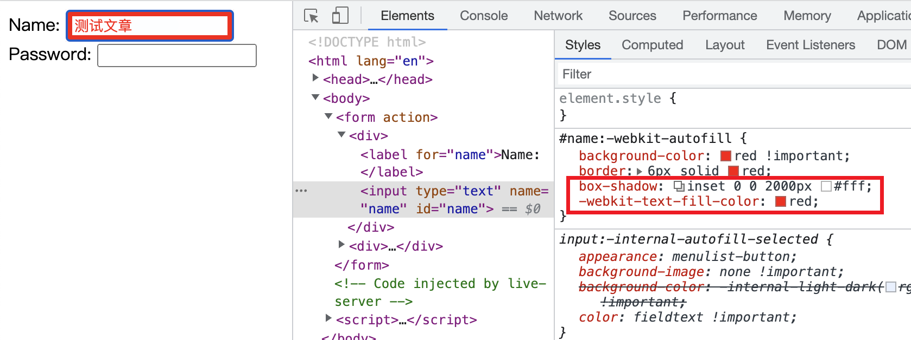
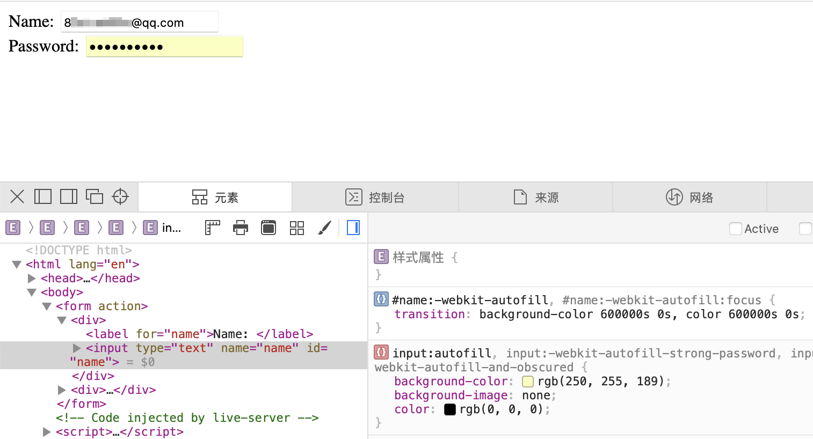
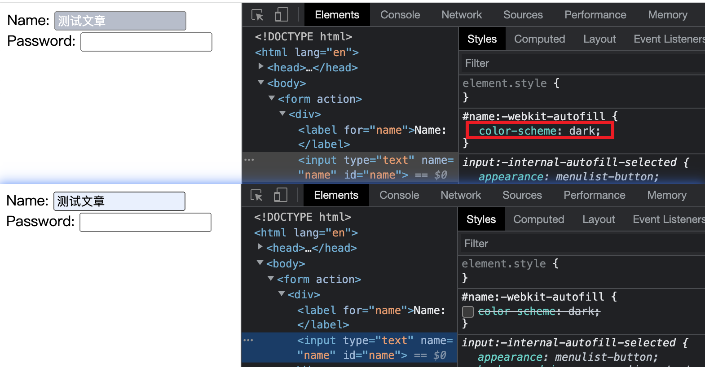

# :autofill 如何覆盖浏览器自动填充表单的样式与

`:autofill` 伪类匹配浏览器自动填充值的 `input` 元素. 如果用户继续编辑这个元素内容就会停止匹配.

```css
#name:autofill {
  background-color: red !important;
  border: 6px solid red;
}
#name:-webkit-autofill {
  background-color: red !important;
  border: 6px solid red;
}
```
```html
<form action="">
  <div>
    <label for="name">Name: </label>
    <input type="text" name="name" id="name">
  </div>
  <div>
    <label for="password">Password: </label>
    <input type="password" name="password" id="password">
  </div>
</form>
```

🤔️好像生效了, 又好像没有生效? 因为只有边框的颜色发生了改变, 而背景色压根儿没变. 这是为啥? [MDN](https://developer.mozilla.org/en-US/docs/Web/CSS/:autofill) 是这么解释的, 许多浏览器在自动填充时使用了 `!important`, 这使得其样式无法被覆盖. 至于为什么不能被覆盖, 请看我之前写过的文章 [CSS 重新认识 !important 肯定有你不知道的](https://juejin.cn/post/7198626288135028791).

`Chrome` 浏览器就这样做了, 如下图, 我们是没有办法通过 `background-color`, `color` 和 `background-image` 三个属性来覆盖其自动填充的样式.


### 如果覆盖?
其实 [stackoverflow](https://stackoverflow.com/questions/2338102/override-browser-form-filling-and-input-highlighting-with-html-css) 给出了一些答案, 我们现在来看. 首先, 就是使用向内的 `box-shadow`, 就是关键词 `inset`, 其本身就有`嵌入`的意思, 所以用在阴影上就表示阴影是向内的.

```css
#name:-webkit-autofill {
  background-color: red !important;
  border: 6px solid red;
  box-shadow: inset 0 0 2000px #fff;
  -webkit-text-fill-color: red;
}
```
还有一个 `-webkit-text-fill-color` `CSS` 属性, 其用来指定文本的`填充`颜色, 如果这个属性没有设值, 就是用 `color`, 其兼容性很好.
.

多说一嘴, 输入框外边的蓝色框框是 `outline`, 不属于自动填充的样式哦(^_^)~


还有一个方法, 也是 [stackoverflow](https://stacko(^_^)verflow.com/questions/61083813/how-to-avoid-internal-autofill-selected-style-to-be-applied). 不过这个方法有一定的不合适, 特别在前面的方法使用起来没有明显缺陷的情况下. 这个方法就是使用过渡, 尽可能延长颜色变化的时长, 使得看起来颜色好像没有变化. 
```css
#name:-webkit-autofill,
#name:-webkit-autofill:focus {
  transition: background-color 600000s 0s, color 600000s 0s;
}
```
这个方法在我本地最新的 `Chrome` 没有效果, 在 `Safari` 有效果. 不论如何, 这是一种思路吧.

## 暗色模式
通过 `color-scheme: dark;` 指定元素在自动填充时以暗色主题渲染. 可以看到暗色背景下, 背景色颜色更深. 实际上应该适应系统的颜色模式, 在暗色模式下使用 `dark`, 否则使用 `light`, 这里不具体展开

## 兼容性
谷歌浏览器和比较久的 `Firefox` 和比较久的 `Safari` 还需要使用 `-webkit-` 私有前缀. 所以保险的写法是下面这样, 都写上
```css
input:autofill,
input:-webkit-autofill {
}
```

谢谢你看到这里😊