# CSS :nth-child 
> :nth-child 伪类根据元素在同级元素中的位置来匹配元素.

<!-- TOC -->

- [CSS :nth-child](#css-nth-child)
  - [语法](#%E8%AF%AD%E6%B3%95)
    - [值是关键词 odd/even](#%E5%80%BC%E6%98%AF%E5%85%B3%E9%94%AE%E8%AF%8D-oddeven)
    - [An+B](#anb)
    - [最新的 [of S] 语法](#%E6%9C%80%E6%96%B0%E7%9A%84-of-s-%E8%AF%AD%E6%B3%95)
    - [权重](#%E6%9D%83%E9%87%8D)
  - [浏览器兼容性](#%E6%B5%8F%E8%A7%88%E5%99%A8%E5%85%BC%E5%AE%B9%E6%80%A7)

<!-- /TOC -->

很简单的例子, 来直觉上理解这个伪类的意思
```html
<ul>
  <li class="me">Apple</li>
  <li>Banana</li>
  <li class="me">Peach</li>
</ul>
<ul>
  <li>Apple</li>
  <li class="me">Banana</li>
  <li class="me">Peach</li>
</ul>
```
```css
.me:nth-child(1) { background-color: salmon; }  
```
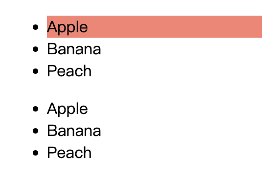

你也许会奇怪🤔, 为什么下边一组的 `Banana` 背景不是红色呢? 因为 `.me:nth-child(1)` 表示**选中同级元素中的第一个元素并且该元素 class 包含 me✅**, 注意**不是**选中第一个 `class` 包含 `me` 的元素. 所以, 如果同级元素中的第一个元素的 `class` 不包含 `me`, 也不会选中.

## 语法
在 `:nth-child()` 语法中, 统计的元素包含同级的任何类型元素.

`:nth-child()` 的完整语法如下, `?` 前面的 `[]` 中内容表示可选, 稍后会介绍这种最新的部分. `:nth-child()` 只接受一个参数, 该参数描述匹配同级元素的模式, 元素索引从 `1` 开始, 注意不是 `0`.
```
:nth-child(<nth> [of S]?) { ... }
```

### 值是关键词 odd/even
- `odd`: 表示在同级元素中奇数位置的元素: 1、3、5...
- `even`: 表示在同级元素中偶数位置的元素: 2、4、6...

比如, 在一个表格中我们希望相邻行的背景颜色不同, 这样方便阅读, 就可以这样写
```css
tr:nth-child(even) { background-color: azure; }
```
```html
<table border="1">
  <thead>
    <tr>
      <th>NAME</th><th>AGE</th> <th>COUNTRY</th>
    </tr>
  </thead>
  <tbody>
    <tr>
      <td>Levi</td> <td>18</td> <td>China</td>
    </tr>
    <tr>
      <td>June</td> <td>23</td> <td>USA</td>   
    </tr>
    <tr>
      <td>JiaXin</td> <td>20</td> <td>China</td>
    </tr>
    <tr>
      <td>Mike</td> <td>22</td> <td>UK</td>
    </tr>
  </tbody>
</table>
```
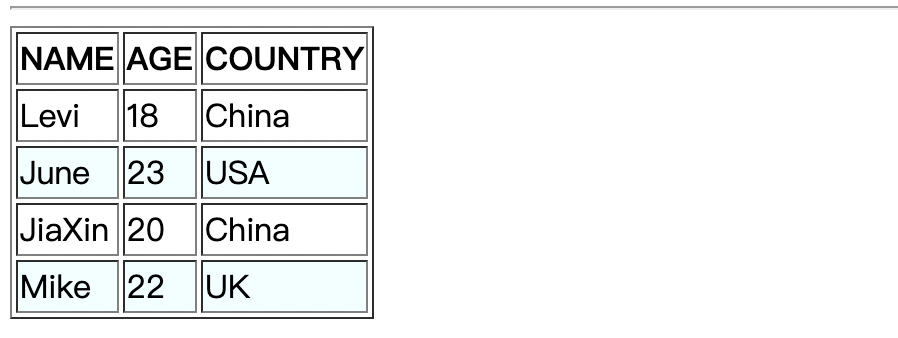

### An+B
不论是 `odd` 还是 `even`, 他们都是更普遍表达的特殊情况的简便写法. 使用 `An+B` 这种记号你可以自由定制你的匹配规则
- `A`: 整数步长
- `n`: 非负整数, 从 `0` 开始
- `B`: 整数偏移量

为什么我们说 `odd/even` 是 `An+B` 特殊取值时的简便写法呢? 因为
- `odd` -> `:nth-child(2n+1)`
- `even` -> `:nth-child(2n)`

下面我们就看看 `An+B` 取不同值的特定用法吧
- `:nth-child(2)`: 表示第二个元素
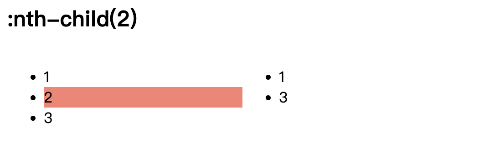
```css
.two:nth-child(2) { background-color: salmon; }
```
```html
<ul class="flex-1">
  <li class="two">1</li>
  <li class="two">2</li>
  <li class="two">3</li>
</ul>
<ul class="flex-1">
  <li class="two">1</li>
  <li class="two" hidden>2</li> <!-- !!! -->
  <li class="two">3</li>
</ul>
```
从上图中可以看到, 左边的符合我们的预期, 第二个元素并且 `class` 是 `two` 的元素背景红了, 但是左边的好像不太行, 因为 `display` 为 `none` 的元素也被考虑进来了!!!

- `:nth-child(3n)`: 表示第3、6、9...个元素.
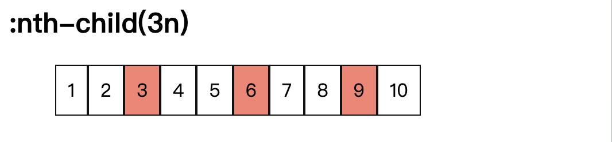
- `:nth-child(n+5)`: 表示第5、6、7、8、9...个元素. 也就是第五个和后面的元素.
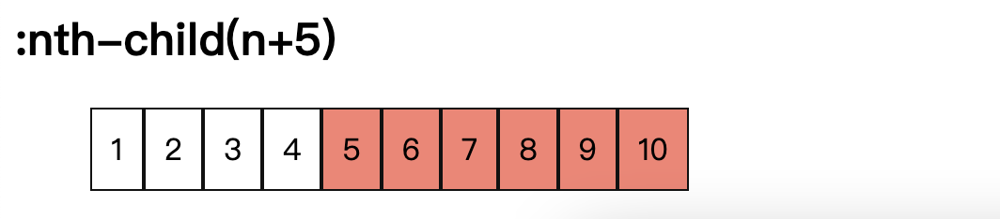
- `:nth-child(-n+3)`: 表示第1(-2+3)、2(-1+3)、3(-0+3)个元素. 如果 `n` 的值继续增加, 就会选中第0、-1、-2...个元素, 负数位置的元素不存在并且元素是从 1 开始索引的.
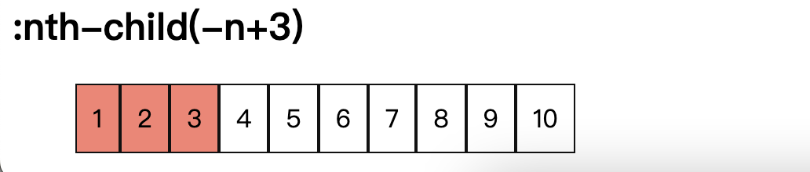
- `:nth-child(4n+1)`: 表示第1、5、9...个元素
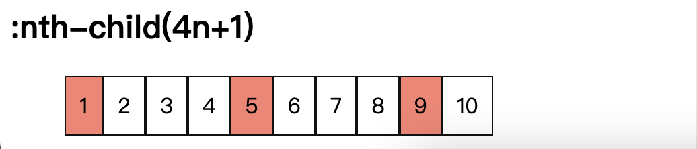
- `:nth-child(n)`: 表示每一个元素
- `:nth-child(1)`: 表示第 1 个元素, 是 `n` 为 1 更特殊的情况
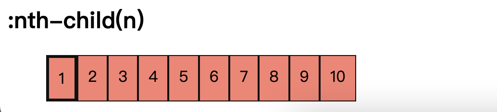
```css
.n:nth-child(n) {
  background-color: salmon;
}
.n:nth-child(1) {
  border-width: 3px;
}
```
- `:nth-child(n+3):nth-child(-n+5)`: 表示第3、4、5个元素. 用于选择一个具有上下限范围内的元素


### 最新的 [of S] 语法
目前 `:nth-child()` 只能选择特定位置的元素, 比如 `.name:nth-child(-n+3)` 只能选择元素中 `class` 包含 `name` 的并且是前三个元素. 但是, 如果我们想要选择前三个 `class` 包含 `name` 的元素呢? 那就是最新的 `of S` 语法

下面的例子
```css
.class1 > .item:nth-child(-n+3 of .name) {
  background-color: salmon;
}
```
```html
<ul class="class1">
  <li class="name item">1</li>
  <li class="item">2</li>
  <li class="item">3</li>
  <li class="item">4</li>
  <li class="item">5</li>
  <li class="name item">6</li>
  <li class="item">7</li>
  <li class="item">8</li>
  <li class="name item">9</li>
  <li class="name item">10</li>
</ul>
```
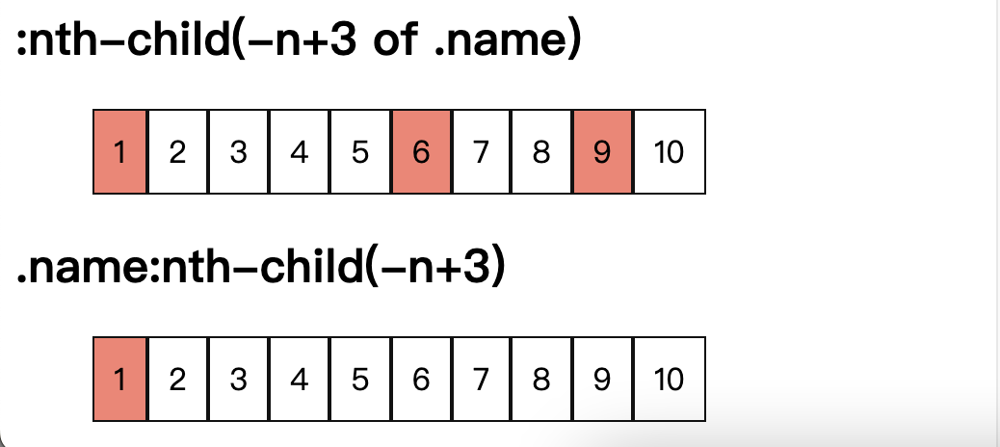
📖一定要留意两者的不同哦. 

你可能问新的语法有什么用呢, 当然有用啦, 比如我们在给表格添加间隔背景时, 如果出现一行元素被隐藏的情况, 会出现什么效果呢?
```css
tr:nth-child(even) {
  background-color: azure;
}
```
```html
<tbody>
  <tr></tr>
  <tr hidden></tr>
  <tr></tr>
  <tr></tr>
</tbody>
```
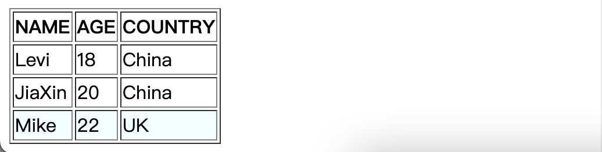
哇! 被隐藏的那一行也被考虑进入了, 按理说应该只有第二行(`JiaXin`)才有阴影的, 怎么办呢? 使用 `of S`. 我们不是要选择偶数行, 而是要选择所有 `hidden` 为 `false` 的偶数行.
```css
tr:nth-child(even of :not([hidden])) {
  background-color: azure;
}
```
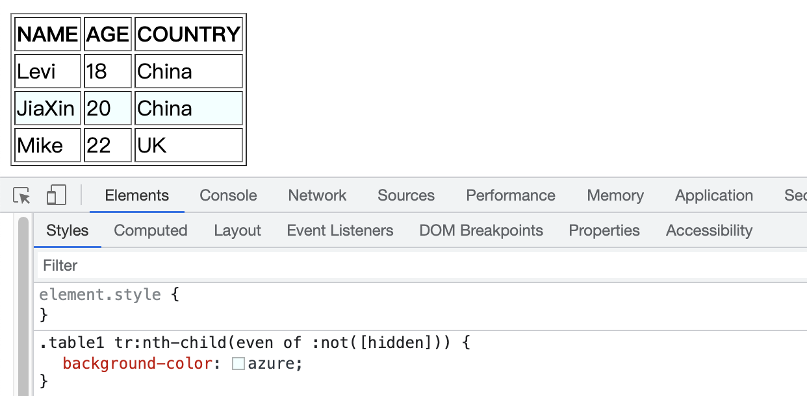
### 权重
`:nth-child()` 的权重是单个伪类的权重. 如果使用 `of S` 语法, 那么就是单个伪类的权重加上 `S` 中权重最高的权重值.
```html
<div>
  <div id="country1" class="country1">CHINA</div>
</div>
```
```css
.country1:nth-child(1) {
  color: blue; /** WIN  */
}
.country1 {
  color: red;
}
```
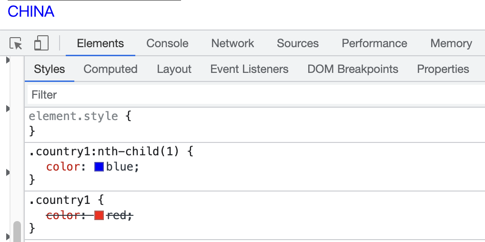

如果我们再加一个呢?
```css
:nth-child(1 of #country1.country1) {
  color: green; /** WIN */
}
```
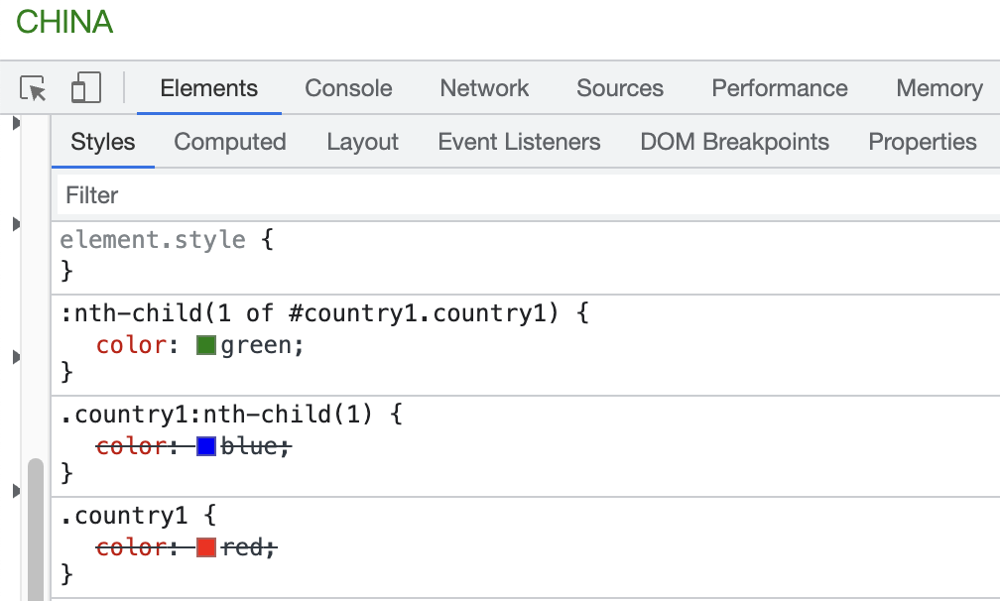
## 浏览器兼容性
根据 [MDN](https://developer.mozilla.org/en-US/docs/Web/CSS/:nth-child#browser_compatibility), `of S` 的新语法需要比较新的浏览器支持
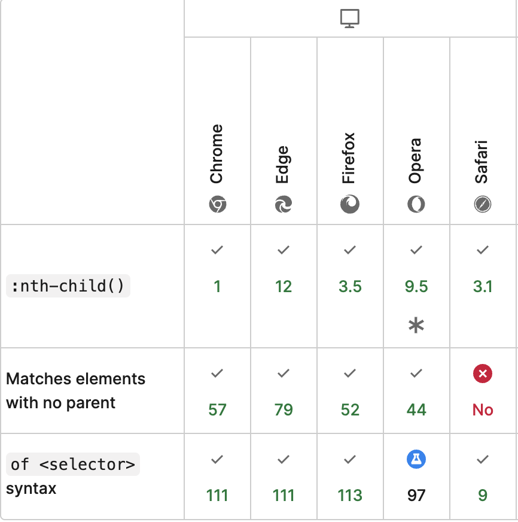

谢谢你看到这里😊
