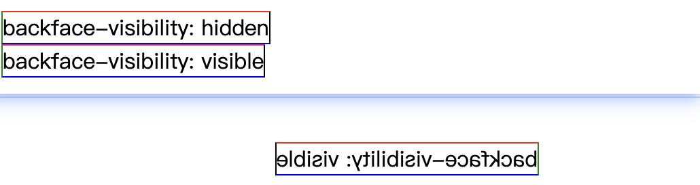
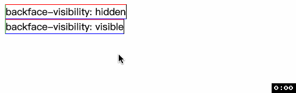

# backface-visibility
> 设置当以元素背向用户时背面是否可见.

元素的背面是正面的镜像. 尽管在二维平面内背面不可见, 但是让元素通过 `transform` 在三维空间转动时背面可能可见.

`backface-visibility` 只有两个关键词属性
- `hidden`: 背面不可见
- `visible`: 背面可见. 默认值

下图中, 分别给上下元素的 `backface-visibility` 属性设置 `hidden` 和 `visible`. 

来看个动图, 当元素沿着右侧边界转动 `180` 度后, 设置 `hidden` 的元素就不可见了.

谢谢你看到这里😊