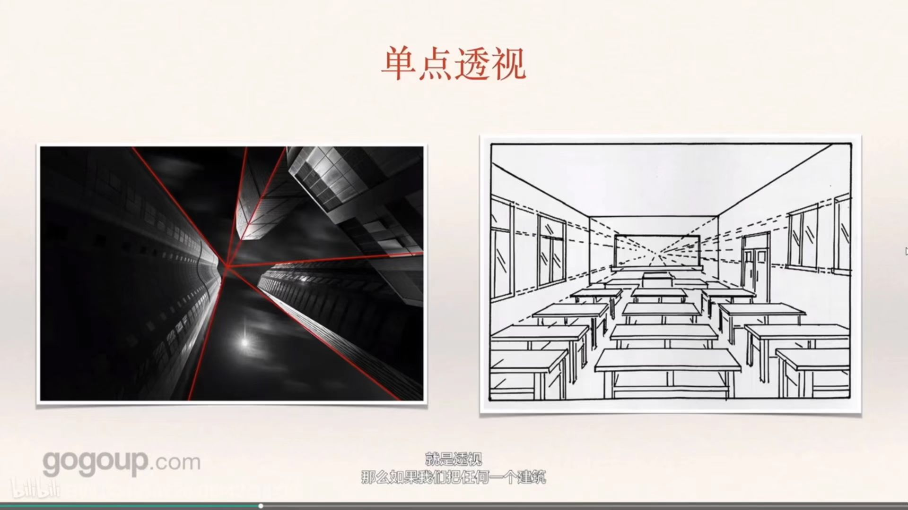
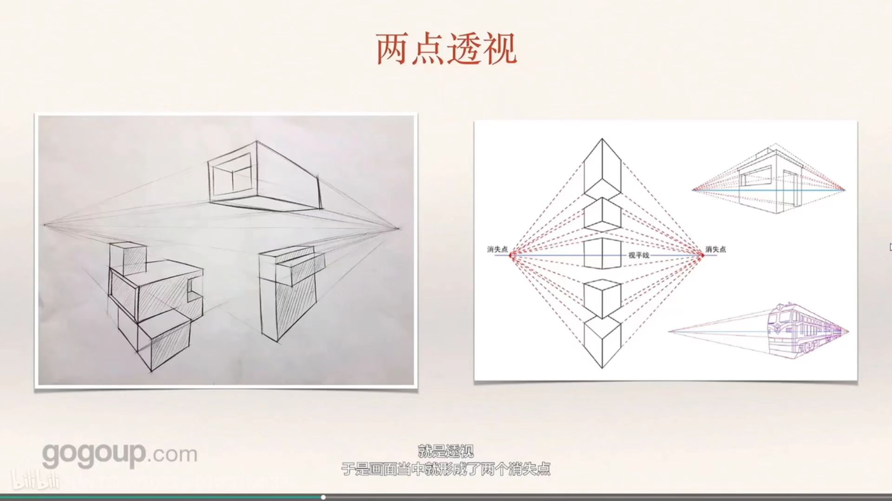
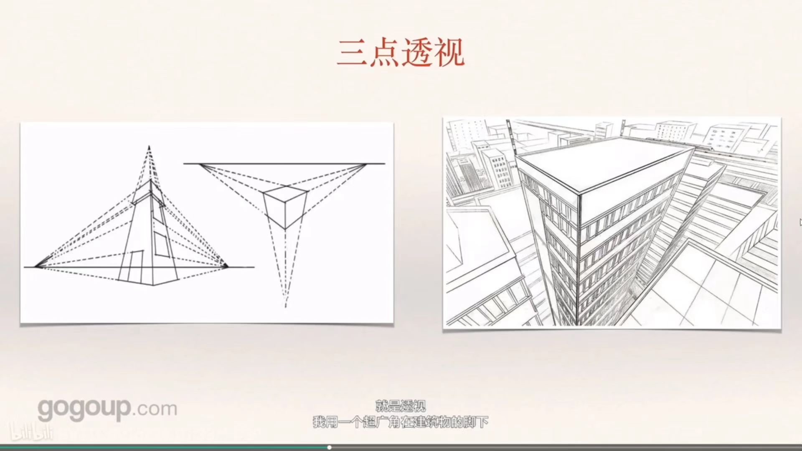
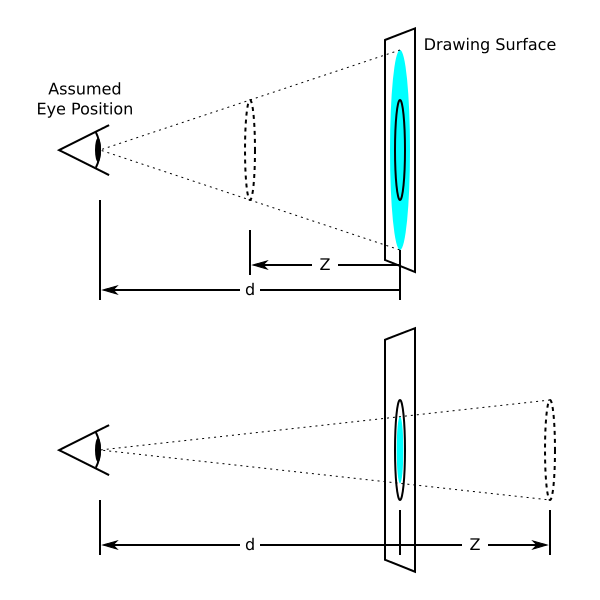

# CSS 3D transform-style & perspective & perspective-origin

## transform-style
> 设置元素的子元素是位于 3D 空间还是和元素同一平面.

这个属性不可继承, 因此需要为元素的所有非叶子节点分别设置.

## 透视
首先我们来说 perspective 单词的意思就是 [透视（画）法](https://dictionary.cambridge.org/dictionary/english-chinese-simplified/perspective). 伴随着透视画法的就是透视规则, 如何在 2D 平面呈现出 3D 的立体效果.

其中[wikipedia](https://zh.wikipedia.org/wiki/%E6%B6%88%E5%A4%B1%E7%82%B9)的介绍是, 两条平行的线条会消失于远方的一点(消失点), 比如我们在看两条平行的铁轨会在相较于远方很远很远的某一点. 这就是在 2D 平面表达 3D 效果的方法, 来源于人们的视觉经验——大小相同的物体, 近的总比远的大.

关于什么是消失点可以看[bilibili 消失点](https://www.bilibili.com/video/BV1TQ4y1o72e/)的介绍视频. 主要分为三种透视
- `单点透视`: 即平面中只有一个消失点. 这时候平面中物体的正面是和平面是平行的, 比如下图中的黑板(侵删)

- `两点透视`: 平面中有两个消失点, 这是平面中物体两个面相交的线与平面平行.

- `三点透视`: 平面中有三个消失点, 即物体没有任何一部分与平面平行

## perspective
> 设置 z=0 的平面与用户之间的距离, 以便给 3D 定位的元素一些视角.

图来自 [https://drafts.csswg.org/css-transforms-2/#transform-rendering](https://drafts.csswg.org/css-transforms-2/#transform-rendering), 侵删

但是 CSS 中的透视和上面介绍的透视又有些不同. 我们来看看下图中每个部分的意义, 首先实线元可以理解为没有透视的平面上的一个圆, d 就是 perspective 的值, 通过修改 Z 的值让实线圆移动到虚线圆的位置, 最后所看到的也就是蓝绿色的圆. Z 是可以通过 translateZ 调整的.

## perspective-origin
> 决定了观察者的位置. 在 perspective 作为消失点(vanishing point)使用.

通常回家观察者眼睛的位置(消失点)在正中心, 但是消失点的位置是可以改变的. 例如

Thank you for reading this :)