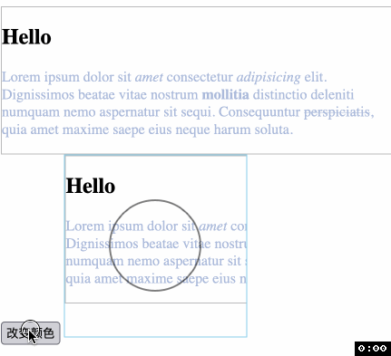
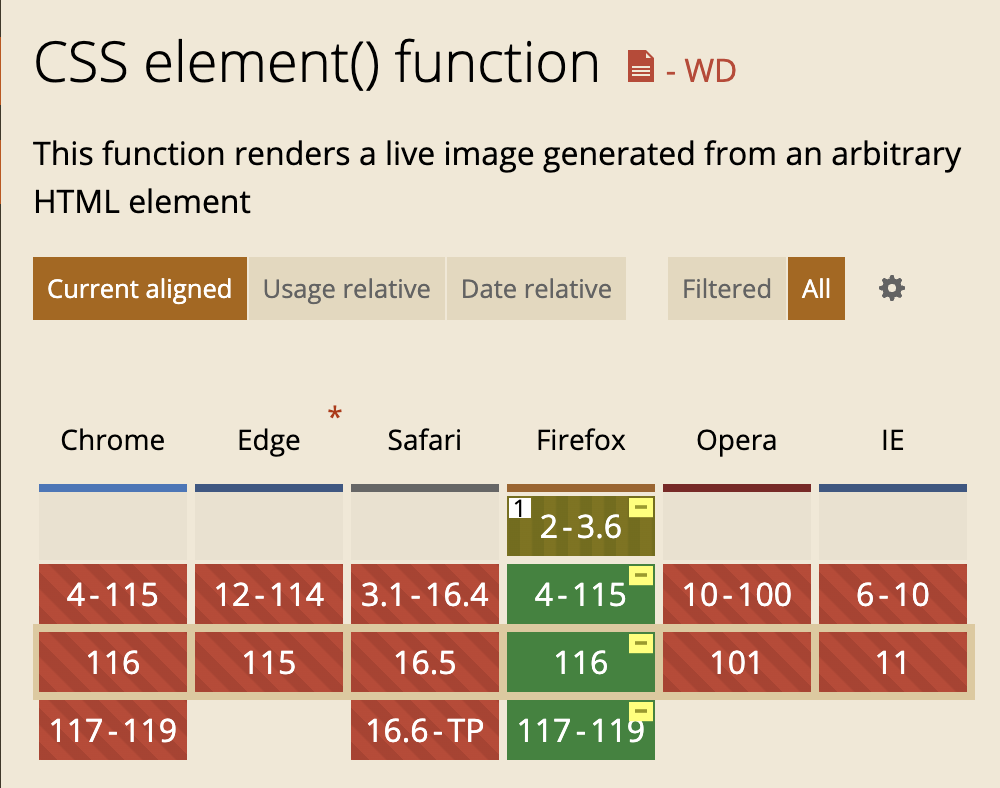

# `CSS` 函数 `element()`
> **(实验性属性, 仅 Firefox 支持).** 从任意 `HTML` 元素定义一个 `<image>` 元素. 

生成的图片是动态的, 意味着如果对应的 `HTML` 元素发生了改变, 那么使用 `element()` 的 `CSS` 属性会自动更新.

一个特别有用的 `element()` 使用场景是在一个 `<canvas>` 元素中渲染一个图片并将其作为背景使用. 马上来看例子!

首先创建一个任意的元素, 最好这个元素的内容花里胡哨一些.
```html
<section id="source" style="border: 1px solid #bbb;">
  <h1>Hello</h1>
  <p id="content" style="color: salmon;">Lorem ipsum dolor sit <em>amet</em> consectetur <cite>adipisicing</cite> elit. Dignissimos beatae vitae nostrum <strong>mollitia</strong> distinctio deleniti numquam nemo aspernatur sit sequi. Consequuntur <del>perspiciatis</del>, quia amet maxime saepe eius neque harum soluta.</p>
</section>
```
然后创建一个 `<canvas>` 并使用 `element()` 创建其背景
```html
<canvas width="200px" height="200px" style="background: -moz-element(#source) no-repeat; border: 1px solid skyblue;"></canvas>
```
我们只在 `<canvas>` 中绘制了一个圆, 然后使用 `element()` 为 `<canvas>` 绘制了背景并且在动态修改原 `HTML` 元素时, `<canvas>` 的背景也同时立即修改.



## 语法
`element(id)` 其中 `id` 是 `element()` 使用的元素的 `id`, 即对应元素的 `id` 属性.

在任何可以使用图片为值的地方都可以使用 `element()` 替换对应的图片值, 比如 `background`, `background-image`, `border-image`, `border-image-source`.

## 兼容性
非常差! 目前只有 `Firefox 57` 及以上版本才可以使用 `element()` 并且要加上私有前缀 `-moz-`.




谢谢你看到这里😊