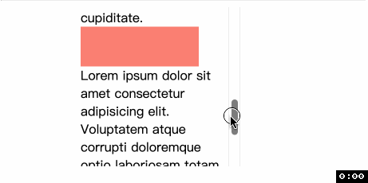
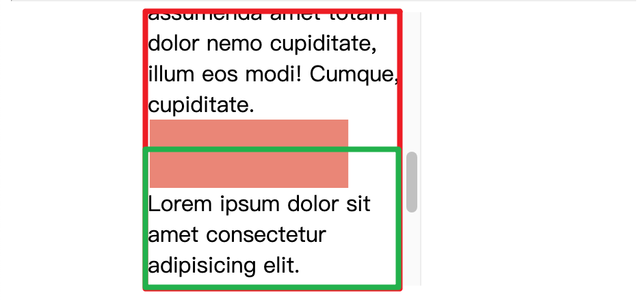

# CSS 滚动驱动的动画
好消息好消息, CSS 规范中出现了以页面滚动驱动(scroll-driven)的动画; 好家伙好家伙, 跟动画有关的新的新增 CSS 属性有 12 个, Chrome 115 已全面支持, 快来尝试吧!

滚动驱动的动画是 web 中常见的动效模式, 比如 [苹果官网的产品介绍页面](https://www.apple.com.cn/ipad-pro/), 那种随着页面滚动文字图片徐徐出现的体验真的棒极了. 滚动驱动的动画当然离不开滚动容器(scroll container), 容器在滚动时会处在不同的滚动位置, 那么滚动动画与这个滚动位置有关系. 当容器上下滚动时, 动画向前或向后进行.

在新的动画 API 出现前, 实现这样的效果都是在滚动的回调事件中通过 JS 实现, 但是使用新的 CSS 属性可以让我们声明式地实现以前需要通过 JS 实现的动画. 可以[👉点击这里👈](https://scroll-driven-animations.style/)先睹为快.

## 两种时间线(timeline)
我不知道中文改怎么翻译我就不翻译了...😅
- `scroll progress timeline`: 通过从上到下(或从左到右)滚动一个可滚动元素(也被称为 `scrollport` 或 `scroller`)来推进这个时间线. 滚动过程中的位置被转化为滚动进度的百分比——滚动刚开始是 `0%`, 滚动结束是 `100%`. 📖这个过程是可以反复的, 即上下(或左右)来回滚动.
  - 
- `view progress timeline`: 这个时间轴是基于元素(`subject`)在滚动容器(`scroller`)中的可见性变化. 也就是说, 元素在容器的可见性被转化为百分比——默认情况下, 当元素刚刚出现在容器边缘时, 为 `0%`, 当元素经过滚动到了对边时, 为 `100%`.
  - 可以类比 `IntersectionObserver` 是如何工作的.
  - 

对比两个时间线, 可以发现他们都会追踪 `scroller` 的滚动偏移, 但是 `view progress timeline` 是根据元素在 `scroller` 中的位置决定整个滚动进度.

另外, 有时候你可能不想让动画推迟开始或者提前结束, 也就是自定义动画的位置, 这可以通过两种方式实现
- 1️⃣ 第一是在定义 `@keyframes` 时, 通过改变关键帧来控制动画在滚动过程中何时开始, 何时结束.
  - 比如下面的例子, 我们设定元素滚动到 30% 进度时才开始应用动画, 80% 进度时动画要全部结束
  - ```css
    @keyframes bg-scroll1 {
      30% {
        transform: scaleX(0.3);
      }
      80% {
        transform: scaleX(1);
      }
    }
- 2️⃣ 第二是 `view progress timeline` 提供了专门的关键字用调整元素什么时候才算开始出现、什么时候算到达对边.
  - 下面代码的意思是我指定元素在刚开始出现时(默认值)算刚开始出现, 在元素完全显示在滚动容器中并且距离出现位置 50% 时算到达对边.
  - ```css
    animation-range: entry cover 50%;
  - 
  - 如果看了上面的动图还不懂, 看下面. 如果我们没有 animation-range, 那么元素动画应用的区域是红框, 但由于我们设置了要在 cover 50% 的时候算到达对边, 因此动画应用的区域变成了绿框 
  - 


谢谢你看到这里😊