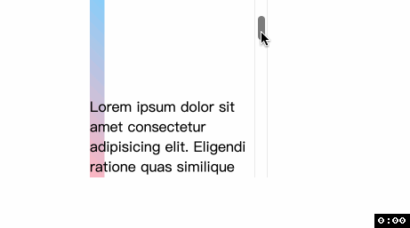
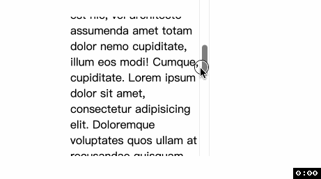

# CSS 滚动驱动的动画
好消息好消息, `CSS` 规范中出现了以页面滚动驱动(`scroll-driven`)的动画; 好家伙好家伙, 跟动画有关的新的新增 `CSS` 属性有 `12` 个, `Chrome 115` 已全面支持, 快来尝试吧!

滚动驱动的动画是 `web` 中常见的动效模式, 比如 [苹果官网的产品介绍页面](https://www.apple.com.cn/ipad-pro/), 那种随着页面滚动文字图片徐徐出现的体验真的棒极了. 滚动驱动的动画当然离不开滚动容器(`scroll container`), 容器在滚动时会处在不同的滚动位置, 那么滚动动画与这个滚动位置有关系. 当容器上下滚动时, 动画向前或向后进行.

在新的动画 `API` 出现前, 实现这样的效果都是在滚动的回调事件中通过 `JS` 实现, 但是使用新的 `CSS` 属性可以让我们声明式地实现以前需要通过 `JS` 实现的动画. 可以[👉点击这里👈](https://scroll-driven-animations.style/)先睹为快.

## 两种时间线(timeline)
我不知道中文改怎么翻译我就不翻译了...😅 但是有必要解释一下这个新的名词是什么意思, 时间线就是用来控制动画进度的.
- `scroll progress timeline`: 通过从上到下(或从左到右)滚动一个可滚动元素(也被称为 `scrollport` 或 `scroller`)来推进这个时间线. 滚动过程中的位置被转化为滚动进度的百分比——滚动刚开始是 `0%`, 滚动结束是 `100%`. 📖这个过程是可以反复的, 即上下(或左右)来回滚动.
  - 
- `view progress timeline`: 这个时间轴是基于元素(`subject`)在滚动容器(`scroller`)中的`可见性`变化. 也就是说, 元素在容器的可见性被转化为百分比——默认情况下, 当元素刚刚出现在容器边缘时, 为 `0%`, 当元素完全离开, 为 `100%`.
  - 可以类比 `IntersectionObserver` 是如何工作的.
  - 
  - 实际上, 开发人员可以决定元素 `0%` 从哪里开始, `100%` 到哪里结束, 这是后话, 涉及 `animation-range` 属性.

对比两个时间线, 可以发现他们都会追踪 `scroller` 的滚动偏移, 但是 `view progress timeline` 是根据元素在 `scroller` 中的位置决定整个滚动进度.

除了上面提到的两种时间线, 还有一种默认的[文档时间线(document timeline)](https://developer.mozilla.org/en-US/docs/Web/CSS/animation-timeline), 从页面加载完成开始. 文档时间线传统上与 `CSS` 的 `animation` 相关, 如果不设定 `animation-timeline` 属性或者设置为 `auto`, 就是文档时间线.

## Scroll Progress Timeline
通过 `animation-timeline` 属性, 指定用于控制 `CSS` 动画进度的时间线, 如果是 `scroll progress timeline` 需要 `animation-timeline` 的值为 [scroll()](https://developer.mozilla.org/en-US/docs/Web/CSS/animation-timeline/scroll). 上面动图的例子
```css
@keyframes bg-scroll { ... }
.bg {
  animation: bg-scroll linear forwards;
  animation-timeline: scroll();
}
```
首先, `animation` 简写属性并不包含`animation-timeline`, 因此必须单独声明. 另外 `animation-timeline` 必须声明在 `animation` 后面因为 `animation-timeline` 会重置所有 `animation` 中没有出现的属性为初始值.
## View Progress Timeline


谢谢你看到这里😊