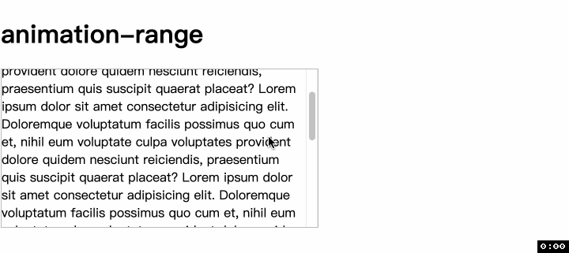
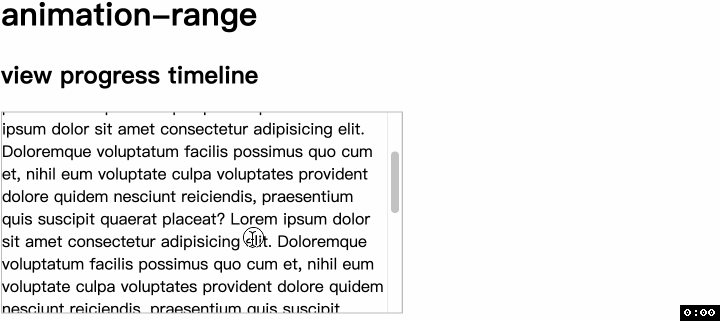
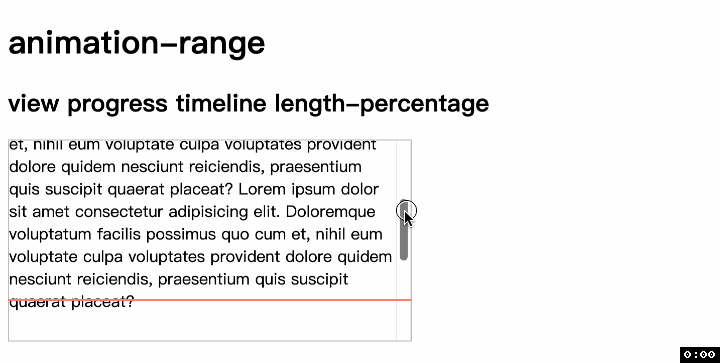

<!-- TOC -->

- [animation-range](#animation-range)
  - [语法](#%E8%AF%AD%E6%B3%95)
    - [normal](#normal)
    - [length-percentage](#length-percentage)
    - [timeline-range-name](#timeline-range-name)
      - [具名时间线范围 named timeline range](#%E5%85%B7%E5%90%8D%E6%97%B6%E9%97%B4%E7%BA%BF%E8%8C%83%E5%9B%B4-named-timeline-range)
      - [cover](#cover)
      - [contain](#contain)
      - [entry 和 entry-crossing](#entry-%E5%92%8C-entry-crossing)
      - [exit 和 exit-crossing](#exit-%E5%92%8C-exit-crossing)
  - [兼容性](#%E5%85%BC%E5%AE%B9%E6%80%A7)

<!-- /TOC -->

# `animation-range`
> 这个属性可同时对 `scroll progress timeline` 和 `view progress timeline` 这两种不同时间线驱动的动画起效果!

还记得之前在 [view()](./49CSS滚动驱动动画view().md) 中看到的例子吗, `view progressive timeline` 是以元素开始出现为 `0%`, 完全离开滚动容器后为 `100%`. 实际上我们可能需要更多类型的进度, 比如开始出现(`0%`)和完全出现(`100%`), 或准备离开(`0%`)和完全离开(`100%`). 如下




这个时候就需要 `animation-range` 大放异彩了, 因为它改变的就是动画范围.
## 语法
```css
animation-range = 
  [ <'animation-delay-start'> <'animation-delay-end'>? | <timeline-range-name> ]#  
```

`animation-range` 是一个简写属性, 是 `animation-range-start` 和 `animation-range-end` 的简写. 如果同时指定两个值, 那么第一个值会作为 `animation-range-start` 第二个值会作为 `animation-range-end`. 

不论是 `animation-range-start` 还是 `animation-range-end`, 他们的取值都是一样的
- `normal`:
- `<length-percentage>`
- `<timeline-range-name>`
- `<timeline-range-name> 加上 <timeline-range-name>`

有了上面的取值, 对于简写属性 `animation-range` 来说
- 如果只是 `normal` 或者 `<length-percentage>`, 那么这个值就属于 `animation-range-start`, 而 `animation-range-end` 默认为 `normal`
- 如果仅仅是一个 `<timeline-range-name>`, 那么动画范围就是这个具名时间线范围从 `0%` 到 `100%`
  - 📖 也就是, 如果 `<timeline-range-name>` 属于 `animation-range-start`, 那么百分比默认为 `0%`; 如果属于 `animation-range-end` 那么百分比默认为 `100%`.
- 如果是 `<timeline-range-name>` 加上 `<length-percentage>`, 那么动画范围就是这个具名时间线从 `<length-percentage>` 到结束.

因此下面的语法都是 OK 的.
- `animation-range: normal;`
- `animation-range: 50%;`
- `animation-range: contain;`
- `animation-range: normal 50%;`
- `animation-range: 50% normal;`
- `animation-range: 50% 75%;`
- `animation-range: entry exit;`
- `animation-range: cover cover 100px;`
- `animation-range: entry 100px exit;`

下面就具体看看不同取值代表的含义
### normal
默认值

先看 `view progress timeline`, 先给出代码, 并且后面的示例都将在此基础上修改
```html
<div class="relative">
  <div class="container">
    Lorem...
    <div class="box positive-inset-length"></div>
  </div>
</div>
```
```css
.container {
  height: 200px;
  overflow: auto;
}
.box {
  animation: appear1 linear both;
  animation-timeline: --why-is-this;
  view-timeline: --why-is-this;
  animation-range: normal;
}
```
这就是默认的表现, 在 `.box` 元素将要出现时, 动画进度为 `0%`; 在元素完全离开滚动容器时, 动画进度为 `100%`.



再看 `scroll progress timeline`.
```html
<div class="relative">
  <div class="container container1">
    <div class="top"></div>
    Lorem ...
  </div>
</div>
```
```css
.container1 {
  scroll-timeline: --youHaveToBeThis;
}
.container1 .top {
  position: absolute;
  animation: appear1 linear both;
  animation-timeline: --youHaveToBeThis;
}
```
这也是默认的表现, 容器开始滚动时, 动画进度为 `0%`; 滚动容器滚动到最大位置时, 动画进度为 `100%`.


### length-percentage
同样先看 `view progress timeline`
```css
.box {
  animation-range: 20%;
}
```
记得之前说过什么吗? 如果只有一个 `<length-percentage>` 值, 那么这个值被分配给 `animation-range-start` 而 `animation-range-end` 保持默认值 `normal` 不变. 下图表现得符合预期, 动画在 `20%` 的位置开始, 在元素完全离开滚动容器时结束.



然后是 `scroll progress timeline`
```css
.container1 .top {
  animation-range: 50%;
}
```
动画效果符合预期, 顶部水平条在滚动 `50%` 的位置开始出现, 在滚动到结束时完全展开.


### timeline-range-name
再继续往下之前, 我必须说的是 [MDN](https://developer.mozilla.org/en-US/docs/Web/CSS/animation-range#values) 关于这几个关键字的解释和含义不如 [CSS 规范](https://drafts.csswg.org/scroll-animations/#view-timelines-ranges) 解释得清楚明白. 因此, 下面的关键字我都会采用规范中的定义, 以便更清楚地说明他们之间的不同之处.

💡 还有一点, 下面的属性和 `scroll progress timeline` 无缘了

📮 本节所有的例子演示都来自 [这个网站](https://scroll-driven-animations.style/tools/view-timeline/ranges/#range-start-name=cover&range-start-percentage=0&range-end-name=cover&range-end-percentage=100&view-timeline-axis=block&view-timeline-inset=0&subject-size=smaller&subject-animation=reveal&interactivity=clicktodrag&show-areas=yes&show-fromto=yes&show-labels=yes). 强烈推荐, 因为演示效果非常清晰易懂


#### 具名时间线范围 named timeline range
📖 百分比的是根据[具名时间线范围, named timeline range](https://drafts.csswg.org/scroll-animations/#named-timeline-range)计算的, 如果没有具名时间线范围则根据整个时间线计算.

#### cover
`cover`: 表示 `view progress timeline` 的全部范围
- `0%` 表示元素的 [principle box](https://drafts.csswg.org/css-display-4/#principal-box) 的 [start border edge 开始边框边界](https://drafts.csswg.org/css-box-4/#border-edge) 和时间线的 [view progress visibility range](https://drafts.csswg.org/scroll-animations/#view-progress-visibility-range) 的 `end edge` 结束边界的相交位置.
- 我知道大家看到这么多名词又看到哐哐哐好多链接🔗有一点害怕, 不过不要紧, 我慢慢简化到大家最熟悉的情景
- `principle box`: 就理解为 `border box` 就行, 为什么会多一个新的名字呢, 因为像 `li` 这样的元素, 它不光光有自己的盒子, 还会有前面的 `marker box`. 但这里我们不考虑这种情况就简化为 `border box`
- `start border edge`: 这个更容易解释, 因为这里用 `start` 表示的逻辑方向. 如果是从下到上滚动, 表示上边框; 如果是从左到右滚动, 表示右边框
- `view progress visibility range`: 这个就是纯纯新概念, 还记得我们之前写过 [view-timeline-inset](./51CSS滚动驱动动画view-timeline-inset.md) 吗? 这个范围表示的就是滚动区域减去 `view-timeline-inset` 后剩下的区域
- 所以, 解释了这么多, `0%` 表示元素的上边框和滚动区域下边界相交的位置. 这样说起来, 是不是容易多了呢? 😊
- `100%` 表示元素的 [principle box](https://drafts.csswg.org/css-display-4/#principal-box) 的 [end border edge 结束边框边界](https://drafts.csswg.org/css-box-4/#border-edge) 和时间线的 [view progress visibility range](https://drafts.csswg.org/scroll-animations/#view-progress-visibility-range) 的 `start edge` 开始边界的相交位置.

来看例子,


接下来, 我们要叠 `buff` 了, 也就是增加百分比和 `view-timeline-inset`
```css
#subject {
  animation-timeline: view(block);
  animation-range: cover 50% cover 100%;
  view-timeline-inset: 10%;
}
```


所以, 再次印证了 `animation-range` 的百分比是根据谁的百分比, 根据的应该是 `timeline-range-name` 指定的范围, 也就是 `cover` 的范围百分比, 也就是整个滚动窗口去掉 `view-timeline-inset` 后的范围百分比.

#### contain
`contain`: `contain` 的情况稍微复杂, 为啥嘞, 因为存在着元素和滚动窗口谁大谁小的问题
- 熟悉 `CSS` 的朋友都知道, `cover` 和 `contain` 这两个关键字出现在很多 `CSS` 属性中, 比如 `object-fit` 和 `background-size`. 以 `background-size` 为例
  - `cover` 表示占满背景不留下一点空白(也就是放大图片和背景宽高中较大值相同); 
  - `contain` 表示把图片完全显示出来, 有可能留下空白.
- 我们先说元素高度小于滚动窗口的情况
  - `0%` 表示元素的 [principle box](https://drafts.csswg.org/css-display-4/#principal-box) 的 [end border edge 结束边框边界](https://drafts.csswg.org/css-box-4/#border-edge) 和时间线的 [view progress visibility range](https://drafts.csswg.org/scroll-animations/#view-progress-visibility-range) 的 `end edge` 结束边界的相交位置.
  - `100%` 表示元素的 [principle box](https://drafts.csswg.org/css-display-4/#principal-box) 的 [start border edge 开始边框边界](https://drafts.csswg.org/css-box-4/#border-edge) 和时间线的 [view progress visibility range](https://drafts.csswg.org/scroll-animations/#view-progress-visibility-range) 的 `start edge` 开始边界的相交位置.
  - 
- 如果是元素高度大于滚动窗口的情况
  - `0%` 表示元素的 [principle box](https://drafts.csswg.org/css-display-4/#principal-box) 的 [start border edge 开始边框边界](https://drafts.csswg.org/css-box-4/#border-edge) 和时间线的 [view progress visibility range](https://drafts.csswg.org/scroll-animations/#view-progress-visibility-range) 的 `start edge` 开始边界的相交位置.
  - `100%` 表示元素的 [principle box](https://drafts.csswg.org/css-display-4/#principal-box) 的 [end border edge 结束边框边界](https://drafts.csswg.org/css-box-4/#border-edge) 和时间线的 [view progress visibility range](https://drafts.csswg.org/scroll-animations/#view-progress-visibility-range) 的 `end edge` 结束边界的相交位置.
  - 

同样下面要叠 `buff` 了, 也就是增加百分比和 `view-timeline-inset`

```css
#subject {
  animation-timeline: view(block);
  animation-range: contain 20% contain 100%;
  view-timeline-inset: 10%;
}
```


#### entry 和 entry-crossing

- `entry`
  - `0%` 与 `cover` 的 `0%` 相同.
  - `100%` 与 `contain` 的 `0%` 相同.
- `entry-crossing`
  - `0%` 与 `cover` 的 `0%` 相同. (这一点规范没有明确说相同, 但是看定义他们确实是相同的)
  - `100%` 表示元素的 [principle box](https://drafts.csswg.org/css-display-4/#principal-box) 的 [end border edge 结束边框边界](https://drafts.csswg.org/css-box-4/#border-edge) 和时间线的 [view progress visibility range](https://drafts.csswg.org/scroll-animations/#view-progress-visibility-range) 的 `end edge` 结束边界的相交位置.
  - 有意思的事情来了, 首先 `entry` 和 `entry-crossing` 看起来就很像, 而且他们 `0%` 的位置一模一样, 不一样的地方就是 `100%`. 因为 `contain` 的 `0%` 包含了两种情况.

对于元素高度小于窗口高度的情况, 这两个属性的标签完全相同. 先看 `entry`


再看 `entry-crossing`, 和 `entry` 一模一样


但是当元素高度超过滚动容器时, 就不一样了, 还是先看 `entry`, `0%` 的时候没啥好说的, `100%` 的位置是元素开始离开滚动容器(上 `border` 要离开)


而 `entry-crossing` 呢, `0%` 的时候和 `entry` 一样, 而 `100%` 的位置是元素下边界进入滚动容器


#### exit 和 exit-crossing

- `exit`: 从这个关键字的意思来看, 就表示离开.
  - `0%` 与 `contain` 的 `100%` 相同.
  - `100%` 与 `cover` 的 `100%` 相同.
- `exit-crossing`
  - `0%` 与 `contain` 的 `100%` 相同.
  - `100%` 表示元素的 [principle box](https://drafts.csswg.org/css-display-4/#principal-box) 的 [end border edge 结束边框边界](https://drafts.csswg.org/css-box-4/#border-edge) 和时间线的 [view progress visibility range](https://drafts.csswg.org/scroll-animations/#view-progress-visibility-range) 的 `start edge` 开始边界的相交位置.
  - 和前面一组选手一样, 这两个元素的区别同样在元素高度大于滚动容器时才能看得出来.

当元素高度小于滚动窗口时, 先看 `exit`


再看 `exit-crossing`


当元素高度大于滚动窗口时, `exit` 表现如下. `0%` 表示当元素的下边界进入滚动容器, 而 `100%` 表示元素完全离开滚动容器, 即元素的下边界离开滚动容器的上边界.


来看 `exit-crossing`, 与 `exit` 不同的是 `0%` 的部分, `exit-crossing` 的 `0%` 是元素的上边界开始离开滚动容器.


## 兼容性


我必须说, 我第一次刚看也不是很明白每个的意思并且搞不清 `entry` 和 `entry-crossing` 的区别, 关键这几个新的 `CSS` 属性又是新出的, 网上可参考的资料寥寥无几, 就只能去看 `CSS` 规范的文档. 如果你不是瞬间滑倒最后而是认真看懂每个关键词的意思以及对应的动图演示, 特别是插入了 `view-timeline-inset` 的值, 相信你一定会有收获

谢谢你看到这里😊
