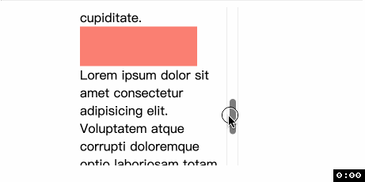
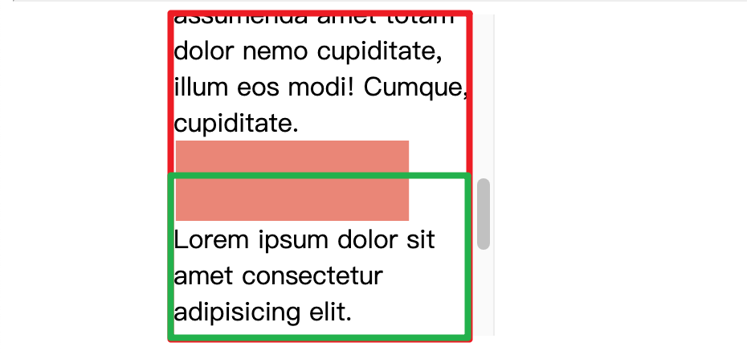

# animation-range (animation-range-start ❤️ animation-range-end)

这是一个简写属性, 分别是 `animation-range-start` 和 `animation-range-end` 的简写

另外, 有时候你可能不想让动画推迟开始或者提前结束, 也就是自定义动画的位置, 这可以通过两种方式实现
- 1️⃣ 第一是在定义 `@keyframes` 时, 通过改变关键帧来控制动画在滚动过程中何时开始, 何时结束.
  - 比如下面的例子, 我们设定元素滚动到 30% 进度时才开始应用动画, 80% 进度时动画要全部结束
  - ```css
    @keyframes bg-scroll1 {
      30% {
        transform: scaleX(0.3);
      }
      80% {
        transform: scaleX(1);
      }
    }
- 2️⃣ 第二是 `view progress timeline` 提供了专门的关键字用调整元素什么时候才算开始出现、什么时候算到达对边.
  - 下面代码的意思是我指定元素在刚开始出现时(默认值)算刚开始出现, 在元素完全显示在滚动容器中并且距离出现位置 50% 时算到达对边.
  - ```css
    animation-range: entry cover 50%;
  - 
  - 如果看了上面的动图还不懂, 看下面. 如果我们没有 animation-range, 那么元素动画应用的区域是红框, 但由于我们设置了要在 cover 50% 的时候算到达对边, 因此动画应用的区域变成了绿框 
  - 


谢谢你看到这里😊