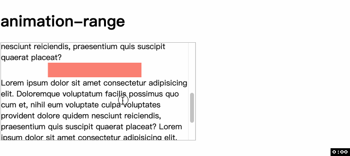
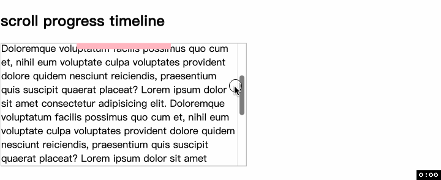
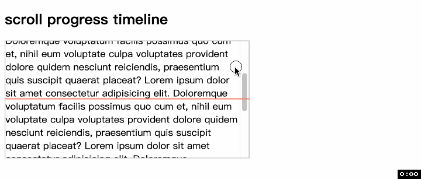

# animation-range (animation-range-start ❤️ animation-range-end)
> 这个属性可同时对 scroll progress timeline 和 view progress timeline 这两种不同时间线驱动的动画其效果!

还记得之前在 [view()](./49CSS滚动驱动动画view().md) 中看到的例子吗, view progressive timeline 是以元素开始出现为 0%, 完全离开滚动容器后为 100%. 实际上我们可能需要更多类型的进度, 比如开始出现(0%)和完全出现(100%), 或准备离开(0%)和完全离开(100%). 如下




这个时候就需要 animation-range 大放异彩了, 因为它改变的就是动画范围.
## 语法
```css
animation-range = 
  [ <'animation-delay-start'> <'animation-delay-end'>? | <timeline-range-name> ]#  
```

animation-range 是一个简写属性, `animation-range-start` 和 `animation-range-end` 的简写. 如果同时指定两个值, 那么第一个值会作为 `animation-range-start` 第二个值会作为 `animation-range-end`. 


### 具名时间线范围 named timeline range
📖 百分比的是根据[具名时间线范围, named timeline range](https://drafts.csswg.org/scroll-animations/#named-timeline-range)计算的, 如果没有具名时间线范围则根据整个时间线计算.


不论是 `animation-range-start` 还是 `animation-range-end`, 他们的取值都是一样的
- `normal`:
- `<length-percentage>`
- `<timeline-range-name>`
- `<timeline-range-name> 加上 <timeline-range-name>`

有了上面的取值, 对于简写属性 animation-range 来说
- 如果只是 normal 或者 `<length-percentage>`, 那么这个值就属于 `animation-range-start`, 而 `animation-range-end` 默认为 normal
- 如果仅仅是一个 `<timeline-range-name>`, 那么动画范围就是这个具名时间线范围从 0% 到 100%
  - 📖 也就是, 如果 `<timeline-range-name>` 属于 `animation-range-start`, 那么百分比默认为 0%; 如果属于 `animation-range-end` 那么百分比默认为 100%.
- 如果是 `<timeline-range-name>` 加上 `<length-percentage>`, 那么动画范围就是这个具名时间线从 `<length-percentage>` 到结束.

因此下面的语法都是 OK 的.
- `animation-range: normal;`
- `animation-range: 50%;`
- `animation-range: contain;`
- `animation-range: normal 50%;`
- `animation-range: 50% normal;`
- `animation-range: 50% 75%;`
- `animation-range: entry exit;`
- `animation-range: cover cover 100px;`
- `animation-range: entry 100px exit;`

下面就具体看看不同取值代表的含义
### normal
默认值
先看 view progress timeline, 先给出代码, 并且后面的示例都将在此基础上修改
```html
<div class="relative">
  <div class="container">
    Lorem...
    <div class="box positive-inset-length"></div>
  </div>
</div>
```
```css
.container {
  height: 200px;
  overflow: auto;
}
.box {
  animation: appear1 linear both;
  animation-timeline: --why-is-this;
  view-timeline: --why-is-this;
  animation-range: normal;
}
```
这就是默认的表现, 在 .box 元素将要出现时, 动画进度为 0%; 在元素完全离开滚动容器时, 动画进度为 100%.


再看 scroll progress timeline.
```html
<div class="relative">
  <div class="container container1">
    <div class="top"></div>
    Lorem ...
  </div>
</div>
```
```css
.container1 {
  scroll-timeline: --youHaveToBeThis;
}
.container1 .top {
  position: absolute;
  animation: appear1 linear both;
  animation-timeline: --youHaveToBeThis;
}
```
这也是默认的表现, 滚动容器开始滚动时, 动画进度为 0%; 滚动容器滚动到最大位置时, 动画进度为 100%.



### length-percentage
同样先看 view progress timeline
```css
.box {
  animation-range: 20%;
}
```
记得之前说过什么吗? 如果只有一个 `<length-percentage>` 值, 那么这个值被分配给 `animation-range-start` 而 `animation-range-end` 保持默认值 normal 不变. 下图表现得符合预期, 动画在 20% 的位置开始, 在元素完全离开滚动容器时结束.


然后是 scroll progress timeline
```css
.container1 .top {
  animation-range: 50%;
}
```
动画效果符合预期, 顶部水平条在滚动 50% 的位置开始出现, 在滚动到结束时完全展开.



### timeline-range-name
再继续往下之前, 我必须说的是 [MDN](https://developer.mozilla.org/en-US/docs/Web/CSS/animation-range#values) 关于这几个关键字的解释和含义不如 [规范](https://drafts.csswg.org/scroll-animations/#view-timelines-ranges) 解释的清楚明白. 因此, 下面的关键字我都会采用规范中的定义, 以便更清楚地说明他们之间的不同之处.

💡 还有一点, 下面的属性和 scroll progress timeline 无缘了

📮 本节所有的例子演示都来自 [这个网站](https://scroll-driven-animations.style/tools/view-timeline/ranges/#range-start-name=cover&range-start-percentage=0&range-end-name=cover&range-end-percentage=100&view-timeline-axis=block&view-timeline-inset=0&subject-size=smaller&subject-animation=reveal&interactivity=clicktodrag&show-areas=yes&show-fromto=yes&show-labels=yes). 强烈推荐, 因为演示效果非常清晰易懂

- `cover`: 表示 view progress timeline 的全部范围
  - 0% 表示元素的 [principle box](https://drafts.csswg.org/css-display-4/#principal-box) 的 [start border edge 开始边框边界](https://drafts.csswg.org/css-box-4/#border-edge) 和时间线的 [view progress visibility range](https://drafts.csswg.org/scroll-animations/#view-progress-visibility-range) 的 end edge 结束边界的相交位置.
  - 我知道大家看到这里这么多名词又看到哐哐哐好多链接🔗有一点害怕, 不过不要紧, 我慢慢简化到大家最熟悉的情景
  - `principle box`: 就理解为 border box 就行, 为什么会多一个新的名字呢, 因为像 li 这样的元素, 它不光光有自己的盒子, 还会有前面的 marker box. 但这里我们不考虑这种情况就简化为 border box
  - `start border edge`: 这个更容易解释, 因为这里用 start 表示的逻辑方向. 如果是从下到上滚动, 表示上边框; 如果是从左到右滚动, 表示右边框
  - `view progress visibility range`: 这个就是纯纯新概念, 还记得我们之前写过 [view-timeline-inset](./51CSS滚动驱动动画view-timeline-inset.md) 吗? 这个范围表示的就是滚动区域减去 view-timeline-inset 的值剩下的区域
  - 所以, 解释了这么多, 0% 表示元素的上边框和滚动区域下边界相交的位置. 这样说起来, 是不是容易多了呢? 😊
  - 100% 表示元素的 [principle box](https://drafts.csswg.org/css-display-4/#principal-box) 的 [end border edge 结束边框边界](https://drafts.csswg.org/css-box-4/#border-edge) 和时间线的 [view progress visibility range](https://drafts.csswg.org/scroll-animations/#view-progress-visibility-range) 的 start edge 开始边界的相交位置.

来看例子,


接下来, 我们要叠 buff 了, 也就是增加百分比和 view-timeline-inset
```css
#subject {
  animation-timeline: view(block);
  animation-range: cover 50% cover 100%;
  view-timeline-inset: 10%;
}
```


所以, 再次印证了 animation-range 的百分比是根据谁的百分比, 根据的应该是 timeline-range-name 指定的范围, 这里也就是 cover 的范围百分比, 也就是整个滚动窗口去掉 view-timeline-inset 后的范围百分比.
- `contain`: contain 的情况稍微复杂, 为啥嘞, 因为存在着元素和滚动窗口谁大谁小的问题
  - 熟悉 CSS 的朋友都知道, cover 和 contain 这两个关键字出现在很多 CSS 属性中, 比如 object-fit 和 background-size. 以 background-size 为例, cover 表示占满背景不留下一点空白(也就是放大图片和背景宽高中较大值相同); 而 contain 表示把图片完全显示出来, 有可能留下空白.
  - 我们先说元素高度小于滚动窗口的情况
    - 0% 表示元素的 [principle box](https://drafts.csswg.org/css-display-4/#principal-box) 的 [end border edge 结束边框边界](https://drafts.csswg.org/css-box-4/#border-edge) 和时间线的 [view progress visibility range](https://drafts.csswg.org/scroll-animations/#view-progress-visibility-range) 的 end edge 结束边界的相交位置.
    - 100% 表示元素的 [principle box](https://drafts.csswg.org/css-display-4/#principal-box) 的 [start border edge 开始边框边界](https://drafts.csswg.org/css-box-4/#border-edge) 和时间线的 [view progress visibility range](https://drafts.csswg.org/scroll-animations/#view-progress-visibility-range) 的 start edge 开始边界的相交位置.
    - 
  - 如果是元素高度大于滚动窗口的情况
    - 0% 表示元素的 [principle box](https://drafts.csswg.org/css-display-4/#principal-box) 的 [start border edge 开始边框边界](https://drafts.csswg.org/css-box-4/#border-edge) 和时间线的 [view progress visibility range](https://drafts.csswg.org/scroll-animations/#view-progress-visibility-range) 的 start edge 开始边界的相交位置.
    - 100% 表示元素的 [principle box](https://drafts.csswg.org/css-display-4/#principal-box) 的 [end border edge 结束边框边界](https://drafts.csswg.org/css-box-4/#border-edge) 和时间线的 [view progress visibility range](https://drafts.csswg.org/scroll-animations/#view-progress-visibility-range) 的 end edge 结束边界的相交位置.
    - 

同样下面要叠 buff 了, 也就是增加百分比和 view-timeline-inset

```css
#subject {
  animation-timeline: view(block);
  animation-range: contain 20% contain 100%;
  view-timeline-inset: 10%;
}
```


- `entry`
  - 0% 与 `cover` 的 0% 相同.
  - 100% 与 `contain` 的 0% 相同.
- `entry-crossing`
  - 0% 与 `cover` 的 0% 相同. (这一点规范没有明确说相同, 但是看定义他们确实是相通的)
  - 100% 表示元素的 [principle box](https://drafts.csswg.org/css-display-4/#principal-box) 的 [end border edge 结束边框边界](https://drafts.csswg.org/css-box-4/#border-edge) 和时间线的 [view progress visibility range](https://drafts.csswg.org/scroll-animations/#view-progress-visibility-range) 的 end edge 结束边界的相交位置.
  - 有意思的事情来了, 首先 `entry` 和 `entry-crossing` 看起来就很像, 而且他们 0% 的位置一模一样, 不一样的地方就是 100%. 因为 `contain` 的 0% 包含了两种情况.

对于元素高度小于窗口高度的情况, 这两个属性的标签完全相同.

先看 entry


再看 `entry-crossing`


- `exit`
- `exit-crossing`

## 与 view-timeline-inset 的关系


谢谢你看到这里😊