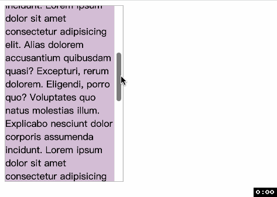
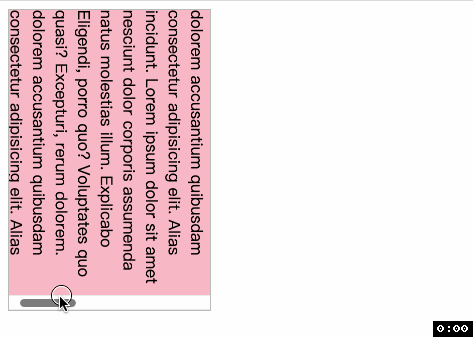
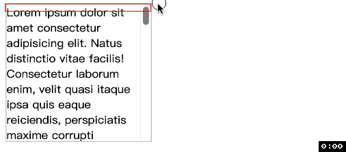

# CSS 滚动驱动动画 scroll()
> `animation-timeline` 通过 `scroll()` 指定可滚动元素与滚动轴来为容器动画提供一个匿名的 `scroll progress timeline`. 

通过元素在顶部和底部(或左边和右边)的滚动推进 `scroll progress timeline`. 并且元素滚动的位置会被转换为百分比, 滚动开始被转化为 `0%`, 滚动结束被转化为 `100%`

如果 `scroll()` 指定的滚动轴不包含滚动条, 也就是元素在滚动轴的方向不可滚动, 那么 `timeline` 的进度为 `0%`.

## 语法
`scroll()` 可以接受两个参数
- `滚动元素`: 滚动元素提供 `scroll progress timeline`. 可以取值
  - `nearest`: (默认值)设置 `animation-timeline` 元素最近的、具有滚动条的祖先元素.
  - `root`: 文档的根元素, 即 `<html>` 元素
  - `self`: 设置 `animation-timeline` 的元素自身
- `滚动轴`:
  - `y`: 垂直滚动轴
  - `x`: 水平滚动轴
  - `block`: (默认值)与滚动容器中行内文本方向垂直的轴. 对于从左到右书写的文字, 与 `y` 相同. 对于从上到下书写的文字, 与 `x` 相同.
  - `inline`: 与滚动容器中行内文本方向水平的轴. 对于从左到右书写的文字, 与 `x` 相同. 对于从上到下书写的文字, 与 `y` 相同.

这两个参数的书写顺序没有要求, 但是参数之间**没有**逗号, 这一点我一定要强调, 因为 `translate` 这个函数的参数就需要有逗号!!!

## 实例
### 正常举例
下面以背景渐变举例, 并且滚动容器就是元素自身.
```css
@keyframes bg-color {
  from {
    background-color: lightpink;
  }
  to {
    background-color: lightskyblue;
  }
}
.box {
  width: 200px;
  height: 300px;
  border: 1px solid #bbb;
  overflow: auto;
  animation: bg-color linear;
  animation-timeline: scroll(self);
}
```


如果我们加上下面的代码, 改变文字书写方向, 从上到下, 从左到右
```css
html { writing-mode: vertical-lr; }
```


📖 注意 `CSS` 规则的书写顺序, 因为 `animation` 是简写属性并且包含 `animation-timeline`, 因此一定要先写 `animation` 再写 `animation-timeline`, 否则 `animation-timeline` 就会被重置

### 最近滚动祖先?
来看一个例子, 这个例子出现了问题, 为什么动画没有效果呢? 📖注意这里我们使用了两个非 `static` 定位的元素.
```html
<div class="relative">
  <div class="scroll">
    <div class="absolute"></div>
  </div>
</div>
```
```css
.relative {
  position: relative;
}
.absolute {
  position: absolute;
  animation: bg-color linear;
  animation-timeline: scroll();
}
.scroll {
  height: 200px;
  overflow: auto;
}
```


为什么元素在滚动时背景没有变化呢? `scroll()` 不是寻找最近滚动祖先元素吗? 是的, 但是在寻找最近祖先元素时[这个祖先元素必须可以影响其位置和大小](https://developer.chrome.com/articles/scroll-driven-animations/#getting-practical-with-scroll-progress-timelines). 因为元素是 `absolute`, 那么可以影响其位置和大小的祖先元素显然不是 `.scroll` 而是 `.relative`. 

🤔️有没有方法可以就让提供 `scroll progress timeline` 的元素是 `.scroll` 呢? 有, 请各位客官看这里[👉scroll-timeline👈](https://developer.mozilla.org/en-US/docs/Web/CSS/scroll-timeline)

谢谢你看到这里😊