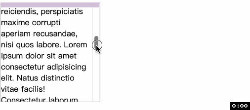

<!-- TOC -->

- [scroll-timelinescroll-timeline-name❤️scroll-timeline-axis](#scroll-timelinescroll-timeline-namescroll-timeline-axis)
  - [解决问题](#%E8%A7%A3%E5%86%B3%E9%97%AE%E9%A2%98)
  - [语法](#%E8%AF%AD%E6%B3%95)
    - [animation-timeline-name](#animation-timeline-name)
    - [animation-timeline-axis](#animation-timeline-axis)

<!-- /TOC -->

# scroll-timeline ( scroll-timeline-name ❤️ scroll-timeline-axis )
在 [scroll()](./ 46CSS%E6%BB%9A%E5%8A%A8%E9%A9%B1%E5%8A%A8%E5%8A%A8%E7%94%BBscroll().md) 的最后我们遇到了因为定位问题导致滚动效果失效的情况, 当然 `CSS` 允许我们手动指定滚动容器, 也就是哪个容器来提供 `scroll progress timeline`. 我们需要在提供时间线的滚动容器上声明 `scroll-timeline` 属性.

我们再次重温 `scroll progress timeline`, 这个时间线(`timeline`)的推进是通过滚动容器(`scroller`)上下或左右方向的滚动进行的. 开始滚动的位置表示时间线处在 `0%`, 滚动结束的位置表示时间线 `100%`. 如果 `0%` 和 `100%` 的位置相同, 比如容器根本不滚动, 那么时间线不会推动.

## 解决问题
下面的代码是不生效, 原因很简单, 当 `scroll()` 采用默认值时, 其第一个默认参数是 `nearest`, 这时就会寻找离当前元素最近的滚动元素. 你可能以为是 `.scroll`, 但实际上不是, 因为在寻找滚动元素的时候需要这个滚动元素能够影响当前元素的位置和大小, 因为当前元素的 `position` 是 `absolute`, 所以可以影响其位置和大小的元素要么是 `body`, 要么是 `position` 非 `static` 的元素. 换言之, 最终找到的就是 `.relative`, 而 `.relative` 根本不会滚动, 所以我们不论怎么滑动 `.scroll` 都不会看到任何变化.
```html
<div class="relative">
  <div class="scroll">
    <div class="absolute"></div>
  </div>
</div>
```
```css
.relative {
  position: relative;
}
.absolute {
  position: absolute;
  animation: bg-color linear;
  animation-timeline: scroll();
}
.scroll {
```css
.scroll {
  scroll-timeline: --youHaveToBeThis;
}
.absolute {
  /* animation-timeline: scroll(); */
  animation-timeline: --youHaveToBeThis;
}
```


## 语法
`animation-timeline` 实际上包括 `animation-timeline-name` 和 `animation-timeline-axis` 的简写属性, 后者是可选的.

如果同时制定两个值, 那么顺序一定是 `animation-timeline-name` 和 `animation-timeline-axis`

### `animation-timeline-name`
- `none`: 没有名字
- `自定义名称`: 其定义名称必须以 `--` 开头. 这样可以避免与 `CSS` 关键字冲突.

### `animation-timeline-axis`
可选的值是 `block(默认值)`, `inline`, `y`, `x`, 具体的意思可以参考 [scroll()](./46CSS%E6%BB%9A%E5%8A%A8%E9%A9%B1%E5%8A%A8%E5%8A%A8%E7%94%BBscroll().md). 

如果滚动容器在 `animation-timeline-axis` 方向上没有内容溢出, 或者溢出被隐藏, 那么将不会创建对应的时间线

谢谢你看到这里😊