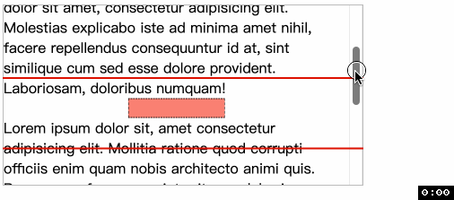
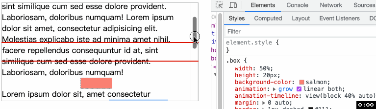

# CSS 滚动驱动动画 view()
> `animation-timeline` 通过 `view()` 表示一个元素 `A` 将提供匿名的、 用来控制动画的 `view progressive timeline`. 

通过 `A` 在其最近的滚动祖先元素中的可见性来推动 `view progressive timeline`. 也就是, 当 `A` 即将出现在滚动祖先元素时, `timeline` 为 `0%`, 当 `A` 完全离开滚动祖先元素时, `timeline` 为 `100%`.

上图


## 语法
`view()` 可以接收两个参数
- `axis`: 轴, 可以是 `block(默认值)`, `inline`, `y`, `x`. 与 [scroll()](./46CSS%E6%BB%9A%E5%8A%A8%E9%A9%B1%E5%8A%A8%E5%8A%A8%E7%94%BBscroll().md) 相同, 可点击参考. 📖 如果指定轴的方向不可以滚动, 那么时间线将始终处于 `0%` 的状态.

- `inset`: 默认情况, 动画是元素将要进入滚动容器开始, 在完全离开滚动容器结束. `inset` 参数可以修改动画开始和结束时位置, 也就是元素滚动到哪里算开始、又滚动到哪里算结束.
  - `inset` 可以是一个值或两个值, 可以是 `auto` 或长度值或百分比值.

📖 这两个参数的位置可以任意, 且两个参数都不是必须, 因此下面的调用都是合理的. 

📖 注意参数之间使用**空格**而不是逗号分隔
- `view()`:
- `view(block)`:
- `view(20px)`:
- `view(inline 20px)`:
- `view(inline 20px 10%)`:

## 例子
### 两个 inset
```html
<div class="container">
  <div class="box"></div>
</div>
```
```css
.container {
  width: 400px;
  height: 200px;
  overflow: auto;
}
@keyframes grow1 {
  from { transform: scaleX(0); }
  to { transform: scaleX(1); }
}
.box {
  width: 50%;
  height: 20px;
  background-color: salmon;
  animation: grow1 linear both;
  animation-timeline: view(block 40% 20%);
}
```


我们仔细观察, 当动画开始的时候, 是距离底部 `20%` 高度的位置开始, 到距离顶部 `40%` 的位置结束.

### 一个 inset
如果像下面一样只有一个值, 表示动画从距离底部 `40%` 的位置开始, 到距离顶部 `40%` 的位置结束. 也就是 `40%` 被复用了.
```css
.box {
  animation-timeline: view(block 40%);
}
```


当然如果你想要动画从默认位置开始, 或默认位置结束, 那么就使用 `auto`
- `view(block 40% auto)`: 默认位置开始, 距`顶部` `40%` 位置结束
  - 
- `view(block auto 40%)`: 距`底部` `40%` 位置开始, 默认位置结束
  - 

💡所以你看到规律了吗? 如果百分比写在第一个位置, 就是相对于 `顶部`; 如果写在二个位置, 就是相对于 `底部` 


谢谢你看到这里😊