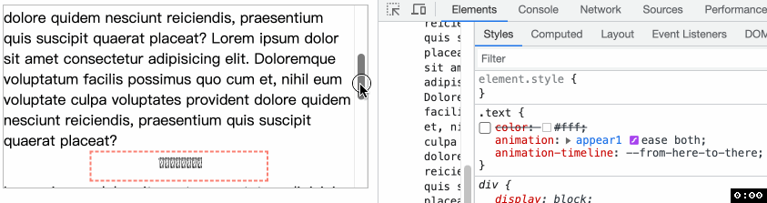

# view-timeline
我们之前在 [scroll()](./46CSS%E6%BB%9A%E5%8A%A8%E9%A9%B1%E5%8A%A8%E5%8A%A8%E7%94%BBscroll().md) 中提到了一个因为绝对定位导致滚动无效的问题, 并使用 [scroll-timeline](./48css%E6%BB%9A%E5%8A%A8%E9%A9%B1%E5%8A%A8%E5%8A%A8%E7%94%BBscroll-timeline.md) 成功解决了这个问题, 而 scroll-timeline 起到的作用就是指定到底是哪个元素提供 scroll progress timeline.

> 与此相似, view-timeline 定义了一个具名的 view progress timeline, 通过滚动容器(scroller)中的某个元素(subject)的可见性改变来推动这个时间线. 而 view-timeline 就定义在 subject 上.

默认情况, 当 subject 将要出现在滚动容器时, 时间线进度时 0%; 当 subject 刚刚完全离开滚动容器时, 时间线进度是 100%.

## 语法
和 scroll-timeline 一样, view-timeline 也是一个缩写属性, 是 [view-timeline-name](https://developer.mozilla.org/en-US/docs/Web/CSS/view-timeline-name) 和 [view-timeline-axis](https://developer.mozilla.org/en-US/docs/Web/CSS/view-timeline-axis) 的缩写.

- `view-timeline-name`: 为 view progress timeline 起一个名字. 名字必须以 `--` 开头. 随后可以在某元素 animation-timeline 中使用这个名字表示该元素动画将随着 timeline 进行. 这个元素可以是 subject, 也可以不是.
  - 也可以是关键字 none, 表示时间线没有名字
- `view-timeline-axis`: (可选)包含 `block(默认)`, `inline`, `y`, `x`. 具体解释见 [scroll()](./46CSS%E6%BB%9A%E5%8A%A8%E9%A9%B1%E5%8A%A8%E5%8A%A8%E7%94%BBscroll().md)

## 例子
在我实际测试的过程中, 发现并不能随意指定元素. 而是 subject 或 subject 的子元素.
```html
<div class="container">
  Lorem ipsum ...
  <div class="box">
    <div class="text">123123123123123123123123</div>
  </div>
  Lorem ipsum ...
</div>
```
```css
.container {
  width: 400px;
  height: 200px;
  overflow: auto;
}
.box {
  width: 50%;
  height: 30px;
  view-timeline: --from-here-to-there; /* 设置时间线 */
}
@keyframes appear1 {
  from { transform: scaleX(0); }
  to { transform: scaleX(1); }
}
.text {
  animation: appear1 ease both;
  animation-timeline: --from-here-to-there; /* */
}
```



谢谢你看到这里😊