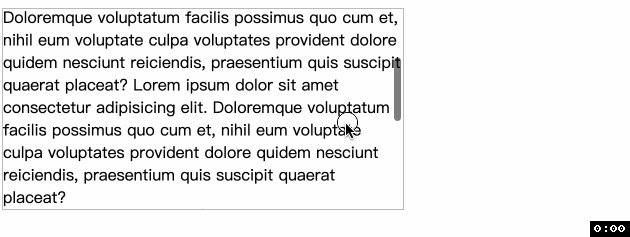
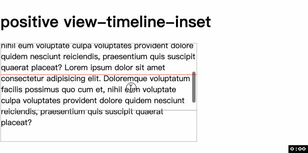
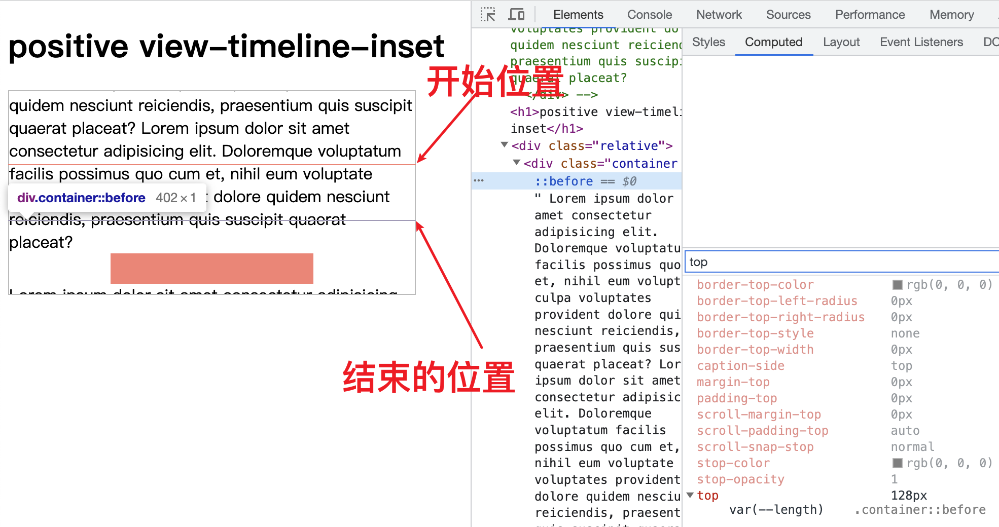
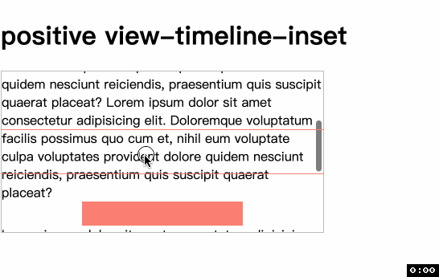
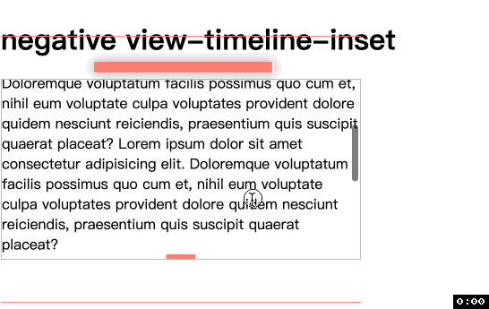
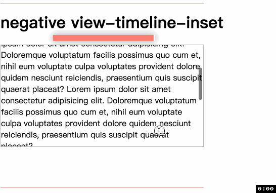
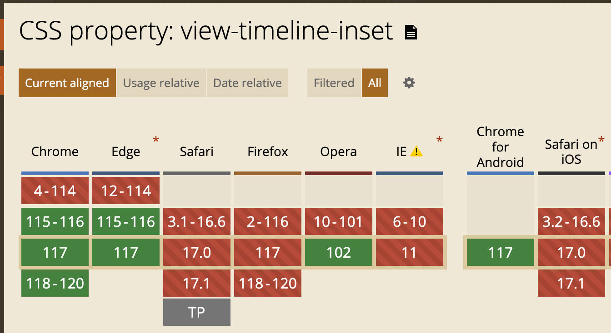

<!-- TOC -->

- [view-timeline-inset](#view-timeline-inset)
  - [语法](#%E8%AF%AD%E6%B3%95)
  - [例子🌰](#%E4%BE%8B%E5%AD%90)
    - [正](#%E6%AD%A3)
      - [scroll-padding 为正](#scroll-padding-%E4%B8%BA%E6%AD%A3)
      - [正的 length](#%E6%AD%A3%E7%9A%84-length)
      - [正的 percentage](#%E6%AD%A3%E7%9A%84-percentage)
    - [负](#%E8%B4%9F)
      - [scroll-padding 为负](#scroll-padding-%E4%B8%BA%E8%B4%9F)
      - [负的 length](#%E8%B4%9F%E7%9A%84-length)
      - [负的 percentage](#%E8%B4%9F%E7%9A%84-percentage)
  - [兼容性](#%E5%85%BC%E5%AE%B9%E6%80%A7)

<!-- /TOC -->

# view-timeline-inset
在使用 [view()](./49CSS%E6%BB%9A%E5%8A%A8%E9%A9%B1%E5%8A%A8%E5%8A%A8%E7%94%BBview().md) 时说过, 元素在滚动容器的可见性推动了 `view progress timeline` 的进展. 默认情况是元素即将出现在滚动容器时, `timeline` 为 `0%`, 当 `A` 完全离开滚动元素时, `timeline` 为 `100%`.

有时我们想调整过程, 比如让时间线早点开始或者早点结束, 换句话就是`元素从什么位置开始是可见的, 从什么位置之后是不可见的`, 这时就是 `view-timeline-inset` 大放异彩的时候了.

## 语法
可以是一个值或两个值, 值可以是 `auto`, 长度值或百分比值.
- `auto`: (默认值)即偏移量是 `0`. 有的浏览器可能使用启发式的方法决定默认值. `实际上` auto 使用的是 [scroll-padding](https://developer.mozilla.org/en-US/docs/Web/CSS/scroll-padding) 的值, 但是 `scroll-padding` 默认为 `0`, 所以 `auto` 就默认为 `0`.
- `长度或百分比`:
  - `正值`: 如果值是正数, 元素可见和不可见的边界就会从默认位置向`内`移动.
  - `负值`: 如果值是负数, 元素可见和不可见的边界就会从默认位置向`外`移动.
  - 📖 如果是这种值, 就会覆盖 `scroll-padding`

如果是两个值, 那么第一个值是元素可见边界的偏移, 第二个值是元素不可见边界的偏移. 如果是一个值, 那么开始和结束位置的偏移都是它.
## 例子🌰
先来看默认, 也就是 `auto` 的情况.
```css
.container {
  height: 200px;
  overflow: auto;
}
.box {
  animation: appear1 linear both;
  animation-timeline: view();
}
@keyframes appear1 {
  from { transform: scaleX(0); }
  to { transform: scaleX(1); }
}
```
```html
<div class="container">
  Lorem...
  <div class="box"></div>
  Lorem...
</div>
```


### 正
#### `scroll-padding` 为正
```css
scroll-padding: 2em;
```
可以看到和前一个例子不同的是, 当元素出现 `2em` 后才开始动画, 到距离离开位置 `2em` 时动画就完成了


#### 正的 `length`
```css
.box {
  animation: appear1 linear both;
  /* animation-timeline: view(); */
  animation-timeline: --why-is-this;
  view-timeline: --why-is-this;
}
.positive-inset-length {
  view-timeline-inset: var(--length);
}
```
📖 在开始之前, 我发现 `view()` 和 `view-timeline-inset` 好像不对付, 两个属性在一块后者死活不生效, 但是我查了一圈也没查出来个所以然.


我很好奇, 如果高度设置的足够大, 大到开始位置是原来结束的位置, 结束的位置反过来到开始的位置会怎么样?

结果就是动画反过来了, 之前的情况是消失到出现, 现在是出现到消失.



#### 正的 `percentage`
`percentage` 显然是根据滚动轴来算的, 例子中的情况是 y 轴滚动, 那么就是按高度来算, `200px * 20% = 40px`


### 负
#### `scroll-padding` 为负
🙅‍♂️🙅‍♂️ 负值没有效果, 相当于 `0`.
#### 负的 `length`
```css
view-timeline-inset: -3em;
```
发现, 当元素开始出现时它已经有了宽度, 当它要消失时, 动画还没有结束. 我截图了它最大宽度作为对比.


#### 负的 `percentage`
```css
view-timeline-inset: -40%;
```


## 兼容性


谢谢你看到这里😊
