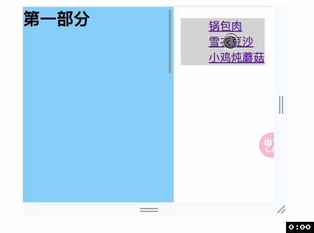
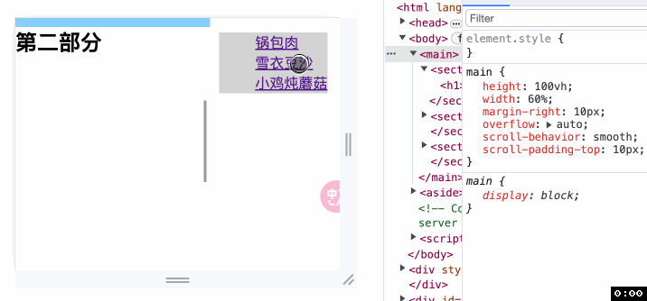
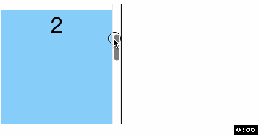
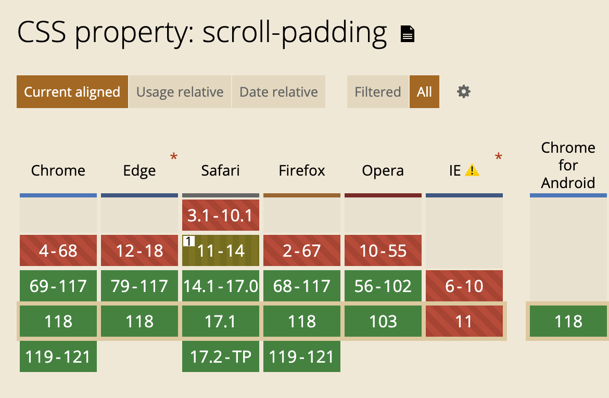

<!-- TOC -->

- [scroll-padding](#scroll-padding)
    - [非滚动捕获容器](#%E9%9D%9E%E6%BB%9A%E5%8A%A8%E6%8D%95%E8%8E%B7%E5%AE%B9%E5%99%A8)
    - [滚动捕获容器](#%E6%BB%9A%E5%8A%A8%E6%8D%95%E8%8E%B7%E5%AE%B9%E5%99%A8)
  - [语法](#%E8%AF%AD%E6%B3%95)
  - [兼容性](#%E5%85%BC%E5%AE%B9%E6%80%A7)

<!-- /TOC -->

# scroll-padding
> 设置元素的滚动内边距, 就像 `padding` 所做的那样. 但并不影响布局.

### 非滚动捕获容器
我们先来看看`不影响布局`到底是什么意思. 我们平时会见到左侧是内容, 右侧是内容导航的页面, 比如下图



这样看起来没有问题, 但往往通过锚点定位时我们不希望内容紧贴着上边界, 那我们就给左侧的滚动容器增加 `scroll-padding`
```css
main {
  height: 100vh;
  overflow: auto;
  scroll-behavior: smooth;
  scroll-padding-top: 10px;
}
```


可以看到, 除了第一部分之外剩余的部分通过锚点定位都会在其上方空出 `10px` 的位置. 但实际上, `main` 是没有 `padding` 的, 即布局没有改变, 只是在滚动时多了这么个视觉上的效果.

### 滚动捕获容器
```html
<div class="scroll">
  <section class="item">1</section>
  <section class="item">2</section>
  <section class="item">3</section>
  <section class="item">4</section>
</div>
```
```css
.scroll {
  width: 200px;
  height: 200px;
  overflow: auto;
  scroll-snap-type: y mandatory;
  scroll-padding-top: 10px;
}
.item {
  height: 100%;
  scroll-snap-align: start;
}
```


可以看到, 在滚动捕获发生时, 滚动容器上会空出一部分距离从而捕获的元素不能紧贴容器的上边缘.


## 语法
和 `padding` 一样, `scroll-padding` 也是一个简写属性, 是 `scroll-padding-bottom`、 `scroll-padding-left`、 `scroll-padding-right`、 `scroll-padding-top` 四个属性的简写.

支持两种类型的值
- `auto`: 默认值, 具体多少由浏览器决定, 通常默认为 0px. 但是浏览器可能使用其他值.
- `<length-percentage>`: 长度值或百分比值

## 兼容性


谢谢你看到这里😊