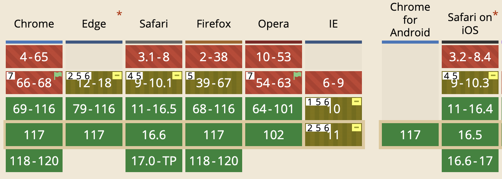

# CSS 滚动捕获 Scroll Snap
CSS 滚动捕获允许开发者通过声明一些位置(或叫作捕获位置)来创建精准控制的滚动体验. 通常来说轮播图就是这种体验的例子, 在轮播图中, 用户只能停在图 A 或者图 B, 而不能停在 A 和 B 的中间.

比如平时用淘宝或小红书, 当你上滑到下一个推荐内容时, 页面不会停留在两个推荐内容之间. 有限的手机屏幕尺寸对于这种一项一项展示的内容来说, 需要精准的滑动提供良好的体验. 当然默认情况下, 是滚动到哪里就显示什么内容, 不会存在所谓的「吸附」行为

## CSS 属性概览
下面两个属性是定义在滚动容器上的
- `scroll-snap-type`: 定义滚动容器是否可以捕获、捕获是必须的还是可选的、捕获应该发生在横向滚动还是纵向滚动.
- `scroll-padding`: 定义滚动容器的捕获偏移.
下面三个属性是定义在容器中的元素上的
- `scroll-snap-align`: 滚动容器的子元素和滚动容器对齐方式, 顶部对齐、中间对齐还是底部对齐
- `scroll-margin`: 滚动容器的子元素的滚动 `margin`.
- `scroll-snap-stop`: 是否允许滑动超过应该捕获的位子. 比如当前屏幕是 A, 在手机屏幕上滑动很长的距离, 是否可以快速划过很多元素(B/C/D/E....)还是一定会停在下一个 B.

## 一些个专有名词
> 有兴趣的可以来读 [CSS 规范](https://drafts.csswg.org/css-scroll-snap/#scroll-snap-container). 专有名词都是这里面定义的

学习 CSS 就是要闹明白这个词啥意思, 那个词啥意思. CSS 属性越来越多, 专有名词也得跟上不是嘛😮‍💨

下面三个名词是针对滚动容器
- `scroll container(滚动容器)`: 很容易理解, 可以滚动的盒子就是滚动容器.
- `scroll snap container(滚动捕获容器)`: 滚动容器不一定是滚动捕获容器, 除非其 `scroll-snap-type` 不是 `none`
- `snapport(捕获窗口)`: 滚动容器减去其 `padding` 后的区域.

下面的名词针对滚动容器的子元素
- `scroll snap area(滚动捕获位置)`: 既然是针对子元素的, 你可能想当然以为就是子元素的 `border box`, 其实不是, 而是 `border box` 加上 `scroll-margin` 指定的区域.
- `snap position(捕获位置)`: 不要被位置这两个字欺骗了, 所谓的位置其实是元素的 `scroll snap area` 和滚动容器的 `snapport` 的对齐(alignment).
## 兼容性
滚动捕获所涉及到的所有属性, 在 `Chrome 75` 都得到了完整支持, 当然其他浏览器也支持, 不过可能在更新的版本.

谢谢你看到这里😊