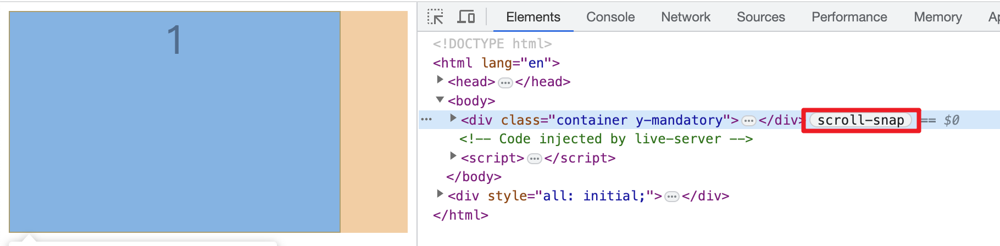
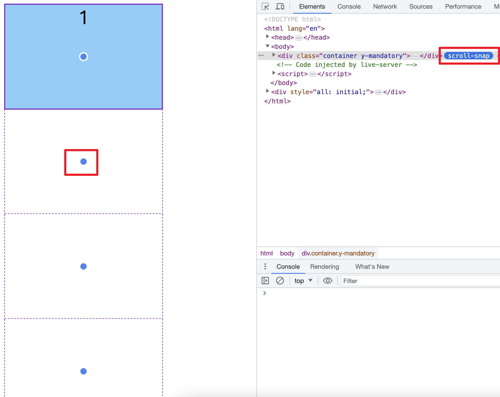
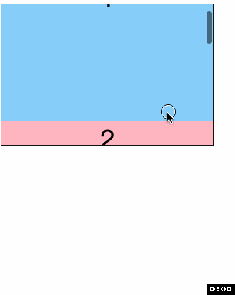

# scroll-snap-type
> 用来指定一个滚动容器(scroll container) 是否是滚动捕获容器(scroll snap container)、捕获的严格程度以及在什么方向上执行捕获.

具体捕获的动画或物理效果不是由 scroll-snap-type 决定, 而是由浏览器决定.

💡建议先读[这个名词介绍](./53CSS%E6%BB%9A%E5%8A%A8%E6%8D%95%E8%8E%B7Scroll%20Snap.md)

## 语法
scroll-snap-type 的内容由两部分组成, 滚动捕获轴和滚动捕获严格程度
- `滚动捕获轴`:
  - `x`: 滚动容器仅捕获`水平`轴上的滚动位置(snap position, 解释参考名词介绍)
  - `y`: 滚动容器仅捕获`垂直`轴上的滚动位置.
  - `block`: 滚动容器仅捕获`逻辑块`轴上的滚动位置.
  - `inline`: 滚动容器仅捕获`逻辑水平`轴上的滚动位置.
  - `both`: 滚动容器捕获两个轴上的滚动位置, 每个轴上捕获的元素可能不同
- `滚动捕获严格程度`:
  - `none`: (默认值). 不捕获
  - `mandatory`: 如果用户没有滚动操作时, 滚动容器`必须`捕获到一个滚动位置(snap position). 如果存在有效的捕获位置, 滚动容器`必须`在滚动停止时捕获.
  - `proximity`: 滚动容器`可能`会在滚动停止时捕获到一个滚动位置, 这取决于浏览器设定的滚动参数.

## 实例
### 捕获轴 `y` 捕获严格程度 `mandatory`
```html
<div class="container y-mandatory">
  <div>1</div>
  <div>2</div>
  <div>3</div>
  <div>4</div>
</div>
```
```css
.container {
  height: 200px;
  width: 300px;
  border: 1px solid #121212;
  overflow: auto;
}
.container div {
  height: 100%;
  scroll-snap-align: center;
}
.y-mandatory {
  scroll-snap-type: y mandatory;
}
```
先暂停一下看看 CSS, 首先我们要给滚动容器设置 `scroll-snap-type: y mandatory;` 这样滚动容器就变成了滚动捕获容器, 单单这样还不行因为 `scroll-snap-align` 的默认值为 none, 这里先设置为 center 有个滚动效果, 后面会详细介绍 `scroll-snap-align`. 另外设置子元素和父元素高度相同

你会发现开发者工具会识别滚动捕获容器, 并出现 `scroll-snap` 的标志

如果你点一下这个标志, 浏览器就会展开滚动的内容, 并且用蓝色点表示 `scroll-snap-align`

下面就看看滚动的效果吧, 我们无法在两个子元素之间停住, 当滚动到某个点时, 最终停在哪个元素(或最终捕捉到哪个元素)也是浏览器决定的.


### 捕获轴 `y` 捕获严格程度 `proximity`
```css
.y-proximity {
  scroll-snap-type: y proximity;
}
```
你会看到, 我们可以明确在两个子元素之间停住, 就像定义中说的那样, 当滚动行为停止后, 是否发生捕获是根据浏览器的参数决定的.

### 同理看下捕获轴 `x`


谢谢你看到这里😊
