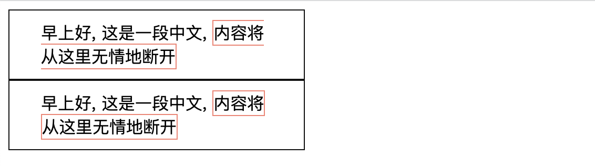
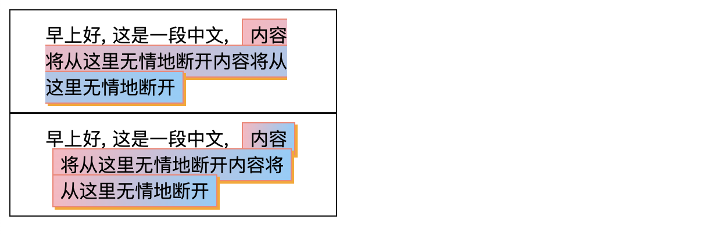
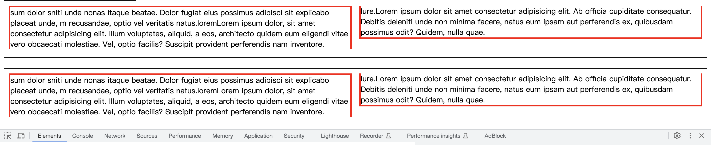
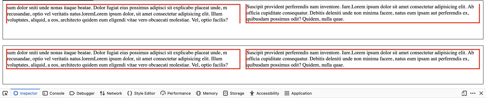
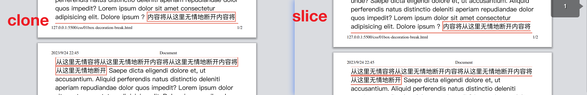
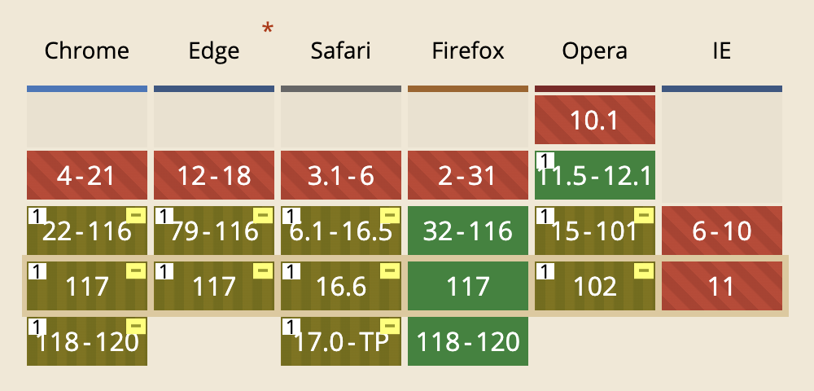

# box-decoration-break
> 指定元素因为换行、换页或者换列而断开时每个片段应该如何渲染.

**`✨✨✨这个属性只支持 inline 元素✨✨✨`**

通常一个元素可能因为换行而分为两部分或更多部分(换好几行), 那么这么多部分某些样式该如何渲染呢? 比如在末尾断开的右边框? 先睹为快吧


## 语法
这个属性就两个关键词语法
- `slice`: (默认值). 关键词表示元素就像没有断开时渲染, 渲染完成后再背断开.
- `clone`: 每个断开的部分都独立渲染.

影响渲染的是一下属性
- `background`
- `border`
- `border-image`
- `box-shadow`
- `clip-path`
- `margin`
- `padding`

## 实例
```html
<div class="box">早上好, 这是一段中文, <span class="break">内容将从这里无情地断开内容将从这里无情地断开</span></div>
<div class="box">早上好, 这是一段中文, <span class="break clone">内容将从这里无情地断开内容将从这里无情地断开</span></div>
```
```css
.break {
  border: 1px solid salmon;
  padding: 2px 6px;
  margin: 2px 6px;
  background: linear-gradient(90deg, lightpink, lightskyblue);
  box-shadow: 2px 2px 0 0 orange;
}
.clone {
  -webkit-box-decoration-break: clone;
  box-decoration-break: clone;
}
```

我放弃展示 `border-image` 了, 因为我感觉这个属性使用的概率真的不高. 那再看看分栏和分页的情况吧
### 分栏
```html
<section class="column">
  <div class="break1">sum ...</div>
</section>
<br>
<section class="column">
  <div class="break1 clone">sum ...</div>
</section>
```
```css
.column {
  column-count: 2;
  height: 100px;
  border: 1px solid #111;
  padding: 10px;
}
.clone {
  -webkit-box-decoration-break: clone;
  box-decoration-break: clone;
}
.break1 {
  border: 3px solid red;
}
```
我有点震惊🤯了, Chrome 不支持分栏情况下的 box-decoration-break, 而 FireFox 支持. (第一张是 Chrome 截图, 第二张是 Firefox 截图)


## 分页
分页和预期表现一致
```html
<body>
Saepe<span class="break clone">内容将从这里无情地断开内容将从这里无情容将从这里无情地断开内容将从这里无情地断开内容将从这里无情地断开</span> Saepe..
</body>
```
```css
.break {
  border: 2px solid salmon;
}
.clone {
  -webkit-box-decoration-break: clone;
  box-decoration-break: clone;
}
```


## 兼容性
兼容性不差, 但是除了 `Firefox` 必须加上 `-webkit-` 前缀.



谢谢你看到这里😊