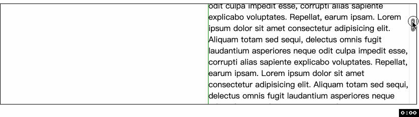
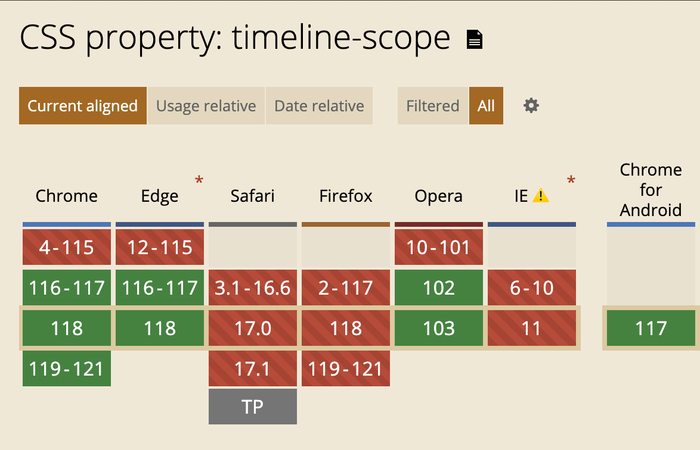

<!-- TOC -->

- [timeline-scope](#timeline-scope)
  - [语法](#%E8%AF%AD%E6%B3%95)
  - [兼容性](#%E5%85%BC%E5%AE%B9%E6%80%A7)

<!-- /TOC -->
# timeline-scope
> 看到 scope 就知道这个属性是和`范围`有关, 没错, `timeline-scope` 就是用来修改一个具名时间线(`named animation timeline`)的范围.

我们介绍过的两种时间线 `scroll progress timeline` 和 `view progress timeline`, 使用这两种时间线(通过 `view()`, `scroll()`, 或者具名时间线)的元素都需要向上查询 `DOM` 树找到滚动容器, 这就是时间线的默认范围.

可是有时驱动元素 `A` 动画可能是 `A` 的兄弟元素 `B` 的滚动, 我们应该怎么办呢?
- 在 `A` 上使用 `animation-timeline` 表示需要一个具名时间线来驱动动画, 比如 `--whatever-this`
- 在 `B` 元素上使用 `scroll-timeline-name: --whatever-this` 表示由 `B` 元素来提供时间线.
- 最后, 在 `A` 和 `B` 的共同祖先 `P` 上使用 `timeline-scope: --whatever-this` 表示时间线范围提升到 `P` 和 `P` 的任何后代元素上.

来看例子

📖 我特意没有在两个 `div` 之间换行, 为了避免换行的出现
```html
<div class="p">
  <div class="a"></div><div class="b">
    Lorem...
  </div>
</div>
```
```css
.p {
  height: 200px;
  timeline-scope: --i-am-here;
}
.p > div {
  width: 50%; /** 为了避免渲染换行符导致宽度不够 */
  height: 100%;
  display: inline-block;
}
.a {
  animation: grow both;
  animation-timeline: --i-am-here;
}
.b {
  overflow: auto;
  scroll-timeline-name: --i-am-here;
}
@keyframes grow {
  from {
    transform: scale(0);
  }
  to {
    transform: scale(1);
  }
}
```
可以看到效果, 驱动左侧动画的不再是其父元素, 而是其兄弟元素, 从而大大提高了设计使用动画的灵活性.


## 语法
这个属性的值可以是
- `none`: 默认值, 表示时间线范围没有变化.
- `dashed-ident`: 和 `scroll-timeline-name` 或 `view-timeline-name` 值相同. 这会导致时间线范围扩大到设置 `timeline-scope` 的元素和其所有后代.


写下来我们看下 `view progress timeline` 的效果
```html
<div class="p">
  <div class="a"></div><div class="b">
    Lorem ...
    <div class="box"></div>
    Lorem ...
  </div>
</div>
```
```css
/* 大部分都和前面的一样, 不过我们修改了 .b 并增加了 .box */
.b {
  overflow: auto;
  /* scroll-timeline-name: --i-am-here; */
}
.b .box {
  view-timeline-name: --i-am-here;
}
```
从下图很容易就看出, 这次驱动左侧动画的是右侧的 `.box` 元素, 当 `.box` 开始出现时, 左侧动画进行; 当 `.box` 完全离开时, 动画结束. 📖注意动画结束时, 右侧的还没有滚动到最后, 说明这次的动画不是由 `scroll progress timeline` 驱动而是由 `view progress timeline` 驱动. 这当然显而易见, 因为代码中 `scroll progress timeline` 的部分被注释了.


📖这里需要再强调 `view-timeline-name` 需要定义在动画元素上, 而不是滚动容器上.

我们可以让右边的元素也动起来吗? 当然
```css
.b .box {
  view-timeline-name: --i-am-here;
  animation: grow both;
  animation-timeline: --i-am-here;
}
```


## 兼容性


谢谢你看到这里😊