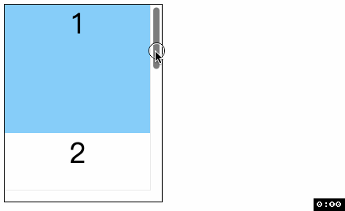
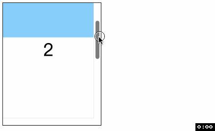
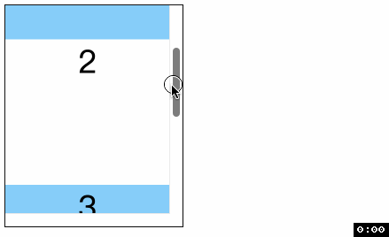
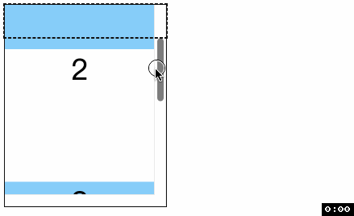
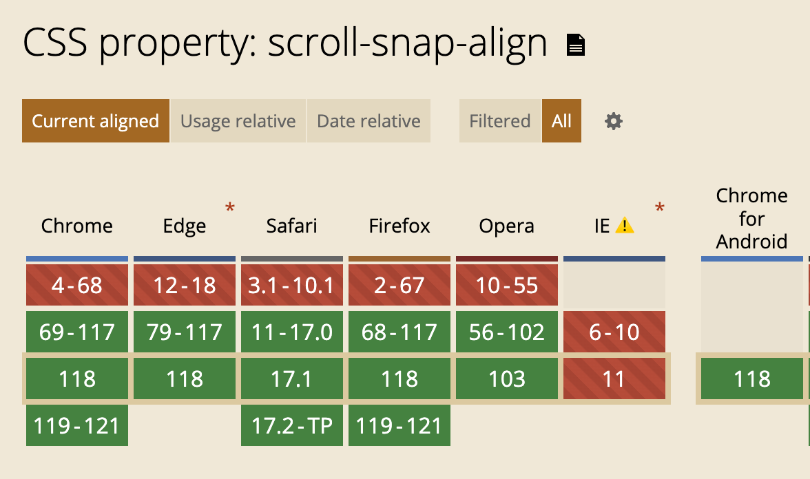

# CSS滚动捕获 scroll-snap-align
> 看到 align, 就条件反射想到对齐方式, 嗯猜对了. 不过要先看一下若干[名词介绍](./53CSS滚动捕获Scroll%20Snap.md)

`scroll-snap-align` 指定了盒子的 `snap position`, 即盒子 `snap area` 和滚动容器的 `snapport` 的对齐方式.

这个属性是定义在滚动元素上, 而不是滚动容器上

## 语法
这个属性可以指定两个值, 分别表示 `y`(块方向) 轴和 `x`(内联方向) 轴的对齐. 如果只指定一个值, 那么第二个值保持相同.
- `none`: 默认值, 无滚动捕获行为.
- `start`: 盒子的 `snap position` 的顶部与 `snapport` 顶部对齐
  - 
- `end`: 盒子的 `snap position` 的尾部与 `snapport` 尾部对齐
  - 
- `center`: 盒子的 `snap position` 的中间与 `snapport` 中间对齐
  - 


## 和 scroll-margin 的关系
在前面的定义中已经说过了, 这个属性对齐的不是盒子的 border box 而是盒子 `snap area`, 即 border box 加上 scroll-margin

我们来点 CSS, 给滚动容器的第二个元素加上 `40px` 的 scroll-margin-top
```css
.item {
  scroll-snap-align: center;
}
.item:nth-child(2) {
  scroll-margin-top: 40px;
}
.item:nth-child(2)::before {
  content: '';
  height: 40px;
  outline: 2px dashed #111;
}
```
元素都是居中对齐, 但是第二个元素算居中位置的时候把 40px 也加上了. 好家伙


## 和 scroll-padding 的关系
同样是前面的定义, 对齐不是发生在滚动容器上, 而是滚动容器的 snapport 上, 即滚动容器减去其 [scroll-padding](./52CSS滚动捕获scroll-padding.md). 

📖 注意 scroll-padding 并不像 padding 一样会渲染出高度, 但是它有它的位置.
```css
.container {
  overflow: scroll;
  scroll-snap-type: y mandatory;
  scroll-padding-top: 40px;
}
```
你会发现, 元素对齐区域变成了黑色虚线下面的区域, 而不再是整个滚动容器.



最后大家可以手动试一下, 加上 scroll-padding 和 scroll-margin 双重 buff 的滚动捕获时什么样的.

## 兼容性


谢谢你看到这里😊 大家周末开心呀