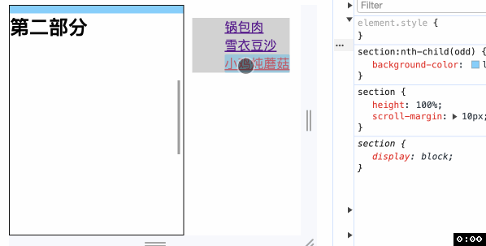
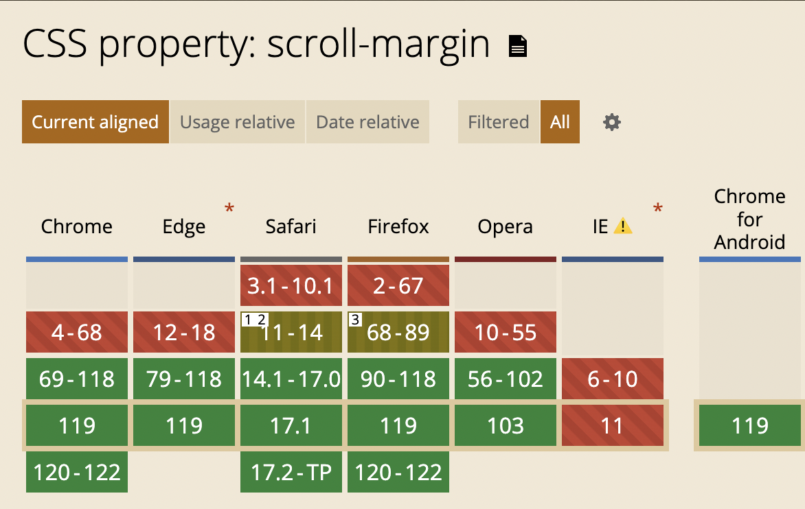

<!-- TOC -->

- [CSS滚动捕获 scroll-margin](#css%E6%BB%9A%E5%8A%A8%E6%8D%95%E8%8E%B7-scroll-margin)
  - [非滚动捕获容器](#%E9%9D%9E%E6%BB%9A%E5%8A%A8%E6%8D%95%E8%8E%B7%E5%AE%B9%E5%99%A8)
  - [语法](#%E8%AF%AD%E6%B3%95)
  - [兼容性](#%E5%85%BC%E5%AE%B9%E6%80%A7)

<!-- /TOC -->

# CSS滚动捕获 scroll-margin
> 设置元素的滚动外边距


## 非滚动捕获容器
之前在 [scroll-padding](./52CSS滚动捕获scroll-padding.md) 中说过如何用 scroll-padding 避免锚点定位时元素贴着容器边缘的问题, 现在我们尝试用 scroll-margin 解决
```html
<body>
  <main>
    <section id="section1"><h1>第一部分</h1></section>
    <section id="section2"><h1>第二部分</h1></section>
    <section id="section3"><h1>第三部分</h1></section>
  </main>
  <aside>
    <nav>
      <ul>
        <li><a href="#section1">锅包肉</a></li>
        <li><a href="#section2">雪衣豆沙</a></li>
        <li><a href="#section3">小鸡炖蘑菇</a></li>
      </ul>
    </nav>
  </aside>
</body>
```
```css
main {
  overflow: auto;
  scroll-behavior: smooth;
  box-sizing: border-box;
  /* scroll-padding-top: 10px; */
}
section {
  height: 100%;
  scroll-margin: 10px;
}
```



## 语法
和 `margin` 一样, `scroll-margin` 也是一个简写属性, 是 `scroll-margin-bottom`、 `scroll-margin-left`、 `scroll-margin-right`、 `scroll-margin-top` 四个属性的简写.

## 兼容性



谢谢你看到这里😊