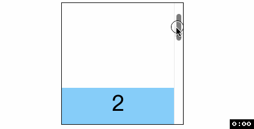
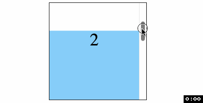
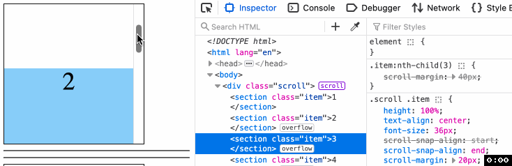
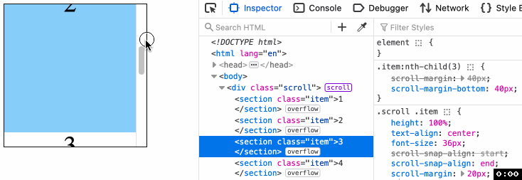

<!-- TOC -->

- [CSS滚动捕获 scroll-margin](#css%E6%BB%9A%E5%8A%A8%E6%8D%95%E8%8E%B7-scroll-margin)
  - [非滚动捕获容器](#%E9%9D%9E%E6%BB%9A%E5%8A%A8%E6%8D%95%E8%8E%B7%E5%AE%B9%E5%99%A8)
  - [语法](#%E8%AF%AD%E6%B3%95)
  - [兼容性](#%E5%85%BC%E5%AE%B9%E6%80%A7)

<!-- /TOC -->

# CSS滚动捕获 scroll-margin
> 设置元素的滚动外边距


## 非滚动捕获容器
之前在 [scroll-padding](./52CSS滚动捕获scroll-padding.md) 中说过如何用 `scroll-padding` 避免锚点定位时元素贴着容器边缘的问题, 现在我们尝试用 `scroll-margin` 解决
```html
<body>
  <main>
    <section id="section1"><h1>第一部分</h1></section>
    <section id="section2"><h1>第二部分</h1></section>
    <section id="section3"><h1>第三部分</h1></section>
  </main>
  <aside>
    <nav>
      <ul>
        <li><a href="#section1">锅包肉</a></li>
        <li><a href="#section2">雪衣豆沙</a></li>
        <li><a href="#section3">小鸡炖蘑菇</a></li>
      </ul>
    </nav>
  </aside>
</body>
```
```css
main {
  overflow: auto;
  scroll-behavior: smooth;
  box-sizing: border-box;
  /* scroll-padding-top: 10px; */
}
section {
  height: 100%;
  scroll-margin: 10px;
}
```

从下图可以看出, 当点击右侧 `<a>` 定位时, 元素并没有紧贴容器上边缘(第一个元素除外), 从而达到良好的滚动体验感受


### 滚动捕获容器
```html
<div class="scroll">
  <section class="item">1</section>
  <section class="item">2</section>
  <section class="item">3</section>
  <section class="item">4</section>
</div>
```
```css
.scroll {
  overflow: auto;
  scroll-snap-type: y mandatory;
}
.scroll .item {
  height: 100%;
  scroll-snap-align: start;
  scroll-margin: 20px;
}
.item:nth-child(3) {
  scroll-margin: 40px;
}
```
你会发现虽然第三个元素设置了 `scroll-margin: 40px;` 但是在下边缘发生滚动捕获时, 捕获的高度还是 `20px`.




更有趣的时, `Firefox` 和 `Safari` 表现与 `Chrome` 不同, 原因在 [MDN](https://developer.mozilla.org/en-US/docs/Web/CSS/scroll-margin#examples) 有提及, 就是使用 `scroll-margin: 40px;` 虽然语法上是给四个 `scroll-margin` 都设置了值, 但实际上只有 `scroll-margin-top` 有值(`y` 轴方向滚动来说)



代码里 `scroll-snap-align: start;` 约束了对齐方式就是顶部对齐, 所以 `Firefox` 和 `Safari` 表现符合预期. 我们可以将 `scroll-snap-align` 改为 `end` 试一下, 为了说明问题, 先将所有元素的 `scroll-margin` 都设置为 `20px`

可以看到, 在 `Firefox` 中发生滚动捕获时, 只会底部对齐, 符合预期



什么情况会让 `Firefox` 也出现问题呢? 那就是将第三个元素的 `scroll-margin` 设置为 `40px`. 看到了吗, 我们指定的 `mandatory` 严格捕获在动图的最后失效了, 滚动停在了第二个元素.




## 语法
和 `margin` 一样, `scroll-margin` 也是一个简写属性, 是 `scroll-margin-bottom`、 `scroll-margin-left`、 `scroll-margin-right`、 `scroll-margin-top` 四个属性的简写.

## 兼容性


谢谢你看到这里😊