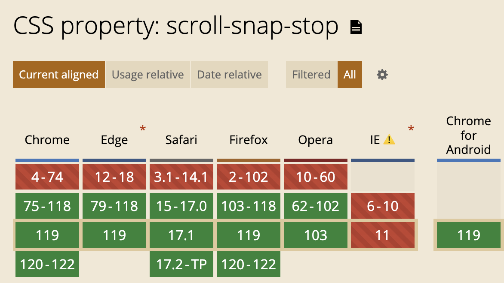

# CSS滚动捕获 scroll-snap-stop
> 是否允许滚动容器在滚动时「跳过」某些捕获位置(snap position)

不清楚捕获位置是什么的小伙伴, [点这里看概念介绍哦](./53CSS滚动捕获Scroll%20Snap.md)

## 语法
- `normal`: (默认值)可以跳过
- `always`: 不会跳过, 总是捕获

<video id="video" controls="" preload="none" poster="封面">
  <source id="mp4" src="../image/1699491871285101.mp4" type="video/mp4">
</videos>

大家看这个视频就知道, always 的表现并不如规范中所说, 至少在我刻意长距离滑动时滚动没有停止在第二个元素.

## 兼容性

谢谢你看到这里😊
