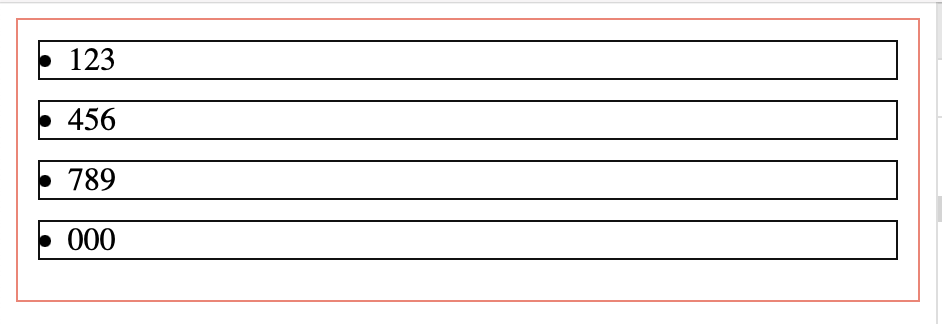
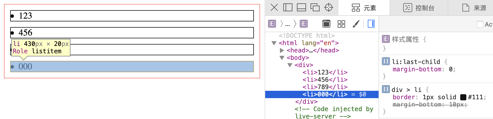
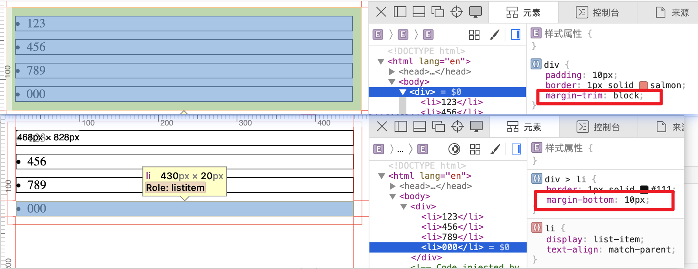
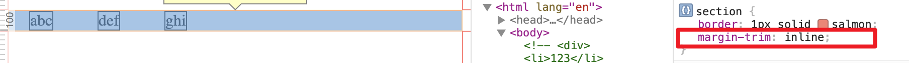
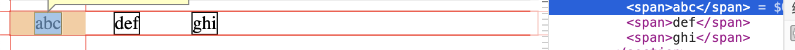
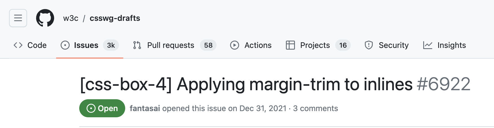
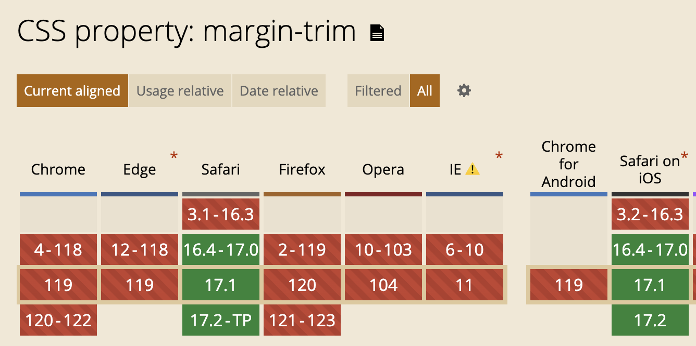

<!-- TOC -->

- [margin-trim](#margin-trim)
  - [主角登场](#%E4%B8%BB%E8%A7%92%E7%99%BB%E5%9C%BA)
  - [主角的局限性](#%E4%B8%BB%E8%A7%92%E7%9A%84%E5%B1%80%E9%99%90%E6%80%A7)
  - [兼容性](#%E5%85%BC%E5%AE%B9%E6%80%A7)

<!-- /TOC -->

# margin-trim
> 🧪这是一个实验性的属性, 目前仅有 `Safari` 支持

看这个属性的名字就知道, 外边距修剪. 

平常都会遇到一些排版上的问题, 比如垂直排列的元素之间增加下外边距
```html
<div>
  <li>123</li>
  <li>456</li>
  <li>789</li>
  <li>000</li>
</div>
```
```css
div {
  padding: 10px;
}
div > li {
  margin-bottom: 10px;
}
</style>
```


但是通常我们不希望最后一个元素增加下外边距, 因为列表容器已经有了下内边距, 因此需要对最后一个元素做特殊处理
```css
li:last-child {
  margin-bottom: 0;
}
```


## 主角登场
说到这里 `margin-trim` 可以做什么呢? 哎, 把 `margin-trim` 加在列表元素的父容器上, 父容器就会修剪子元素和父容器相邻的子元素的外边距.

```css
 div {
  padding: 10px;
  margin-trim: block; // 主角在这
}
div > li {
  margin-bottom: 10px;
}
/* li:last-child {
  margin-bottom: 0;
} */
```
我们从下图看到, 虽然每个子元素的下边距都是 `10px`, 但是和父容器相邻的子元素的外边距却被裁减了.



### 语法
在上面的例子我们通过 `block` 属性指定只能修剪逻辑块方向的外边距, 其实 `margin-trim` 的值可以是下面的任何一个
- `none`
- `block`
- `block-start`
- `block-end`
- `inline`
- `inline-start`
- `inline-end`

## 主角的局限性
然而, 我们的主角还没有得到 `Safari` 的全部支持, 因为在内联方向上的 `margin` 裁减没!有!效!果!





为什么会这样呢? 因为在 `inline` 方向上的裁剪效果[还没有定](https://github.com/w3c/csswg-drafts/issues/6922)


## 兼容性
仅 `Safari >= 16.4` 才支持





谢谢你看到这里😊