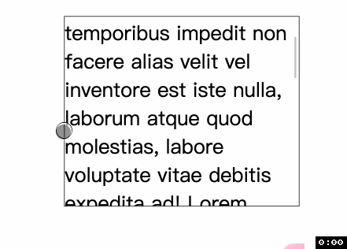
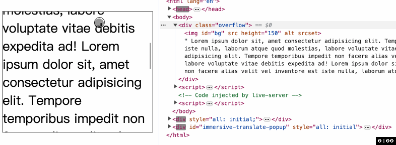
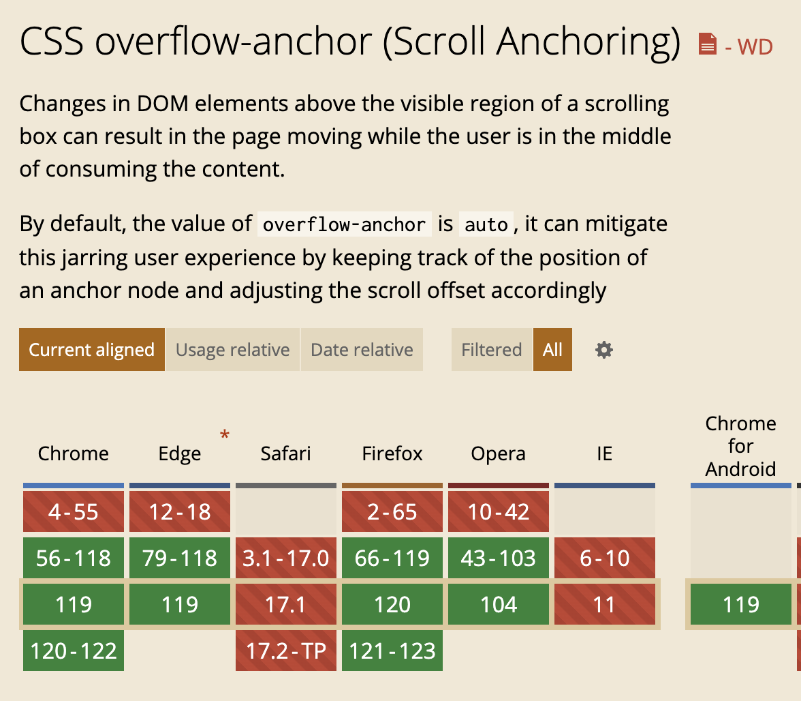

# overflow-anchor
为了认识这个属性, 我们需要先看一种常见的现象. 即在网页加载中, 图片常常比文字加载更慢, 这样图片加载完成后可能会将文字向下顶. 比如下图演示


```html
<div class="overflow">
  
  Lorem...
</div>
```
```js
const bg = document.getElementById('bg')
setTimeout(() => {
  bg.src = 'https://www.baidu.com/img/PCtm_d9c8750bed0b3c7d089fa7d55720d6cf.png'
}, 3000)
```

但是如果你把代码拷贝运行, 你却得不到上图的效果, 因为我有一个属性没有告诉你.

其实浏览器厂商早就注意并修复了这个问题, 真实的情况是图片加载后文字也不会向下滚动. 如下图, 注意右边代码中 `` 标签的 `src` 有值后文字并没有向下滚动, 这才是浏览器的默认行为.



那究竟是哪个属性起了作用呢? 就是今天的主角 `overflow-anchor`. 下面的代码是第一个动图对应的代码.
```css
.overflow {
  height: 300px;
  overflow: auto;
  border: 1px solid #111;
  overflow-anchor: none;
  font-size: 2em;
}
```

⚠️ 在上面的例子中, 为了演示效果我们先把内容往下滚动了一部分让图片在黑色框框之外. 不然如果一点也不滚动图像就在框框里, 那么图像加载完成后肯定会将文字挤下去.

## auto 和 none
`overflow-anchor` 可以是 `auto` 或 `none`. 其中 `auto` 是默认值, 使用 `none` 就会禁止浏览器的默认行为.

## 兼容性
`Safari` 不支持这个属性😭 不愧是当代 `IE`.
 


 
谢谢你看到这里😊