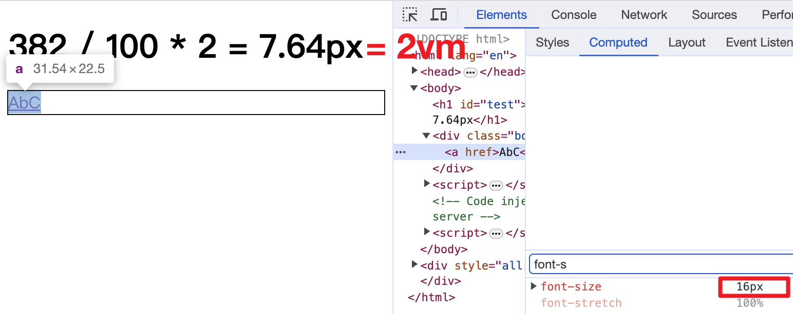
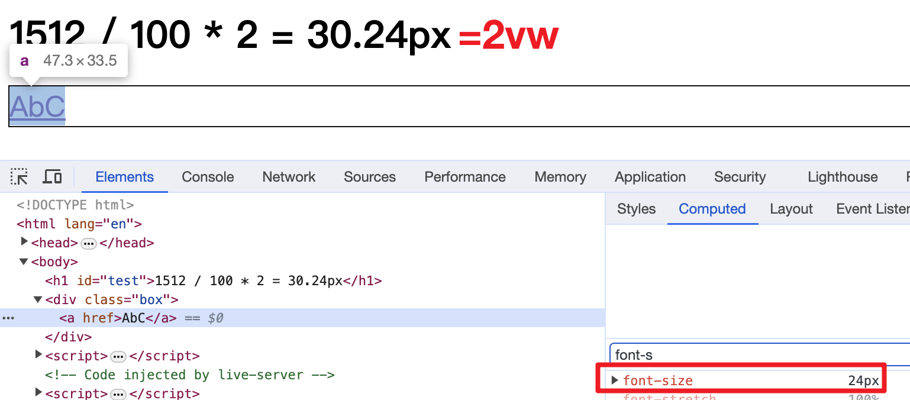
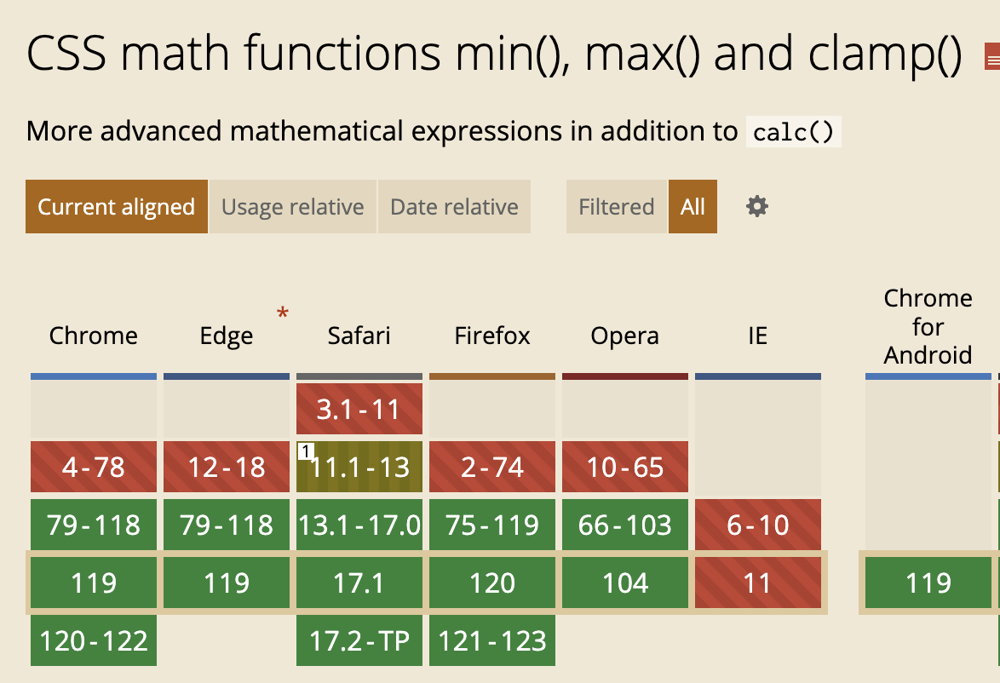

# clamp()
> clamp v. 夹紧, 夹住

## 引出主题
`clamp()` 接收三个参数: 最小值、中间值、最大值, 并将中间值限制在最小值和最大值之间.

```html
<h1 id="test"></h1>
<div class="box"><a href="">AbC</a></div>
```
```css
.box {
  outline: 1px solid #111;
  /* 16px, width/100*2=20px, 24px */
  font-size: clamp(1rem, 2vw, 1.6rem);
}
```
为了演示 `2vw` 的具体值是多少, 我们增加了下面的 JavaScript 代码
```js
const width = document.documentElement.clientWidth
const html = `${width} / 100 * 2 = ${width / 100 * 2}px`
document.getElementById('test').innerHTML = html
```
Chrome 默认情况下 1rem 就是 16px. 所以我们先来演示 2vw 小于 1rem 的情况, 最后渲染的字体大小为 `16px`



接下演示 2vm 大于 2rem 的情况, 最后渲染大小是 24px



通过上面的例子, 我们初步演示了 clamp() 的用途.


## 兼容性



谢谢你看到这里😊
