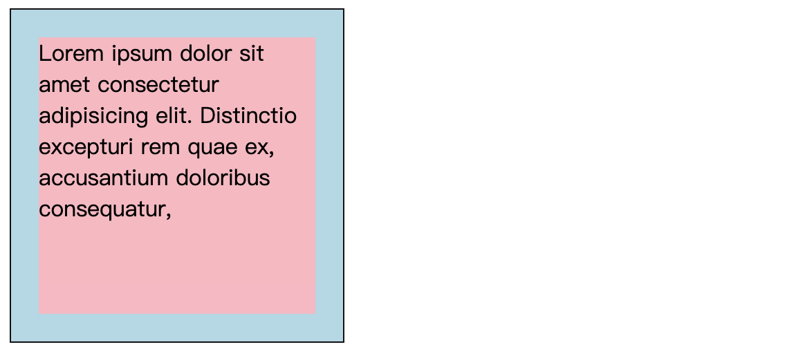
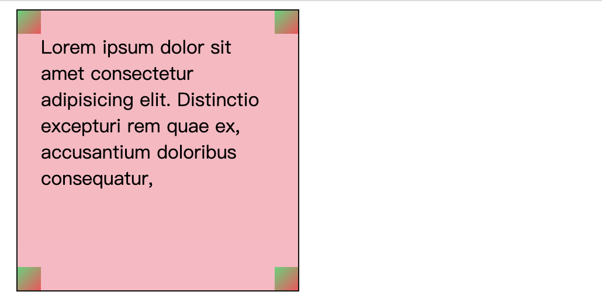
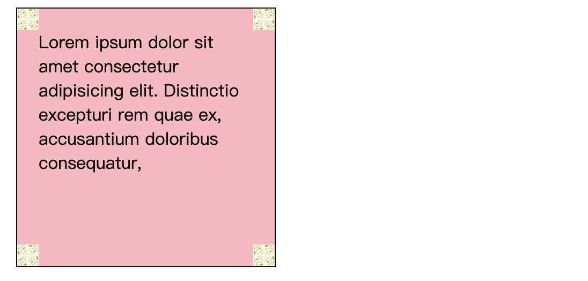
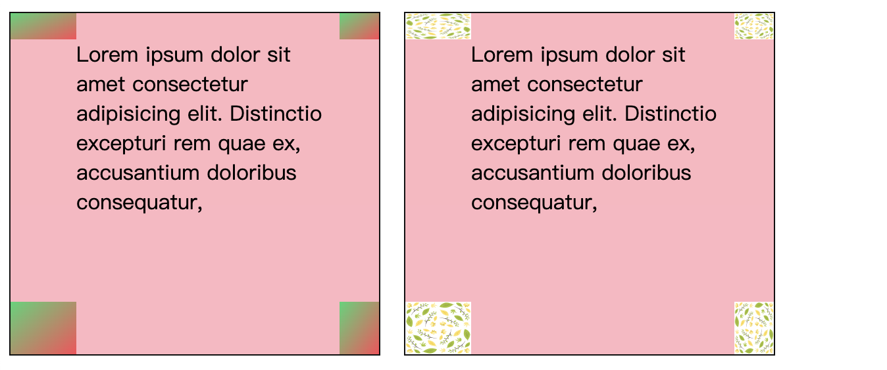
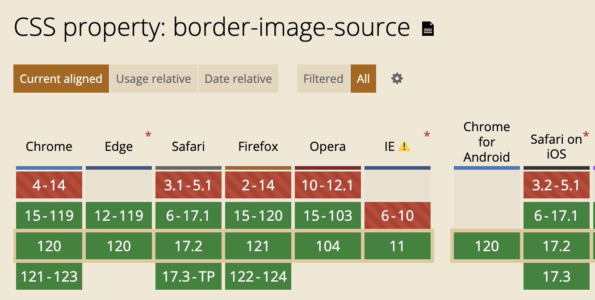

# border-image-source
> 指定源图像.

建议[先看这里](./64border-image.md), 概览多个概念.

## 语法
所以合法的图像类型的值都可以, 渐变当然也可以.

我们用做测试的图片来自 [pixabay](https://pixabay.com/vectors/nature-pattern-leaves-drawing-6573288/), 也是我在 `MDN` 的 [blog Border images in CSS: A key focus area for Interop 2023](https://developer.mozilla.org/en-US/blog/border-images-interop-2023/) 上看到的. 谢谢 `MDN`, 如果不是这篇文章, 我也不会想梳理这些个已经推出很久的 `CSS` 属性.

我们下来看要应用边框图像的毛坯房. 其实这也是 `border-image-source: none` 的样子, 因为 `none` 就是属性默认值.
```css
width: 200px;
height: 200px;
outline: 1px solid #111;
border: 20px solid lightblue;
background-color: lightpink;
```


下面我们看看渐变的样式
```css
border-image-source: linear-gradient(135deg, #2ed573, #ff4757);
```


最后通过 `url()` 指定图片
```css
border-image-source: url(https://developer.mozilla.org/en-US/blog/border-images-interop-2023/nature.png);
```


其实现在的例子都不太符合我们的想象, 不要紧, 后面会优化. 接下来我想说的是, 虽然图像在四个角, 但是他们的尺寸是随着四个边框的宽度改变的.
```css
border-width: 20px 30px 40px 50px;
```


## 兼容性
相当令人惊喜, 这是一个 `IE11` 都支持的属性.



谢谢你看到这里😊