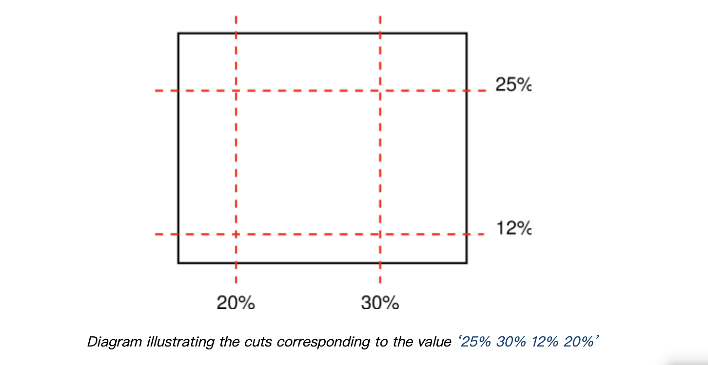

# border-image-slice
> 通过指定图片四边向内的偏移偏移, 将图片分成 9 个区域: 4角、4边和中心区域. 这 9 个区域最终组合成 border image.

下图来自 [CSS 规范](https://drafts.csswg.org/css-backgrounds/#the-border-image-source). 其中, 中间部分默认不显示, 除非我们指定 border-image-slice 的值包含 fill, 并且中间部分的图片会覆盖 `background`.

我们先来看一个动图, 体验一下这个属性的特点, 然后介绍它的语法. 这里我们不会介绍具体 9 个区域是如何组合的, 掌握 CSS 背后的细节可以放在以后.

## 语法
这个属性值由两部分组成, 数值部分和关键词 fill.

先说 fill 的作用就是让 9 个区域中的中间部分展示出来, 并且其会覆盖 background.

数值部分就是最开头介绍的从图片四边向内的偏移距离. 和 margin、padding 一样, 数值部分也可以接受1、2、3、4个值, 对应关系同前两者. 并且数值的类型如下
- `<percent>`: 百分比相对于图片的大小. 水平方向根据图片宽度计算, 数值方向根据图片高度计算.
- `<number>`: 如果是光栅图像(如PNG、JPG)表示像素数; 如果是矢量图(SVG), 表示向量坐标.

数值不能为负,

谢谢你看到这里😊
