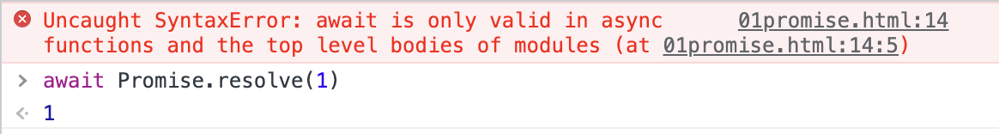

## async await
### async function
`async function` 声明了一个 `async function`, 允许在 `function` 中使用 `await` 关键字. `async` 和 `await` 关键字允许以 `promise` 为基础的异步的代码以更清楚的方式书写, 从而避免 `promise` 链式调用.

`async` 函数内可以使用 `0` 个或多个 `await` 表达式. `await` 会阻塞 `Promise` 中异步代码的执行直到 `Promise` 变为 `fulfilled` 或 `rejected`. 如果 `Promise` 变为 `fulfilled` 那么 `Promise` 的值就会成为 `await` 表达式的返回值.
```js
async function() {
  let result = await new Promise(resolve => {
    resolve(1)
  })
  console.log('result',result) // result 1
}
```
如果 `await` 后的 `Promise` 抛出了异常, 就需要使用 `try...catch...` 语法捕获这个异常
```js
let p
async function asyncTest3() {
  try {
    p = await new Promise((resolve, reject) => {
      reject('Today is the last day of holiday')
    })
  } catch (error) {
    console.log('p',p) // undefined
    console.log('error',error) // error Today is the last day of holiday
  }
}
```
`📖await` 只能在 `async function` 中使用, 否则就会收到 `Syntax Error` 的语法错误. 当然在控制台使用 `await` 也行.
```html
<script>
  await Promise.resolve(1)
<script>
```

关于报错信息中提示的顶层 `modules` 中使用, 我们需要给 `script` 标签添加 `type` 属性并且值为 `module` 即可.
```html
<script type="module">
  await Promise.resolve(1)
<script>
```
📖 `async/await` 的行为类似于 `Promise` 和 `Generators` 的结合. 我想起来之前面试有面试官就问过这个问题...

`async function` 总是返回一个 `Promise`, 如果返回值不是 `Promise` 那么就会被隐式包装在 `Promise` 中返回.
```js
let p1 = (async function() {})()
    
let p2 = (async function() {
  return 1
})()

let p3 = (async function() {
  return Promise.resolve(1)
})()

let p4 = (async function() {
  return {
    then(resolve, reject) {
      resolve(1)
    }
  }
})()

setTimeout(() => {
  console.log('p1',p1) // p1 Promise {<fulfilled>: undefined}
  console.log('p2',p2) // p2 Promise {<fulfilled>: 1}
  console.log('p3',p3) // p3 Promise {<fulfilled>: 1}
  console.log('p4',p4) // p4 Promise {<fulfilled>: 1}
})
```
在上面的代码中, `async function` 内部分别返回了
- `undefined`
- `1`
- `Promise`
- `thenable` 对象

可以看出不同返回类型, 都有相应的处理.

📖尽管 `async function` 的返回值好像被包裹在 `Promise.resolve()` 中, 但是并不完全相同. `async function` 会返回一个不同的引用而 `Promise.resolve()` 会返回相同的引用.
```js
const p = new Promise((resolve) => {
  resolve(1)
})
async function asyncReturn() {
  return p
}
async function asyncReturn2() {
  return Promise.resolve(p)
}
function basicReturn() {
  return Promise.resolve(p)
}
console.log(p === basicReturn()) // true
console.log(p === asyncReturn()) // false
console.log(p === asyncReturn2()) // false
```
`async function` 的函数体可以被想象成由 `0` 个或多个 `await` 表达式分割. 如果函数体中没有 `await` 表达式, 那么函数将同步执行. 如果有 `1` 个 `await` 表达式, 那么函数总是异步完成.

`async function` 与一般的函数声明一样, 也会被提升至函数所在的作用域开始, 所以在作用域的任何地方都可以调用.
### await
### 面试: 错误处理

```js
```


