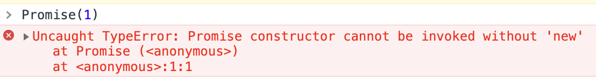
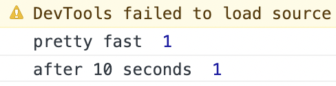
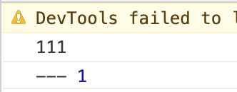
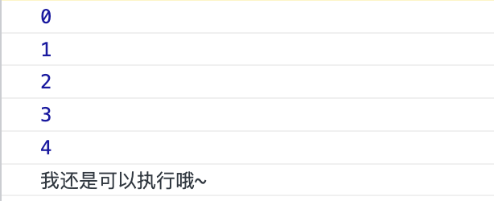
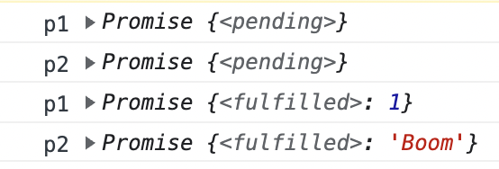
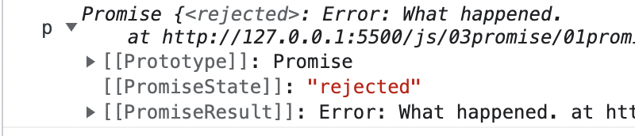
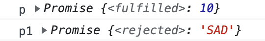

<!-- TOC -->

- [Promise 之基础](#promise-%E4%B9%8B%E5%9F%BA%E7%A1%80)
  - [Promise 构造函数](#promise-%E6%9E%84%E9%80%A0%E5%87%BD%E6%95%B0)
    - [参数 executor](#%E5%8F%82%E6%95%B0-executor)
    - [返回值](#%E8%BF%94%E5%9B%9E%E5%80%BC)
    - [总结流程](#%E6%80%BB%E7%BB%93%E6%B5%81%E7%A8%8B)
  - [thenable 对象](#thenable-%E5%AF%B9%E8%B1%A1)
  - [resolve 函数](#resolve-%E5%87%BD%E6%95%B0)
  - [then](#then)
    - [返回值](#%E8%BF%94%E5%9B%9E%E5%80%BC)
    - [链式调用](#%E9%93%BE%E5%BC%8F%E8%B0%83%E7%94%A8)

<!-- /TOC -->

## Promise 之基础
这里强烈推荐 [B站技术蛋老师](https://www.bilibili.com/video/BV1QV411a7Hu) 关于 `Promise` 的介绍, 很好懂哦.

`Promise` 的出现, 解决了回调地狱的问题, 让异步代码写起来更加优雅.

### Promise 构造函数
`Promise` 是一个表示异步操作最终完成或失败的对象. 但是当创建异步操作时, 并不能立刻知道操作是完成还是失败. `Promise` 允许我们在操作有结果时, 对成功的结果或失败的原因添加对应的处理函数.

`Promise` 内部有如下几个状态. 当然这些状态是内部属性, 不能直接访问.
- `pending`: 初始状态
- `fulfilled`: 异步操作成功结束
- `rejected`: 异步操作失败

#### 参数 executor
`Promise` 这个构造函数本身接收一个函数作为参数, 暂且给这个函数起名 `executor`. 📖注意, `Promise` 仅支持通过 `new` 调用, 非 `new` 调用会抛出 `TypeError`



参数 `executor` 是一个函数, 会在构造 `Promise` 对象时调用, `executor` 中的逻辑可以包含我们上面说的异步操作. `executor` 接收两个函数(`resolve` 和 `reject`)作为参数并且 `executor` 的返回值会被忽略, 并不代表 return 语句没有作用哦😯

```js
let p = new Promise((resolve, reject) => {
  // ....
  return 1; // 被忽略
})
```
如果在 `executor` 中有错误抛出, 那么 `Promise` 的状态会立刻变为 `rejected`.
```js
let p = new Promise((resolve, reject) => {
  throw new TypeError('Oops')
})
```


`resolve` 和 `reject` 是两个函数, 你可以给他们起任何名字, 在调用他们时也很简单, 他们只接收一个参数, 这个参数可以是任意类型. `resolve` 和 `reject` 分别在异步操作成功时和失败时调用. 如果调用 `resolve` 和 `reject` 时不传参数, 那么就相当于传了 `undefined`.

调用 `resolve` 可传入另一个 `Promise` 对象 `p1`, 此时 `new Promise` 返回的 `p` 的状态不会因为 `resolve` 的调用而变成 `fulfilled`, 而是会跟随 `resolve` 的参数 `p1` 的状态变换.

另一个函数 `reject` 的语义类似抛出异常, 调用 `reject` 可以类似 `reject(new TypeError(...))`.

`executor` 的完成状态对 `promise` 的状态有影响, 但影响有限
- 首先, `executor` 的返回值被忽略. `executor` 内部的 `return` 仅仅影响函数执行的流程而不会对 `promise` 的完成状态有任何影响. 如果 `executor` 在 `resolve` 或 `reject` 之前调用, 那么 `promise` 将永远停留在 `pending` 状态.
  - ```js
    let p = new Promise((resolve, reject) => {
      return 1
      resolve(2)
    })
    p.then(res => console.log('res is ', res)) // 无输出
    .catch(err => console.log('err is ', err)) // 无输出
    console.log('p',p) // p Promise {<pending>}
- 如果 `executor` 中抛出异常, `promise` 的状态就会变为 `rejected`, 除非 `resolve` 或 `reject` 已经被调用. 也就是说, 如果在 `resolve` 或 `reject` 调用之后代码抛出了异常, 那么异常会被忽略.

📖即便存在 `pending` 的 `promise` 也不会阻止程序不退出. 如果事件循环(`event loop`)为空, 那么即便有 `pending` 状态的 `promise` 程序也会退出.

#### 返回值
当通过 `new` 调用后, `Promise` 这个构造函数返回一个 `Promise` 对象 `p`. 无论 `executor` 的两个参数 `resolve` 和 `reject` 哪一个被调用, `p` 的状态都会变成 *resolved*, 但是, 如果调用 `resolve` 或 `reject` 时传入了另一个 `Promise` 作为参数, 那么我们只能说 `p` 是 *`resolved`* 而尚未 *`settled`*. 

当 `Promise` 的状态从 `pending` 变成 `fulfilled` 或 `rejected` 时, `then` 方法中对应的关联处理函数就会被调用. 无论是 `fulfilled` 还是 `rejected`, 我们都可以称 `Promise` 最终 `settled`. 

下图是来自 `MDN` 的官网的图片, 侵删


所以我们可以画出这几个状态之间的关系


如果是 `Promise` 先变为 `fulfilled` 再添加对应的处理函数, 那么这个函数也会被调用, 因此就没有所谓的竞争条件.
```js
let p = new Promise((resolve) => {
  setTimeout(() => {
    resolve(1)
  }, 1000)
})
p.then((res) => { console.log('pretty fast ', res) })
setTimeout(() => {
  p.then((res) => { console.log('after 10 seconds ', res) })
}, 10 * 1000)
```


#### 总结流程
- 调用构造函数生成新的 `Promise` 对象 `p`, 调用时同样产生一对函数 `resolve` 和 `reject`
- `executor` 中通常有异步操作, 该异步操作往往提供了回调式的 `API`(即在异步操作完成时会调用回调函数). 回调函数在 `executor` 中定义, 因此它可以访问 `resolve` 和 `reject`
- `executor` 的调用是同步的, 即在调用 `Promise` 构造函数时 `executor` 就执行了, 并且带有 `resolve` 和 `reject` 作为参数.
- `executor` 内部可以执行一些代码(异步操作), 最终异步操作的完成通过调用 `resolve` 和 `reject` 产生的副作用来与 `p` 沟通. 副作用就是 `p` 变成了 `resolved` 状态
  - 如果先调用 `resolve`, `p` 的状态可能仍然是 `pending`(`resolve` 的参数是一个 `thenable` 对象) 也可能变成 `fulfilled` (`resolve` 的参数不是 `thenable` 对象) 也可能变成 `rejected` (`resolve` 的参数是一个无效的解析值)
  - 如果先调用 `reject`, `p` 立刻变为 `rejected` 状态
  - 一旦调用 `resolve` 或 `reject`, `p` 就变成 `resolved` 状态. `resolve` 和 `reject` 先调用谁, 谁才会影响 `p` 的最终状态, 后续的调用既不能覆盖之前的调用(比如先调用了 `resolve` 又调用了 `resolve`), 也不能改变 `p` 的最终状态(比如先调用 `resolve` 又调用 `reject`, 不能将 `p` 从 `fulfilled` 变为 `rejected`)
    - ```js
      let p = new Promise((resolve, reject) => {
        resolve(1)
        resolve(2)
      })
      p.then(res => { console.log('---', res) }) // --- 1
  - 如果 `executor` 因为内部抛出异常而接触, 那么 `p` 变成 `rejected` 状态. 但是如果已经调用了 `resolve` 或者 `reject`, 那么抛出的异常就会被忽略.
    - ```js
      let p = new Promise((resolve, reject) => {
        resolve(1)
        console.log('111')
        throw new TypeError('Oooooooooops')
        console.log('222 ')
      })
      p.then(res => { console.log('---', res) })
    - 
  - 调用 `resolve` 或 `reject` 并不会让 `promise` 立刻变成 `settled` 状态(`fulfilled` 或 `rejected`), 因为如果调用 `resolve` 时传入的是另一个 `thenable` 对象, 那么 `promise` 的最终状态还是会匹配 `thenable` 的最终状态.
- 一旦 `promise` 变为 `settled`, 那么它就会调用那些由 `then()`, `catch()` 或 `finally()` 注册的处理函数. 并且 `promise` `resolve` 的参数或 `reject` 的参数都会成为这些注册的处理函数的输入.

### thenable 对象
上面说了很多 `thenable` 对象, 那么什么是 `thenable` 呢? 答案很简单, 属性包含 `then` 并且 `then` 是可调用函数的对象就是 `thenable` 对象.
### `resolve` 函数
`resolve` 函数有如下一些特征
- 如果 `resolve` 的参数是 `p`(也就是 `new Promise` 的返回值), 那么 `p` 就会变成 `rejected` 并抛出 `TypeError`. 下面的代码中我特意加了延迟, 不然 `resolve` 调用时的 `p` 的值还是 `undefined` 呢.
  - ```js
    let p;
    p = new Promise((resolve, reject) => {
      setTimeout(() => {
        resolve(p)
      }, 1000)
    })
    p.then(res => { console.log('---', res) })
    .catch(err => { console.log('what happened ? ', err) })
  - 
- 如果 `resolve` 的参数不是 `thenable` 对象, 即是原始类型或者不是 `thenable` 对象(对象没有属性的名字为 `then` 或者属性 `then` 不是可调用方法), 那么 `promise` 的状态就立刻变为 `fulfilled`.
- 如果 `resolve` 的参数是一个 `thenable` 值(包括另一个 `Promise` 对象), 那么 `thenable` 的 `then` 方法就会被保存起来并在将来被调用. `then` 方法和 `executor` 一样也会接收两个函数为参数, 这两个函数与 `resolve` 和 `reject` 的行为完全相同. 如果调用 `then` 方法时抛出了异常, 那么当前的 `promise` 会变成 `rejected`.

### then()
`then()` 方法接收两个函数作为参数, 这两个函数分别是 `Promise` 完成和失败的处理函数.
- `onFulfilled`: 参数可选. 在 `Promise` 完成时异步调用的函数. 这个函数有一个参数, 就是 `Promise` 完成时调用 `resolve` 的参数. 如果 `onFulfilled` 不是函数, 那么它就会被内部替换为箭头函数(`(x) => x`) 其中 x 就是 Promise 完成时的值.
- `onRejected`: 参数可选, 在 `Promise` 变为 `rejected` 状态时异步调用的函数. 这个函数只有一个参数, 就是 `Promise` 失败的原因. 如果 `onRejected` 不是函数, 处理同上.
```js
new Promise(resolve => {
  resolve(1)
}).then(
  value => { console.log('Promise fulfilled with ', value) },
  err => { console.log('Promise rejected with reason ', err) }
)
```
在实际代码中, 我们更倾向于使用 `catch` 处理状态为 `rejected` 的 `promise` 而不是 `then` 中同时处理成功和失败两种情况.
```js
new Promise(resolve => {
  resolve(1)
}).then(value => { 
  console.log('Promise fulfilled with ', value) 
}).catch(err => {
  console.log('Promise rejected with reason ', err)
})
```
📖前面提过, 如果在一个 `promise` 对象上调用 `N` 个 `then` 方法, 那么这个 `promise` 最多会有 `N` 个 `onFulfilled` 和 `N` 个 `onRejected`. 所有的处理函数会按照他们被添加的顺序调用.
📖还有就是添加 `then` 的时机, 即便 `promise` 在变为 `fulfilled` 后调用 `then`, 对应的处理函数还是可以执行.
```js
let p = new Promise(resolve => {
  resolve(1)
})
for (let i = 0; i < 5; i++) {
  p.then(() => { console.log(i) })
}
Promise.resolve(1).then(() => { console.log('我还是可以执行哦~') })
```

#### 返回值
`then()` 会立刻返回一个新的 `Promise` 对象 `p`, `p` 被返回时总是 pending 状态.

`then()` 的两个函数参数总有一个会异步执行. `p` 的行为取决于这两个函数的执行状态, 规则如下
- `返回一个值`: `p` 变为 `fulfilled` 并且返回值就是 `p` 的值
  - ```js
    let p1 = Promise.resolve(1).then(value => value)
    console.log('p1',p1)
    setTimeout(() => {
      console.log('p1',p1)
    }, 1000)
    
    let p2 = Promise.reject('Boom').then(null, err => err)
    console.log('p2',p2)
    setTimeout(() => {
      console.log('p2',p2)
    }, 1000)
  - 正如规则中所说, `p` 返回时总是 `pending`. 并且 `onFulfilled` 和 `onRejected` 都是异步调用的, 所以我们没办法知道 `p` 的状态什么时候会变成 `resolved`.
  - 
- `什么也不返回`: `p` 变成 `fulfilled` 并且 `p` 的值为 `undefined`
- `抛出异常`: `p` 便成 `rejected` 并且 `p` 的值为异常
  - ```js
    let p = Promise.resolve(1).then(() => {
      throw new Error('What happened.')
    })
    setTimeout(() => {
      console.log('p',p)
    }, 1000)
  - 
- `返回一个状态为 fulfilled 的 promise`: `p` 变为 `fulfilled` 并且 `p` 的值就是返回的 `promise` 的值 
- `返回一个状态为 rejected 的 promise`: `p` 变为 `rejected` 并且 `p` 的值就是返回的 `promise` 的值
  - ```js
    let p = Promise.resolve(1).then(() => Promise.resolve(10))
    setTimeout(() => {
      console.log('p',p)
    }, 1000)

    let p1 = Promise.resolve(1).then(() => Promise.reject('SAD'))
    setTimeout(() => {
      console.log('p1',p1)
    }, 1000)
  - 
- `返回另一个状态为 pending 的 promise`: `p` 的状态跟随 `promise` 的状态变化. `p` 的完成值与 `promise` 的值相同.
  - ```js
    let person = {
      name: 'Levi'
    }
    let p = Promise.resolve(1).then(() => new Promise(resolve => {
      resolve(person)
    }))
    p.then(value => {
      console.log(value === person) // true
    })
#### 链式调用
因为 then() 方法返回新的 Promise 所以可以链式调用.
```js
Promise.resolve(1)
.then(value => {
  console.log('value',value) // 1
  return value * 2
})
.then(value => {
  console.log('value',value) // 2
  return value + 1
})
.then(value => {
  console.log('value',value) // 3
})
```
```js
```


谢谢你看到这里😊
