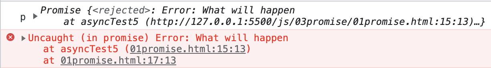
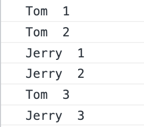
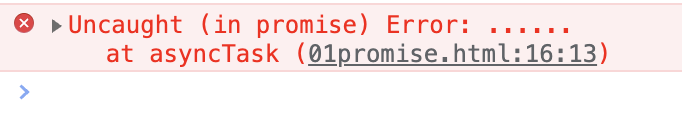
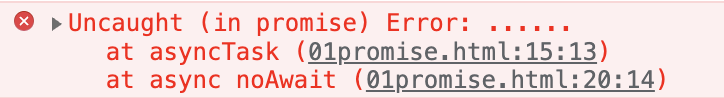

## async await
### async function
`async function` 声明了一个 `async function`, 允许在 `function` 中使用 `await` 关键字. `async` 和 `await` 关键字允许以 `promise` 为基础的异步的代码以更清楚的方式书写, 从而避免 `promise` 链式调用.

`async` 函数内可以使用 `0` 个或多个 `await` 表达式. `await` 会阻塞 `Promise` 中异步代码的执行直到 `Promise` 变为 `fulfilled` 或 `rejected`. 如果 `Promise` 变为 `fulfilled` 那么 `Promise` 的值就会成为 `await` 表达式的返回值.
```js
async function() {
  let result = await new Promise(resolve => {
    resolve(1)
  })
  console.log('result',result) // result 1
}
```
如果 `await` 后的 `Promise` 抛出了异常, 就需要使用 `try...catch...` 语法捕获这个异常
```js
let p
async function asyncTest3() {
  try {
    p = await new Promise((resolve, reject) => {
      reject('Today is the last day of holiday')
    })
  } catch (error) {
    console.log('p',p) // undefined
    console.log('error',error) // error Today is the last day of holiday
  }
}
```
如果 `async function` 中没有 `await` 并抛出了异常, 那么也会返回 `rejected` 的 `promise`
```js
async function asyncTest5() {
  throw new Error('What will happen')
}
let p = asyncTest5()
setTimeout(() => {
  console.log('p',p)
})
```

`📖await` 只能在 `async function` 中使用, 否则就会收到 `Syntax Error` 的语法错误. 当然在控制台使用 `await` 也行.
```html
<script>
  await Promise.resolve(1)
<script>
```

关于报错信息中提示的顶层 `modules` 中使用, 我们需要给 `script` 标签添加 `type` 属性并且值为 `module` 即可.
```html
<script type="module">
  await Promise.resolve(1)
<script>
```
📖 `async/await` 的行为类似于 `Promise` 和 `Generators` 的结合. 我想起来之前面试有面试官就问过这个问题...

`async function` 总是返回一个 `Promise`, 如果返回值不是 `Promise` 那么就会被隐式包装在 `Promise` 中返回.
```js
let p1 = (async function() {})()
    
let p2 = (async function() {
  return 1
})()

let p3 = (async function() {
  return Promise.resolve(1)
})()

let p4 = (async function() {
  return {
    then(resolve, reject) {
      resolve(1)
    }
  }
})()

setTimeout(() => {
  console.log('p1',p1) // p1 Promise {<fulfilled>: undefined}
  console.log('p2',p2) // p2 Promise {<fulfilled>: 1}
  console.log('p3',p3) // p3 Promise {<fulfilled>: 1}
  console.log('p4',p4) // p4 Promise {<fulfilled>: 1}
})
```
在上面的代码中, `async function` 内部分别返回了
- `undefined`
- `1`
- `Promise`
- `thenable` 对象

可以看出不同返回类型, 都有相应的处理.

📖尽管 `async function` 的返回值好像被包裹在 `Promise.resolve()` 中, 但是并不完全相同. `async function` 会返回一个不同的引用而 `Promise.resolve()` 会返回相同的引用.
```js
const p = new Promise((resolve) => {
  resolve(1)
})
async function asyncReturn() {
  return p
}
async function asyncReturn2() {
  return Promise.resolve(p)
}
function basicReturn() {
  return Promise.resolve(p)
}
console.log(p === basicReturn()) // true
console.log(p === asyncReturn()) // false
console.log(p === asyncReturn2()) // false
```
`async function` 的函数体可以被想象成由 `0` 个或多个 `await` 表达式分割. 如果函数体中没有 `await` 表达式, 那么函数将同步执行. 如果有 `1` 个 `await` 表达式, 那么函数总是异步完成.

`async function` 与一般的函数声明一样, 也会被提升至函数所在的作用域开始, 所以在作用域的任何地方都可以调用.
### await
虽然 `await` 会等待 `Promise` 的状态变为 `settled`, 但是 `await` 并不会阻止 `JS` 的执行. 在等待 `Promise` 变为 `settled` 的时间里, `JS` 还可以做其他事情.

#### `await` 控制流效果
如果代码执行中遇到了 `await`, 那么就会执行 `await` 后面的表达式, 也就是 `Promise`, 并且所有等待 `await` 结果的代码都将会暂停⏸️并进入微任务队列(`microtask queue`). `JS` 主线程准备执行事件循环(`event loop`)中的下一个任务. 即便 `await` 后的表达式是一个已经 `resolved` 的 `Promise` 或者不是 `promise`, 暂停也会发生.
```js
async function call(name) {
  console.log(name, ' 1')
  await console.log(name, ' 2')
  console.log(name, ' 3')
}
call('Tom')
call('Jerry')
```

效果等价于
```js
function call1(name) {
  return new Promise((resolve) => {
    console.log(name, ' 1')
    resolve(console.log(name, ' 2'))
  }).then(() => {
    console.log(name, ' 3')
  })
}
```

#### 改进堆记录
有时, 如果 `Promise` 直接在 `async function` 中返回, 那么 `await` 会被忽略. 实际上没有被忽略, 只是 `await` 的结果又再一次被包装进了 `Promise`👀
```js
async function asyncTask() {
  await null
}

async function noAwait() {
  // return await asyncTask()
  return asyncTask() // await 作用没了, 不如不写
}
```
但是, 如果 `asyncTask` 中抛出了异常, 从下图片中可以看到只有 `asyncTask` 一个函数出现了错误的栈调用信息中, 而 `noAwait` 没有出现.  
```js
async function asyncTask() {
  await null
  throw new Error('......')
}

async function noAwait() {
  return asyncTask()
}
```

这不利于排查错误, 如果我们想要让 `noAwait` 函数出现在栈信息中, 可以在 `return` 之后加上 `await`. 只不过这样做会带来一些些性能开销, 毕竟异常先被「解开」又被「包装」
```js
async function asyncTask() {
  await null
  throw new Error('......')
}

async function noAwait() {
  // return asyncTask()
  return await asyncTask()
}
```

### 面试: 异常处理
在面试中其实被问到过 `async await` 如何进行错误处理. 一般都知道使用 `try...catch..`, 面试官就会接着问如果是连续多个 `await` 呢? 都写在 `try...catch..`. 中不又形成嵌套地狱吗?

有一个非常流行的 `JS` 库 [await-to-js](https://github.com/scopsy/await-to-js) 优雅地解决了 `async await` 的异常处理问题. 我们来看核心代码
```js
export function to(promise, errorExt) {
  return promise
    .then((data) => [null, data])
    .catch((err => {
      if (errorExt) {
        const parsedError = Object.assign({}, err, errorExt);
        return [parsedError, undefined];
      }

      return [err, undefined];
    });
}
```
代码非常简单, 就是接收一个 `promise` 作为参数, 如果 `promise` 变成 `resolve` 状态, 就返回 `[null, data]`, 其中 `null` 表示异常信息. 如果 `promise` 变为 `rejected` 状态, 就返回 `[err, undefined]`.

我们使用时
```js
[ err, user ] = await to(GetUserById(1));
if(!user) return cb('Not found');

[ err1, userMike ] = await to(GetUserByName('Mike'));
if(!userMike) return cb('Mike Not found');
```
看, 是不是非常巧妙呢? 可以尝试在你的项目中用起来!

谢谢你看到这里😊
