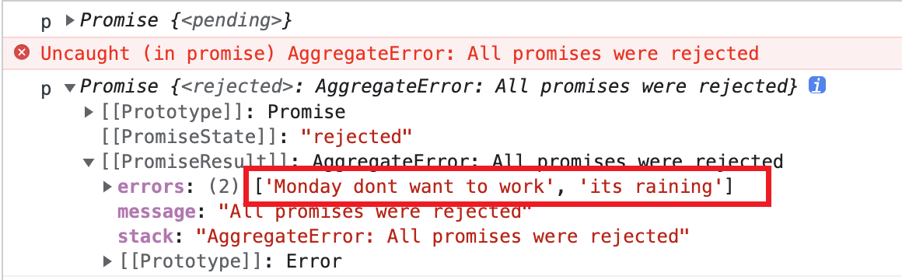

## Promise 其他 API
### Promise.resolve
这个静态方法将「解析(resolve)」参数并返回 `Promise`. 
```js
let p = Promise.resolve(1)
let tempP = new Promise(resolve => resolve(2))
let p2 = Promise.resolve(new Promise(resolve => setTimeout(resolve)))
let p3 = Promise.resolve({
  then(resolve) {
    resolve(3)
  }
})
console.log('p',p) // p Promise {<fulfilled>: 1}
console.log('p1',p1) // p1 Promise {<fulfilled>: 2}
console.log('p1 === tempP',p1 === tempP) // true
console.log('p2',p2) // p2 Promise {<pending>}
console.log('p3',p3) // p3 Promise {<pending>}
```
- 如果参数是 `Promise`, 那么直接返回参数; 
- 如果参数是 `Thenable` 对象, 就会调用对象的 `then(resolve, reject)` 方法; 
- 其他情况就会返回状态为 **`fulfilled`** 的 `Promise` 并且值为参数.

📖 `Promise.resolve()` 「解析」一个 `promise`, 解析不等同于将 `promise` 变为 `fulfilled` 或 `rejected` 状态. 简而言之, `Promise.resolve()` 返回一个 `Promise` `p`, `p` 最终的状态取决于另一个 `promise`(参数), `thenable` 对象或其他类型的参数.

`Promise.resolve()` 的特例是参数为 `Promise`. 如果参数 `value` 属于 `Promise` 或者是 `Promise` 的子类, 并且 `value.constructor === Promise` 那么 `Promise.resolve()` 就会直接返回而不是创建新的 `Promise`, 就像上面示例代码中的 `p1`. 

否则, `Promise.resolve()` 本质上就是 `new Promise(resolve => resolve(value))` 的简写形式.

来看否则的情况, 如果传递了一个 `thenable` 对象, 就会调用 `then` 方法并且 `Promise.resolve()` 的返回值 `p` 将会采用 `thenable` 的状态. 如果 `then` 方法的第一个参数 `resolve` 接收另一个 `thenable` 对象, 那么这个 `thenable` 对象会再次被解析, 所以 `p` 的最终完成值绝不会是 `thenable`. 
```js
let thenable1 = {
  then(resolve) {
    resolve(1)
  }
}

let p = Promise.resolve({
  then(resolve) {
    resolve(thenable1)
  }
})
console.log('p',p) /*
Promise {<pending>}
  [[Prototype]]: Promise
  [[PromiseState]]: "fulfilled"
  [[PromiseResult]]: 1
*/
```
上面的代码就是很好的示范, `Promise.resolve()` 的参数是 `thenable` 对象 `t`, `t` 的 `then` 方法的参数 `resolve` 又接收了另一个 `thenable` 对象.

🚔但是不要在 `Promise.resolve()` 中调用一个解析自己的 thenable 对象, 这将导致无限递归.
```js
let thenable = {
  then(resolve) {
    resolve(thenable)
  }
}

let p = Promise.resolve(thenable)
```

因为 `Promise.resolve()` 是泛型方法, 因此它可以在任何与 `Promise` 构造函数相同签名的构造函数上调用.
```js
function NonPromiseConstructor(executor) {
  executor(
    value => { console.log('Success.', value) },
    err => { console.log('Failed!', err) }
  )
}
Promise.resolve.call(NonPromiseConstructor, '2023')
```

在上面的代码中, `NonPromiseConstructor` 和 `Promise` 构造函数一样, 接收一个 `executor` 函数作为参数, 并且 `executor` 接受 `resolve` 和 `reject` 两个函数作为参数.

但是如果这样写却失去了嵌套解析 `thenable` 的能力, 因为嵌套解析 `thenable` 是由 `Promise` 的 `resolve` 函数(就是 `executor` 的第一个参数) 实现的. 
```js
let thenable = {
  then(resolve) {
    resolve(
      {
        then(resolve2) {
          resolve2(1)
        }
      }
    )
  }
}
Promise.resolve.call(NonPromiseConstructor, thenable)
```


### Promise.reject
`Promise.reject(reason)` 静态方法返回带有失败原因的状态为 `rejected` 的 `Promise` 对象.

为了调试, `reason` 可以是 `Error` 的一个实例. `Promise.reject()` 本质上是 `new Promise((resolve, reject) => reject(reason))` 的简写.
```js
let p = Promise.reject(1)
let p1 = Promise.reject(new Promise(resolve => {
  setTimeout(() => { resolve(1) }, 1)
}))
let p2 = Promise.reject({
  then(resolve) {
    resolve(2)
  }
})
console.log('p',p) // p Promise {<rejected>: 1}
console.log('p1',p1) // p1 Promise {<rejected>: Promise}
console.log('p2',p2) // p2 Promise {<rejected>: {…}}
```
与 `Promise.resolve()` 不同, `Promise.reject()` 总是将 `reason` 包在一个新的 `Promise` 对象中, 即便 `reason` 就是 `Promise` 对象.

我们也可以在非 `Promise` 的构造函数上调用 `Promise.reject()`, 前提是这个构造函数要与 `Promise` 构造函数有相同的签名.
```js
function NonPromiseConstructor(executor) {
  executor(
    value => { console.log('Success.', value) },
    err => { console.log('Failed!', err) }
  )
}

Promise.reject.call(NonPromiseConstructor, '为啥放假要调休')
```
### Promise.race
`Promise.race()` 静态方法接收可迭代的 `Promise` 对象集合为参数, 并返回一个 `Promise`. 返回的 `Promise` 随着集合中第一个状态变为 `settled`(`fulfilled` 或 `rejected`) 的 `Promise` 也变为 `settled` 状态.

`Promise.race()` 是 `Promise` 中的并发性方法之一. 当你关注许多异步任务中的第一个异步任务完成但是不关注这个任务是成功还是失败时, `Promise.race()` 很有用.
```js
let p1 = new Promise(resolve => {
  setTimeout(resolve, 10000, 'Apple')
})
let p2 = new Promise(resolve => {
  setTimeout(resolve, 1000, 'Banana')
})
let p = await Promise.race([p1, p2])
console.log('p',p) // p Banana
```
当参数中第一个 `Promise` 变为 `settled` 时 `Promise.race()` 的返回值 `p` 才会**异步**变为 `settled`. 换句话说就是, 参数中第一个 `Promise` 变为 `fulfilled` 时参会值 `p` 变为 `fulfilled`, 或第一个 `Promise` 变为 `rejected` 时返回值 `p` 变为 `rejected`.

如果参数为空, 比如空数组, 那么 `p` 将永远保持 `pending` 状态. 如果参数不为空且参数中的每一个 `Promise` 都不是 `pending` 状态, 返回值 `p` **仍然**是异步 `settle`.
```js
let p = Promise.race([1, Promise.resolve(2)])
console.log('p', p)
setTimeout(() => {
  console.log('p after 1 second, ', p)
}, 1000)
```


如果参数中有一个或多个非 `Promise` 值或者有一个状态已经为 `settled` 的 `Promise`, 那么 `Promise.race()` 将会找到第一个这样的值并 `settle`.
```js
let p1 = await Promise.race([1, Promise.resolve(2)])
let p2 = await Promise.race([Promise.resolve(2), 1])
console.log('p1',p1) // 1
console.log('p2',p2) // 2
```
#### 应用
可以使用 `Promise.race()` 实现网络请求超时限制.
```js
let rejectFallback = new Promise((resolve, reject) => {
  setTimeout(() => {
    reject('Request Timeout')
  }, 5000)
})

Promise.race([fetch('http://localhost:3000/roles'), rejectFallback])
.then(async data => {
  console.log('data.json()', await data.json())
})
.catch(err => err)
```


同样可以使用 `Promise.race()` 来侦测 `promise` 的状态.
```js
function promiseStatusIs(promise) {
  const pendingStatus = {
    status: 'pending'
  }
  return Promise.race([promise, pendingStatus])
    .then(value => {
      return value === pendingStatus ? pendingStatus : { status: 'fulfilled', value }
    })
    .catch(err => {
      return { status: 'reject', err }
    })
} 

let result = await promiseStatusIs(Promise.reject('Bad News'))
console.log('result',result) // result {status: 'reject', err: 'Bad News'}
```
### Promise.any
`Promise.any()` 静态方法接收可迭代的 `Promise` 对象集合为参数并返回一个 `Promise` 对象 `p`.

返回值
- `已经是 rejected`: 如果可迭代对象为空
- `异步变为 fulfilled`: 当参数中的任何一个 `Promise` 变为 `fulfilled`. 并且 `p` 的值就是第一个 `fulfilled` 的 `Promise` 的值.
- `异步变为 rejected`: 当参数中所有的 `Promise` 都变为 `rejected`. 失败的原因是一个 `AggregateError` 对象, 这个对象的 `errors` 属性为所有 `Promise` 失败原因的数组. 数组中的顺序是参数中 `Promise` 的添加顺序而不是完成顺序. 即便参数非空而且没有 `pending` 状态的 `Promise`, 返回值 `p` 仍然是异步变为 `rejected`.

```js
// 第一种返回值
let p = Promise.any([])
console.log('p', p) // p Promise {<rejected>: AggregateError: All promises were rejected}

// 第二种返回值
let p1 = new Promise(resolve => {
  setTimeout(resolve, 100, '1')
})
let p2 = new Promise(resolve => {
  setTimeout(resolve, 500, '2')
})
let p = Promise.any([p2, p1])
console.log('p',p) // p Promise {<pending>}
setTimeout(() => {
  console.log('p',p) // p Promise {<fulfilled>: '1'}
}, 1000)

// 第三种情况
let p = Promise.any([
  Promise.reject('Monday dont want to work'),
  Promise.reject('its raining')
])
console.log('p',p)
setTimeout(() => {
  console.log('p',p)
}, 100)
```


`Promise.any()` 是 `Promise` 并发方法中的一个, 这个方法具有短路效应, 如果第一个 `Promise` 变为 `fulfilled`, 就不再等待参数中其他 `Promise` 完成.

与 `Promise.race()` 返回第一个 `settled` 的 `Promise` 不同, `Promise.any()` 返回第一个 `fulfilled` 的 `Promise`, 它忽略所有 `rejected` 的 `Promise` 直到找到第一个 `fulfilled` 的 `Promise`.
### Promise.all
### Promise.allSettled
```js
```


谢谢你看到这里😊

