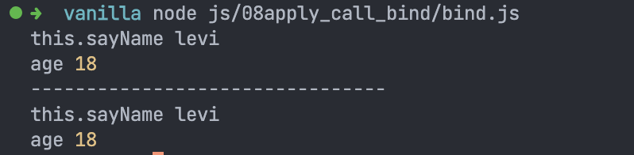
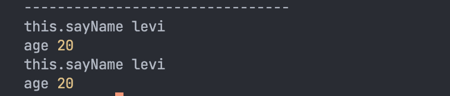

# JS 面试问题: 手写 apply/call/bind 🕵️‍♀️
这是比较经典的面试题, 要明白考点就是函数调用时 `this` 究竟是谁的问题, 明白了这点一切就好说了.


## 手写 call/apply
先来看 `call` 和 `apply`, 这两个方法很相近, 都是给定 `this` 和参数调用函数, 只不过 `apply` 的第二个参数是数组或者类数组对象, 而 `call` 可以接受很多个参数.

如果要我们自己实现函数调用时 `this` 值的绑定问题, 一定是 `obj.func()` 这种形式. 因为只有这种对象属性调用函数的方式, 函数的 `this` 才会是前面的对象, 即 `obj`.

```js
function sayName(age) {
  console.log('this.sayName', this.name)
  console.log('age',age)
}

Function.prototype.myCall = function(thisObj, ...args) {
}

sayName.myCall({ name: levi }, 18)
```

上面就是大体的框架. 

因为 `call` 接收的参数个数不定, 所以需要使用剩余参数的形式.

接下来的我们要知道的是 `myCall` 通过 `sayName.myCall()` 方式调用时的 `this` 就是 `sayName`. 所以...

```js
Function.prototype.myCall = function(thisObj, ...args) {
  thisObj.testMethod = this
  thisObj.testMethod(...args)
  delete thisObj.testMethod
}

sayName.call({ name: 'levi' }, 18)
console.log('--------------------------------')
sayName.myCall({ name: 'levi' }, 18)
```


```js
Function.prototype.myApply = function(thisObj, argsArray) {
  thisObj.testMethod = this
  thisObj.testMethod(...argsArray)
  delete thisObj.testMethod
}

sayName.apply({ name: 'levi' }, [18, 19, 20])
console.log('--------------------------------')
sayName.myApply({ name: 'levi' }, [18, 19, 20])
```

## 手写 bind
`bind` 返回一个绑定了 `this` 的函数, 因此我们实现的时候也需要在 `myBind` 中返回一个(匿名)函数, 在这个(匿名)函数中使用上面👆的原理.

```js
Function.prototype.myBind =  function(thisObj) {
  thisObj.testMethod = this

  return function(...args) {
    thisObj.testMethod(...args)
    delete thisObj.testMethod
  }
}

console.log('--------------------------------')
sayName.bind({ name: 'levi' })(20)
sayName.myBind({ name: 'levi' })(20)
```


上面的方法都没有进行严格的参数校验, 可能存在 `bug`, 只是提供思路

谢谢你看到这里😊

