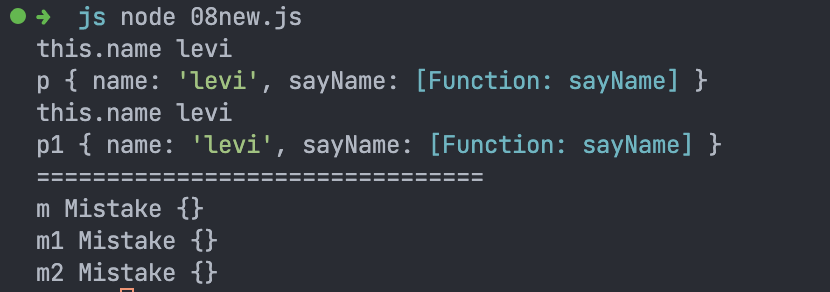

# JS 面试问题: 手写 new 🆕

首先, `new` 操作符可以创建一个用户自定义的对象类型或者创建一个带有构造函数的内置对象类型.

当一个函数通过 `new` 方式调用时, 这个函数被当作一个构造函数. `new` 将做下面的事情
1. 创建一个空的纯 `JS` 对象. 我们称之为 `newInstance`.
2. 将 `newInstance` 的 `[[Prototype]]` 指向构造函数的 `prototype` 属性如果 `prototype` 是一个对象. 否则指向 `Object.prototype`.
    - 📖原型链, 从构造函数创建的所有实例都可以访问添加到构造函数的 `prototype` 上的属性或对象
3. 用给定的参数执行构造函数, 将 `newInstance` 绑定为 `this` 上下文. 即在构造函数中所有对 `this` 的引用都将指向 `newInstance`
4. 如果构造函数返回 `non-primitive`, 其将作为 `new` 操作符的返回值返回. 否则, 如果构造函数不返回任何值或者返回了 `primitive`, `new` 操作符返回 `newInstance`.
    - 📖`primitive`: 指 `null/undefined/string/number/boolean/bigint/symbol`
    - 通常构造函数不返回值, 但是可以通过返回值来覆盖正常对象的返回过程.

有了上面的介绍, 就可以开始写代码了

```js
function myNew(constructor, ...args) {
  // 第一步
  let newInstance = {}

  // 第二步
  if (constructor.prototype !== null) {
    Object.setPrototypeOf(newInstance, constructor.prototype)
  } else {
    Object.setPrototypeOf(newInstance, Object.prototype)
  }

  let result = constructor.apply(newInstance, args)

  if (typeof result === 'object' && result !== null) {
    return result
  } else {
    return newInstance
  }
}
```
测试
```js
function Person(name) {
  return {
    name,
    sayName() {
      console.log('this.name',this.name)
    }
  }
}

let p = myNew(Person, 'levi')
p.sayName()
console.log('p',p)
let p1 = new Person('levi')
p1.sayName()
console.log('p1',p1)

console.log('================================')

function Mistake() { return 1 }
let m = myNew(Mistake)
console.log('m',m)
let m1 = new Mistake()
console.log('m1',m1)
```


谢谢你看到这里😊
