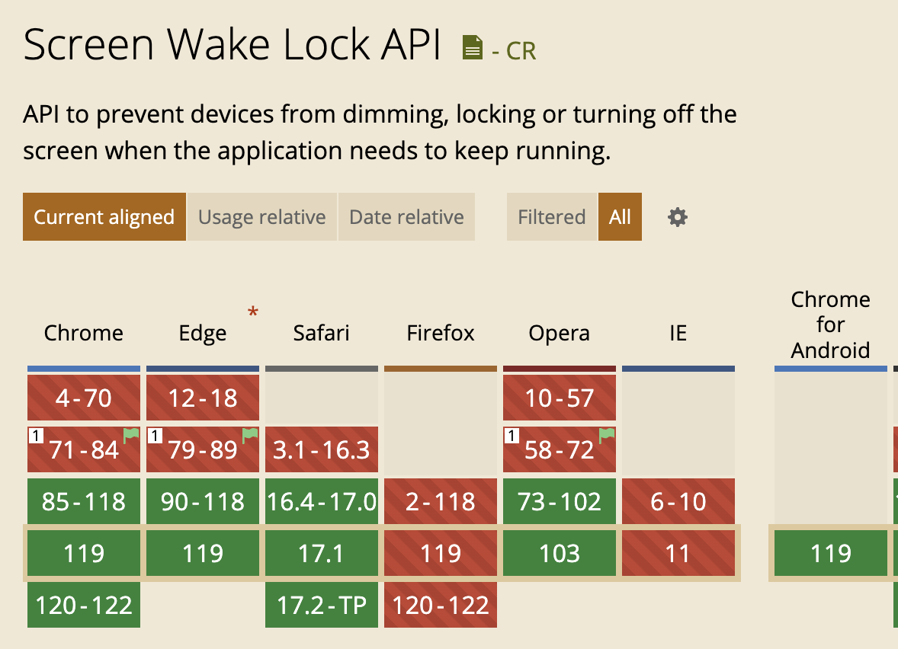

# Screen Wake Lock API
> 这个 API 提供了组织屏幕变暗或锁屏的方式, 如果某个应用需要一直运行.

大多数设备默认在一段时间后会关闭屏幕来延长硬件的寿命或者节能. 而像阅读、导航等情景需要保持屏幕常亮.

快速使用
1. 通过 [navigator.wakeLock.request()](https://developer.mozilla.org/en-US/docs/Web/API/WakeLock/request) 方法获得 [WakeLockSentinel](https://developer.mozilla.org/en-US/docs/Web/API/WakeLockSentinel) 对象获得锁;
2. 通过 [navigator.wakeLock.release()](https://developer.mozilla.org/en-US/docs/Web/API/WakeLockSentinel/release) 释放锁

## WakeLock
> 通过 WakeLock 获得一个 [screen wake lock](https://w3c.github.io/screen-wake-lock/#dfn-screen-wake-lock).

screen wake lock 防止息屏, 并且只有可见的文档才能获取 screen wake lock.

我们可以通过全局的 `Navigator.wakeLock` 访问.

### request(type)
> 仅支持在 HTTPS 下调用

request() 返回一个在成功时解析 WakeLockSentinel 的 Promise 对象.

接收字符串类型的 type 为参数, 目前 type 仅支持 screen 这一个值. 如果省略 type 不写, 还是默认 screen.

## WakeLockSentinel

## 兼容性
很遗憾, Firefox 浏览器不支持.

谢谢你看到这里😊