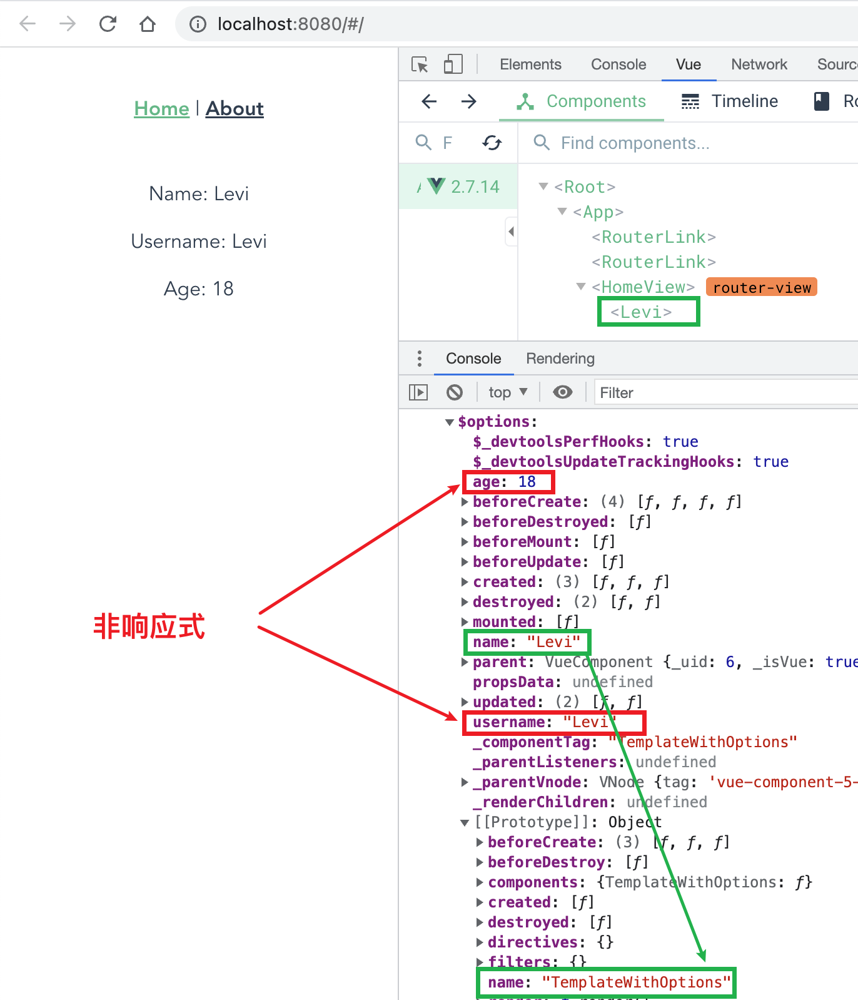

# 在 Vue 模板中使用非响应式数据

最近在工作中遇到了一个问题, 就是想要在模板 `<tempalte>` 中使用数据, 但是又不想这个数据是响应式的, 无非是提高一点点可忽略不计的性能吧, 然后调查了一些方法

## 使用` $options`
我们知道模板中的 `this` 就是组件实例, 因此 `this` 可以省略不写, 所以我们可以直接在 `this` 上添加一些数据, 也可以在 `this` 的` $options` 上添加.

```html
<template>
  <div>
    <p>Name: {{ $options.name }}</p>
    <p>Username: {{ $options.username }}</p>
    <p>Age: {{ $options.age }}</p>
  </div>
</template>

<script>
export default {
  name: 'TemplateWithOptions',
  created() {
    this.$options.name = 'Levi'
    this.$options.username = 'Levi'
    this.$options.age = 18
    console.log('this',this)
  }
}
</script>
```


📖 注意不可以使用 `name`, 因为 `name` 是 `$options` 对象原型对象上的属性, 表示的是组件的名字, 如果我们覆盖了 `name` 那么 `Vue dev tools` 中的组件名也会发生改变

谢谢你看到这里😊
