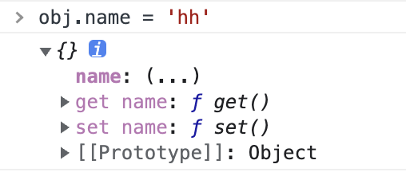

# Vue2 数据绑定与依赖
> 这里实现非常非常简单与基础的数据绑定与依赖

## 初始部分
首先, 来看模板的内容, 只有绑定与更新. 注意这里模板超级简单, 没有标签嵌套、没有级联的属性等等.
```html
<div id="app">
  <div>{{ name }}</div>
  <div>{{ age }}</div>
  <div>{{ name }}</div>
  <div>{{ age }}</div>
  <button @click="updateAge">updateAge</button>
</div>
```
构造自己的 `Vue` 实例对象, 照葫芦画瓢也传入两个参数
- `Vue` 实例挂载的根容器组件
- 配置对象
```js
const app = new Vue('#app', {
  data: {
    name: 'Levi',
    age: 25
  },
  methods: {
    updateAge() {
      this.age = 18
    }
  }
})
```
## 代码讲解
这里直接使用 `ES6` 中的 `Class` 作为实现基础. `PS`: 我们不对参数做任何校验, 默认所以参数都有且类型数据都正确.

### 数据绑定
在 `constructor` 函数中
- 首先获得根元素
- 然后从 `configObject` 上解构出 `data` 和 `methods` 两个对象
- 创建 `_data` 属性用来保存最原始传入的数据
- 最后调用 `init()` 方法.
```js
constructor(el, configObject) {
  this.el = document.querySelector(el)
  const { data, methods } = configObject
  this._data = data

  this.init()
}
```
`init()` 方法中只做一件事就是调用 `initDataBind()` 方法.
```js
class Vue {
  init() {
    this.initDataBind()
  }

  initDataBind() {
    this.data = {}
    const _this = this

    for(let key in this._data) {
      let obj = {
        get() {
          return _this._data[key]
        },
        set(newValue) {
          _this._data[key] = newValue
        }
      }
      Object.defineProperty(this.data, key, obj)
      Object.defineProperty(this, key, obj)
    }
  }
}
```
我们创建了新的属性 `data` 用来做响应式, 首先来说明一下 `getter` 和 `setter` 中的 `this` 指向问题, `this` 就是添加新属性的对象. 来看下面的代码和控制台的打印.
```js
let obj = {}
Object.defineProperty(obj, 'name', {
  get() { return 'Levi' },
  set() { console.log(this) }
});
obj.name = 'hh'
```


除了在 `data` 上定义响应式之外, 还在 `Vue` 实例本身定义了, 稍后在 `methods` 部分做介绍.
### 绑定方法
在绑定方法的步骤里, 要留意的是方法中 `this` 的指向问题.
首先在构造函数中, 创建 `methods` 属性来接收所有的方法
```js
constructor(el, configObject) {
  this.el = document.querySelector(el)
  const { data, methods } = configObject
  this.methods = methods

  this.init()
}
```
在 `init()` 方法中调用 `bindEvent()` 来处理方法绑定. 在 `bindEvent()` 中首先找到所有绑定了事件的元素, 然后给这个元素添加 `click` 事件, 并且其回调函数是绑定了 `this` 的.
```js
init() {
  this.bindEvent()
}

bindEvent() {
  const elements = this.el.querySelectorAll('*')
  elements.forEach(element => {
    const methodName = element.getAttribute('@click')
    if (!methodName) return
    element.addEventListener('click', this.methods[methodName].bind(this))
  })
}
```

### 收集依赖
方法已经绑定好了, 方法执行的时候可能会更新数据, 那么数据更新时就会通知对应页面使用到这个数据的地方也更新, 所以我们要收集页面中到底哪些地方使用了


```js
```

谢谢你看到这里😊
